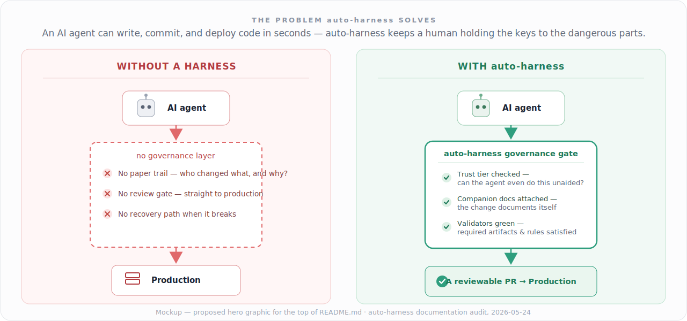
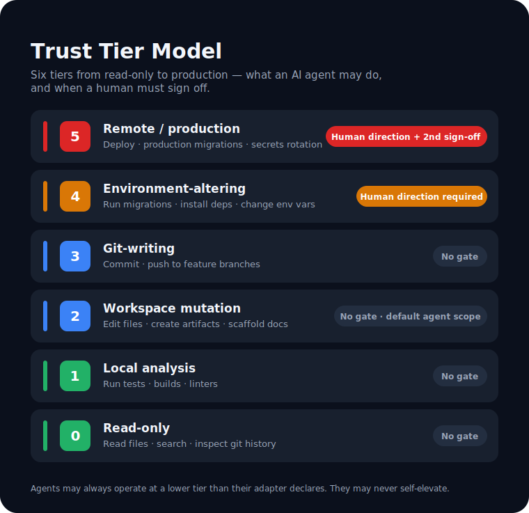
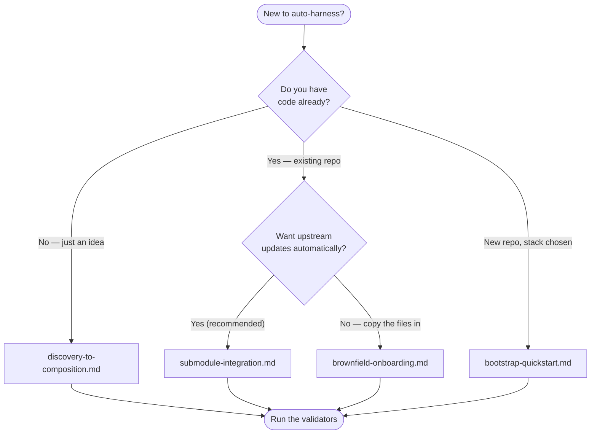
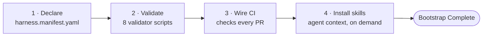

# auto-harness — Documentation Audit & Improvement Plan

**Prepared:** 2026-05-24
**Scope:** Whole-tree documentation review (362 markdown files; authored documentation surface)
**Priority reader:** The curious newcomer — someone who has never seen the harness
**Method:** Five parallel deep-dive review passes + a fact-verification pass against the repo
**Status:** Audit and plan only — no documentation files were modified

---

## 1. Executive summary

auto-harness does not have a documentation *quality* problem. It has a documentation *sequencing and surfacing* problem, and the difference matters because the fix is far cheaper than a rewrite.

The content is genuinely strong. The glossary is normative and example-backed. There are eleven polished Mermaid diagrams with plain-language framing. The ADRs are model decision records. The troubleshooting guide maps every validator error to a fix. The kernel doctrine is principled. A reader who finds the right page, in the right order, is well served.

The problem is that almost none of that lands for a first-time visitor. The single best assets in the repo are the least discoverable ones. The value proposition is buried roughly eighty lines deep in the README, behind a seventeen-row table of contents and a five-way "pick your path" decision the reader cannot yet make. The core vocabulary — *module*, *composition*, *overlay*, *manifest*, *kernel*, *trust tier* — is used dozens of times before it is ever defined. The eleven diagrams sit in one file that the README references once, in a deep reference table, with the wrong count. The recommended adoption path is missing from the two pages whose only job is to route newcomers. And the docs ship at least two factual contradictions — the validator count and the diagram count — that a careful reader *will* notice and that quietly erode trust in everything else.

Put bluntly: the harness is built to stop AI agents from drifting, yet its own documentation has drifted in exactly the way it was designed to catch. There is even a validator — `validate-catalog-counts.sh` — whose entire job is preventing this, with a self-acknowledged blind spot that let the diagram count rot anyway.

The good news is that this is the cheap kind of broken. The welcoming material exists; it is mis-ordered. The visuals exist; they are mis-filed. The counts are wrong in known, enumerable places. This plan is mostly **reorder, surface, wire, and correct** — not **write from scratch**. A focused effort over roughly two to three weeks of part-time work, sequenced into five phases, would move the front door from "dense reference manual" to "welcoming on-ramp" without weakening a single governance control.

**The one-sentence verdict:** the harness teaches discipline beautifully to people who already believe in it, and barely speaks to the newcomer who hasn't decided yet — and the newcomer is the person who decides whether the project grows.

---

## 2. How this audit was done

The repository holds 362 markdown files. Not all of them are "documentation" in the sense this audit cares about — roughly 60 are validator and bootstrap test fixtures (intentionally broken, by design), one directory is an archived `legacy/` tree, and a large block is filled-in sample-project artifacts. This audit covers the **authored documentation surface**: the root entrypoints, the `platform/` documentation (kernel, profiles, workflow, reference, skills, agents, templates, validators, examples), and the `docs/` governance tree (ADRs, PRDs, opportunities, knowledge, roadmap, threat model).

The review ran as five parallel passes, each owning a slice:

| Pass | Slice |
|------|-------|
| 1 | Front door & root entrypoints — README, HARNESS, AGENTS, CLAUDE, TOOLS, SUMMARY, plus CONTRIBUTING / SECURITY / CODE_OF_CONDUCT / CHANGELOG |
| 2 | Workflow guides (18 files) and reference docs (glossary, how-to-read, index) |
| 3 | Concept & module architecture — kernel doctrine, the trust model, the 26-module catalog, compositions |
| 4 | Machinery — skills, agent packs, validators, templates, examples — plus the full visual inventory |
| 5 | The `docs/` governance tree — ADRs, PRDs, opportunities, knowledge logs, roadmap |

Every load-bearing claim in this document was then verified directly against the repository. That verification matters: one finding initially rated Critical (a project-name mismatch said to span four entrypoints) turned out to affect only the README's H1 — the other three files use the "Development Harness Framework" descriptor deliberately in a subtitle. It is downgraded to Medium accordingly. Where this audit cites a file and line number, it has been checked.

---

## 3. The headline: the 60-second test fails

A curious newcomer gives a new project about a minute before deciding whether to keep reading. Here is what that minute currently looks like on `README.md`.

They read the H1: **"Development Harness"** (`README.md:7`). The repository is named `auto-harness`. The badges say `auto-harness`. Mild dissonance — *am I in the right place?*

They read the opening sentence (`README.md:13–16`): *"A modular governance framework for AI-assisted software development. It gives AI agents... a structured operating contract — so they know what they're allowed to do, what artifacts must exist, when human review is required, and what companion documentation must accompany every significant change."*

Every word is accurate. None of it is concrete. "Governance framework," "operating contract," "artifacts," "companion documentation" arrive in a single breath, and the newcomer still cannot picture **what they would actually do** with this thing or **what goes wrong without it**.

Then they hit a **seventeen-row table of contents** (`README.md:34–52`) — which silently signals "this is a reference manual, settle in" — followed immediately by a **five-way branch** (`README.md:21–31`): *new project? just an idea? existing codebase? Web3? already adopted?* That is a decision asked of a reader who does not yet know what the harness **is**. It is a fork in the road before the road has been explained.

The genuinely compelling material — the vivid problem statement at `README.md:80–84`, *"agents accelerate toward production at the speed of inference — with no paper trail, no ownership, and no recovery path when something goes wrong"* — sits **eighty lines down**, past the fold, past the TOC, past the branch. Most newcomers never reach it.

**The hook exists. It is just buried under the navigation.** That is the headline finding, and Phase 1 of the roadmap is built entirely around fixing it.

---

## 4. Findings by severity

Severity reflects impact on the priority reader. **Critical** = actively misleads a reader or blocks the newcomer. **High** = a real comprehension or trust failure. **Medium** = friction or inconsistency. **Low** = polish.

### Critical

| # | Finding | Evidence | Reader impact |
|---|---------|----------|---------------|
| C1 | **The README buries its value.** The problem statement and "Who This Is For" sit ~80 lines deep, behind a 17-row TOC and a 5-way path branch. | `README.md:13–84` | The newcomer bounces before reaching the reason to care. |
| C2 | **Core vocabulary is undefined at the point of contact.** *module, composition, overlay, manifest, kernel, trust tier* are used dozens of times before definition. The kernel docs never define what a module *is*; `module-types.md` explains module *families* but not the noun. "Overlay" appears 100+ times across the profile catalog and is never defined anywhere. | `kernel/base/README.md:9`; `core/registry/module-types.md`; all 26 `profiles/**/README.md` | The central mental model never assembles. Every later page assumes fluency the reader was never given. |
| C3 | **The docs contradict themselves on countable facts.** Validators: `glossary.md:66` says "Six validators exist" and enumerates six; `how-to-read.md` says eight; `submodule-integration.md:31` says seven. On disk: **eight**. Diagrams: `HARNESS.md:15` says "six Mermaid diagrams"; `diagrams.md:19` says "Eleven." On disk: **eleven** (12 Mermaid blocks). | `glossary.md:66`, `HARNESS.md:15`, `diagrams.md:19` | A reader who notices one wrong number stops trusting all of them — including the ones that are right. |
| C4 | **The recommended adoption path is missing from the navigation layer.** `submodule-integration.md` is called "the recommended consumption pattern," yet it appears in neither `how-to-read.md`'s adoption path nor `index.md`'s workflow list. Worse, `bootstrap-quickstart.md:19–27` opens by telling submodule-mode readers — i.e. the recommended majority — *not to follow the rest of the page*. | `how-to-read.md`, `index.md`, `bootstrap-quickstart.md:19–27` | The two pages whose only job is routing newcomers route them to the wrong guide. |

### High

| # | Finding | Evidence | Reader impact |
|---|---------|----------|---------------|
| H1 | **The visuals exist but aren't wired into the concept docs.** Eleven polished Mermaid diagrams + two designed SVG covers, concentrated in two files. `diagrams.md` is *pointed to* from ~17 files — but almost always as a line item in a reference list or a governance doc; only the governance skill embeds diagrams (#2, #3) beside the concept they explain. Diagrams #4–#11 are reached only by opening `diagrams.md` and scrolling its table of contents. The README's "How It Works" section — the newcomer's first real conceptual stop — contains a YAML block and a bash block and **zero diagrams**. | `docs/architecture/diagrams.md`; `README.md:105–173` | The repo's best newcomer assets sit beside the concepts they explain almost nowhere. |
| H2 | **The centerpiece concept has the thinnest doc.** `trust-model.md` is 27 lines — the shortest substantive doc in the kernel — while peripheral domain overlays (`web3` at 234 lines) run 5–9× longer. It is a spec, not an explanation: no narrative, no "why six tiers," and it references "agent adapter," itself undefined. | `kernel/base/trust-model.md` | Beginners stall on the most-referenced concept in the system. |
| H3 | **The quickstart is not copy-paste runnable.** `bootstrap-quickstart.md:73` sets `PLATFORM=path/to/platform` as a placeholder with no instruction to replace it; the CI snippet at `:252` uses `$PLATFORM` while `ci-integration.md` uses `$PLATFORM_ROOT`; `troubleshooting.md:578–582` uses `$PLATFORM` with no definition anywhere in that file. | `bootstrap-quickstart.md:73,252`; `troubleshooting.md:578` | Commands silently produce wrong paths and fail. |
| H4 | **The machinery assumes you already know the vocabulary.** No `SKILL.md` and no agent README defines what an "Agent Skill" *is*; install snippets (`cp -r ... .agents/skills/`) appear with no statement of what happens after the copy. A newcomer cannot tell a skill from a template from a workflow. | All 7 `platform/skills/*/SKILL.md` | The reader is handed tools without being told what tools they are. |
| H5 | **The `docs/` governance tree has no index.** 12 ADRs and 7 PRDs are discoverable only by guessing filenames — there is no `docs/README.md`, `docs/adr/README.md`, or `docs/requirements/README.md`. `docs/opportunities/` *does* have an index; the asymmetry is glaring. | `docs/`, `docs/adr/`, `docs/requirements/` | Contributors cannot find the decision behind a feature. |
| H6 | **The examples index is stale and the samples aren't walkthroughs.** `examples/README.md` documents one of five sample projects on disk (`agentic-ui-starter`, `interview-driven-hackathon`, `mcp-server-starter`, `node-web-saas-postgres`, `submodule-consumer`). The samples themselves are filled-in artifact dumps with no narrated "here is the journey." | `platform/examples/README.md` | Skills point newcomers at samples the index never mentions; no can-follow path exists. |
| H7 | **A required-artifact path points at a missing file.** `docs/architecture/overview.md` is referenced as architecture context or a required artifact in seven `docs/` files (ADR-0007, ADR-0008, OPP-0008, PRD-0001/0002/0003, `revision-tracker.md`). The file does not exist in this repo — only `diagrams.md` does; ADR-0007 explicitly calls it a "Required artifact." | `ADR-0007:50`, `PRD-0001:20` | The project's own decision records point at a file that was never created. |

### Medium

| # | Finding | Evidence |
|---|---------|----------|
| M1 | The README is ~570 lines doing four jobs — landing page, tutorial, reference, and contributor guide simultaneously. A front door should not also be the whole house. | `README.md` |
| M2 | Project-name inconsistency: repo `auto-harness`, badges `auto-harness`, README H1 "Development Harness." Pick one wordmark and lead with it. | `README.md:7` |
| M3 | The 26-module catalog is structurally inconsistent: READMEs vary 58→234 lines; the lead heading is phrased five different ways ("What This Overlay Governs" / "Requires" / "Produces" / "Activates" / "Does and Doesn't Require"); only the four newest carry a "See Also." | `platform/profiles/**/README.md` |
| M4 | Glossary gaps: *Bootstrap Complete*, *Harness Ready*, *lite manifest*, *install.sh*, *overlay* are load-bearing terms used in the workflow guides and undefined in `glossary.md`. "Overlay / module / profile" are three words for one concept, never reconciled. | `platform/reference/glossary.md` |
| M5 | The doctrine docs (`doctrine.md`, `audit-model.md`, `enforcement-model.md`, `lifecycle-controls.md`) are bare bullet lists — rules stated without the rationale a newcomer needs to absorb them. | `platform/core/kernel/base/` |
| M6 | `validators/README.md` is written for contributors, not users — roughly half is internal Ruby-library and test-suite detail, with no worked example of reading a *failing* run. | `platform/validators/README.md` |
| M7 | `templates/README.md` leads with a ~140-row placeholder table before ever explaining what a template is for; the directory map a newcomer needs is buried below it. | `platform/templates/README.md` |
| M8 | Status drift in the governance tree: `ADR-0004` still says `Status: Proposed` though it was locked-and-built on 2026-05-12; `distilled-learnings.md` shows a review cadence ~7 months stale; `kpi-dictionary.md` is past its stated quarterly cycle. | `ADR-0004:9`, `docs/knowledge/distilled-learnings.md` |
| M9 | Governance docs leak into newcomer paths: `roadmap.md` and the README reach into PRD/OPP cross-reference thickets with no "you probably don't need this tree" signpost. | `docs/roadmap.md`, `README.md` |

### Low

| # | Finding | Evidence |
|---|---------|----------|
| L1 | `TOOLS.md` ships empty `<!-- Fill in -->` stubs in the canonical repo copy — looks unfinished to a browser. | `TOOLS.md:81–97` |
| L2 | Agent-pack status lines are inconsistent: four packs carry "R&D / 0.1.0," four carry nothing — leaving stability ambiguous. | `platform/agents/*/README.md` |
| L3 | `index.md` is a bare link list with no one-line orientation per entry — a router for someone who already knows the vocabulary. | `platform/reference/index.md` |
| L4 | The 2026-05-24 `change-log.md` row is a single ~1,600-word table cell — effectively unreadable as a table. | `docs/project/change-log.md` |
| L5 | `platform/SUMMARY.md` is now a 16-line redirect stub; a newcomer who lands there could read it as "platform docs are empty." | `platform/SUMMARY.md` |

---

## 5. The curious-newcomer journey, annotated

This is the path a first-timer actually walks, and where each step leaks readers.

1. **Lands on the GitHub repo `auto-harness` → opens `README.md`.** Sees H1 "Development Harness." *Small dissonance.* (M2)
2. **Reads the opening blurb.** Accurate but abstract — no concrete picture, no example, no visual. *Comprehension does not start here.* (C1)
3. **Hits the 17-row TOC.** Signal received: "dense reference manual." *First major drop-off.* (C1, M1)
4. **Hits the 5-way "pick your path" branch.** Asked to choose before being told what the thing is. *Second drop-off.* (C1)
5. **If they persist to line 80** — finally meets the real hook. Most do not get here.
6. **Reaches "How It Works."** A YAML manifest and a bash block. No diagram. The reader who thinks visually gets nothing. (H1)
7. **Encounters "trust tier," "module," "companion rule," "composition"** — all used, none yet defined. The reader either already gets it or is now lost. (C2)
8. **Tries to act → opens a workflow guide.** If routed by `how-to-read.md` they are sent to `bootstrap-quickstart.md`, which opens by telling them to leave. The recommended path (`submodule-integration.md`) is not on the map. (C4)
9. **Copies a command.** It contains an unreplaced `$PLATFORM` placeholder. It fails. (H3)

Every numbered step is a place a real person quietly closes the tab. Steps 2–4 are pure sequencing. Step 6 is one embedded diagram. Steps 7–9 are definition, routing, and a variable name. **None of this requires new prose — it requires reordering, surfacing, and correcting.**

---

## 6. Jargon & accessibility

The pattern is consistent: nearly every load-bearing term is *eventually* defined well — but always 100+ lines after first use, and the README never links the glossary inline. Terms used before definition, with first appearance:

- **operating contract** — `README.md:14` (never defined in README; not in glossary)
- **artifacts** — `README.md:15` (defined implicitly ~80 lines later)
- **companion rules / companion documentation** — `README.md:16` (defined at `:221`)
- **modules / composable** — `README.md:88` (defined at `:197`)
- **manifest** — `README.md:88` (never expanded in README as "the declaration file")
- **trust tier** — `README.md:60` (defined at `:180`)
- **composition** — `README.md:58` (defined at `:248`)
- **brownfield** — `README.md:58` (never defined in README)
- **overlay** — used 100+ times across the profile catalog; defined nowhere
- **kernel / kernel doctrine** — `README.md:192` (never plainly defined in README)
- **self-dogfood** — `README.md:442` (never defined)
- **Agent Skill** — every `SKILL.md` (the term the files are built around is never defined)
- **Bootstrap Complete / Harness Ready** — lifecycle states across the workflow guides; absent from the glossary

The tone throughout is competent but **reference-style and noun-stacked** — short on second-person "you" framing, heavy on abstract compounds. This is the right register for the practitioner who already bought in. It is the wrong register for the newcomer, who needs verbs, examples, and one concrete thing they can picture.

The accessibility fix is small and mechanical: a **five-definition "Core Concepts" block** placed where newcomers first land (top of the README's concept section and top of `module-types.md`), plus **inline glossary links on first use** of the six core terms. The glossary itself is already good — it is simply never reached in time.

---

## 7. The visual audit

The user's instinct here is correct, and the data backs it: visuals are the single highest-leverage lever available, because the assets **already mostly exist and simply are not wired in.**

### 7.1 What exists today

| Asset | Type | Depicts | Discoverability |
|-------|------|---------|-----------------|
| `diagrams.md` #1 Component Composition | Mermaid | manifest → modules → contract → validators/CI → skills | Buried — deep reference link only |
| #2 Trust Tier Decision Flow | Mermaid | action → tier → autonomous / care / human-auth | **Embedded in the governance skill — good** |
| #3 Companion Rule Firing | Mermaid | PR diff → trigger → check → pass/fail | **Embedded in the governance skill — good** |
| #4 Opportunity → PRD → ADR lifecycle | Mermaid | OPP status transitions | `diagrams.md` TOC only |
| #5 Distillation Trigger Composition | Mermaid | active hooks + passive PR rules | `diagrams.md` TOC only |
| #6 Consumer Adoption Flow | Mermaid | submodule → install → headers → validators → CI | `diagrams.md` TOC only |
| #7–#11 Paired mechanism, design-pressure cascade, catalog-counts, canonical-position, anchor-satellite | Mermaid | governance dynamics | `diagrams.md` TOC only — never embedded in context |
| `docs/_assets/cover-front.svg` / `cover-back.svg` | SVG | designed book covers | GitBook PDF export only |

**Eleven Mermaid diagrams + two designed SVG covers, in two files.** The verdict is blunt: discoverability is poor. The diagrams are high quality — each opens with a plain-language "Question:" and a "Read this as:" interpretation — and `diagrams.md` is, ironically, one of the best-written newcomer documents in the repo. It is also one of the least-visited, linked from the README only inside a reference table at `:556`, with a count that is wrong.

### 7.2 Where new visuals pay off most

Ranked by impact on the newcomer:

1. **A README hero graphic** — the "without a harness / with auto-harness" before-and-after. One image replaces the eighty lines of prose the reader currently has to survive. *A designed mockup ships with this audit:* `_assets/proposed-visuals/hero-before-after.svg`.
2. **Embed diagram #1 in "How It Works."** It already exists. It is exactly the right picture. It is simply not on the page.
3. **A newcomer routing decision tree** on `how-to-read.md` — fixes C4 by routing to the *one* correct guide. Draft below.
4. **A designed trust-tier ladder** for `trust-model.md` — six rungs, gates drawn at Tiers 4–5. *A designed mockup ships with this audit:* `_assets/proposed-visuals/trust-tier-ladder.svg`.
5. **An "anatomy of the harness" panel** — a labeled visual of the four artifact types (module, skill, validator, template) and how they relate. Fixes the H4 vocabulary gap.
6. **An agent-pack inheritance tree** in `platform/agents/base/README.md` — one diagram replaces eight prose paragraphs.

### 7.3 Two designed mockups (shipped with this audit)

These are concrete demonstrations of the "designed hero visual" direction — not abstract recommendations. They live alongside this document.

### 7.4 Two proposed Mermaid drafts (ready to drop in)

Mermaid is the right default for flow and logic diagrams: it renders natively on GitHub and GitBook, it version-controls as text, and the `validate-catalog-counts.sh` validator can eventually police it. Reserve designed SVGs for the few hero/concept visuals that must look striking.

**Draft A — Newcomer routing decision tree** (proposed for `how-to-read.md`; fixes C4):

**Draft B — "How It Works" pipeline** (proposed for `README.md:105`; fixes H1 at its highest-value location):

---

## 8. Count-drift & factual defects

These are not stylistic notes — they are bugs in the documentation, and they are listed separately because they are the cheapest, highest-trust-recovery fixes available. Every one is a known, enumerable string.

| Defect | Says | Reality | Locations to correct |
|--------|------|---------|----------------------|
| Validator count | "six" / "seven" / "eight" | **8** scripts on disk | `glossary.md:66`, `submodule-integration.md:31`, `ci-integration.md` table — and add `validate-doc-references` + `validate-catalog-counts` to the glossary enumeration |
| Diagram count | "six Mermaid diagrams" | **11** diagrams | `HARNESS.md:15`, `SUMMARY.md:82`, `README.md:556` |
| Dangling artifact path | `docs/architecture/overview.md` cited as architecture context / required artifact | file does not exist in this repo | ADR-0007, ADR-0008, OPP-0008, PRD-0001/0002/0003, `revision-tracker.md` |
| Stale status | `ADR-0004: Proposed` | locked & built 2026-05-12 | `ADR-0004:9` |
| Stale examples index | 1 sample project | **5** on disk | `platform/examples/README.md` |
| Variable name | `$PLATFORM` vs `$PLATFORM_ROOT` | inconsistent across guides; undefined in `troubleshooting.md` | `bootstrap-quickstart.md:252`, `troubleshooting.md:578` |

The irony is worth stating plainly because it is also the strategic lesson: the harness ships `validate-catalog-counts.sh` precisely to kill count-drift, and `CHANGELOG.md` openly admits Mermaid diagram labels are *not yet covered* by it. The diagram count rotted through exactly that gap. **Closing that validator gap (Phase 3) is what makes these fixes stay fixed.** Without it, this audit's corrections will themselves drift within a few release cycles.

---

## 9. The improvement roadmap

Five phases, sequenced so each is independently shippable and low-risk. Effort estimates are rough part-time ranges; treat them as relative sizing, not commitments.

### Phase 0 — Truth & wiring · ~half a day · zero risk

Fix the things that are simply *wrong*. No prose, no design, no debate.

- Correct the validator count to 8 and the diagram count to 11 everywhere they appear (§8 table).
- Reconcile the `docs/architecture/overview.md` references — either create the file or correct the seven pointers.
- Flip `ADR-0004` to `Accepted`.
- Add `submodule-integration.md` to `how-to-read.md` and `index.md`.
- Standardize on `$PLATFORM_ROOT`; define it at the top of `troubleshooting.md`.
- Fill or remove the empty `TOOLS.md` stubs.

**Why first:** these are trust repairs. A reader who catches one wrong number distrusts the rest. Ship this before anything else and ship it as one commit.

### Phase 1 — The 60-second front door · ~1–2 days

Rebuild the top of the README as an on-ramp, not a manual.

- Lead with the project's actual name as the wordmark.
- One plain-language "what this is" sentence + one concrete two-line example, *above* the TOC.
- Promote "What It Does" and "Who This Is For" above the TOC; collapse the TOC to 6–8 anchors (or a `
` block).
- Embed the **hero graphic** at the top and **diagram #1** in "How It Works."
- Move the 5-way path branch *below* the value section — context before the fork.
- Add a "New here? Start with the README" banner to `HARNESS.md` and `SUMMARY.md`.

**Why second:** this is the single highest-impact change for the priority reader. It is reordering plus one image — not new content.

### Phase 2 — Make the mental model click · ~2–3 days

- A five-definition **"Core Concepts"** block (module, composition, overlay, manifest, kernel, trust tier) at the top of `module-types.md` and referenced from the README.
- Inline glossary links on first use of the six core terms, repo-wide.
- Expand `trust-model.md` from spec to explanation — keep the table, add the *why*, embed the ladder visual.
- Add rationale (not just rules) to the four doctrine docs.
- Close the glossary gaps (M4): *Bootstrap Complete*, *Harness Ready*, *lite manifest*, *install.sh*, *overlay*.
- One worked **"anatomy of a module"** walkthrough of a real `module.yaml`.

### Phase 3 — The visual program · ~3–5 days · parallelizable

- Surface all 11 existing diagrams: embed each in the concept doc it explains, not only in `diagrams.md`.
- Add the high-value missing visuals: the routing decision tree (Draft A), the "How It Works" pipeline (Draft B), the agent-pack inheritance tree, the "anatomy of the harness" panel, a lifecycle state diagram.
- Commission the two designed hero SVGs (mockups shipped with this audit).
- **Extend `validate-catalog-counts.sh` to cover diagram labels** — close the blind spot that let the count rot.

### Phase 4 — Navigation & catalog hygiene · ~2–3 days

- Create `docs/README.md` — a one-table ADR/PRD index with status (highest-leverage navigational fix).
- Standardize the 26 module READMEs: one uniform lead heading, a fixed-position "Depends on / Conflicts with" callout, a "See Also" block on each.
- Refresh `examples/README.md` with all 5 sample projects, and turn one into a narrated end-to-end walkthrough.
- Add "for contributors, not first-time users" banners to the governance docs a newcomer might wander into.
- Rewrite `validators/README.md` user-first, with a worked failing-run example; move the Ruby-internals to a contributor section.

---

## 10. Companion-rule & governance implications

The harness governs itself, so this plan must obey the harness — and saying so is part of acting as PM here.

Editing `README.md`, `HARNESS.md`, or `AGENTS.md` trips the **governance-entrypoint companion rule**: the change needs an ADR or an `operating-principles.md` update *in the same commit*. Phases 1 and 2 touch these files repeatedly. Rather than fight that rule file-by-file, **author one ADR** — *"ADR-00NN: Documentation Information Architecture"* — that records the decision to re-sequence the front door and surface the visuals, and let the Phase 1–2 commits cite it. One decision record, cleanly, instead of a dozen awkward change-log stubs.

Phase 4's module-README standardization touches `platform/profiles/**` and should carry a `docs/project/change-log.md` entry. Phase 3's `validate-catalog-counts.sh` change touches a validator and will itself need a companion ADR or change-log entry.

This is not bureaucratic overhead — it is the project's own thesis applied to itself. A documentation overhaul that skipped the paper trail would be the harness failing its own audit.

---

## 11. What not to do

Equally important — scope discipline:

- **Do not rewrite the ADRs, PRDs, or the doctrine into "friendly" prose.** They are correctly pitched at contributors and they are good. Add an *index* and *rationale*, not a tone change.
- **Do not expand the `docs/` governance tree for newcomers.** A newcomer should almost never be *in* it. The fix is signposting it as "not for you yet," not softening it.
- **Do not lean on binary image assets.** They rot, they do not diff, and the catalog-counts validator cannot police them. Mermaid first; reserve SVG for the two or three hero visuals that genuinely need design.
- **Do not touch validator logic or trust-tier boundaries** in the name of "clarity." This is a documentation effort. The governance contract is not in scope.
- **Do not collapse the five root entrypoints into one file.** The separation is deliberate and correct. The fix is a clearer *map* of them, surfaced earlier — not a merge.

---

## 12. If you do only five things

For when the full roadmap is more than the calendar allows, here is the ruthless short list — each one is high-impact and individually shippable:

1. **Fix the counts** (Phase 0). Half a day. Stops the slow trust leak.
2. **Reorder the README top** so the value and a concrete example land above the TOC (Phase 1). The biggest single win for the priority reader.
3. **Embed one diagram** — diagram #1 — in "How It Works" (Phase 3, item 1). One link, outsized payoff.
4. **Add the five-definition Core Concepts block** (Phase 2). Makes every later page legible.
5. **Create `docs/README.md`** as the ADR/PRD index (Phase 4). The cheapest navigational fix with the longest tail.

Everything else in this plan is real and worth doing. But those five, in that order, would move auto-harness from "documented" to "welcoming" — and welcoming is what turns a curious newcomer into a contributor.

---

## Appendix A — Condensed findings by review slice

**Front door (root entrypoints).** Strong "Who This Is For" personas and a good entry-points table — both buried below the TOC. The hook at `README.md:80` is the best prose in the repo and is stranded. README is ~570 lines doing four jobs. Quick wins: name wordmark, promote the value section, collapse the TOC, inline glossary links.

**Workflow & reference guides.** `discovery-to-composition.md`'s ASCII flow and `troubleshooting.md`'s error solver are excellent. But `bootstrap-quickstart.md` Step 0 is a trapdoor, `$PLATFORM` is undefined where used, and the recommended `submodule-integration.md` is absent from both routing pages. Glossary missing lifecycle terms.

**Concept & module architecture.** `module-types.md` is the best newcomer asset; module READMEs explain *why* well. But the core nouns are never defined, `trust-model.md` is a 27-line spec for the centerpiece concept, and the catalog varies wildly in depth and heading style. Eleven diagrams exist; only `opportunity-capture/README.md` links them.

**Machinery (skills, agents, validators, templates, examples) + visuals.** `diagrams.md` is high quality and nearly invisible. `examples/README.md` documents 1 of 5 samples; samples are artifact dumps, not walkthroughs. Skills never define "Agent Skill." `validators/README.md` is contributor-pitched. Stale diagram count in `HARNESS.md`.

**Governance docs tree.** ADRs and the OPP→PRD→ADR lifecycle are disciplined and genuinely well-run; the tree audits itself with unusual honesty. But there is no index for 12 ADRs + 7 PRDs, an `overview.md` required-artifact path points at a missing file across seven docs, `ADR-0004` status has drifted, and `distilled-learnings.md` is months stale. The prior `QUALITY-AUDIT-2026-05-18.md` shows the project already knows how to find and fix its own gaps — this audit is a continuation of that loop, pointed at the front door.

---

*Audit and plan prepared 2026-05-24. No documentation files were modified. Accompanying files: `_assets/proposed-visuals/hero-before-after.svg`, `_assets/proposed-visuals/trust-tier-ladder.svg`.*
