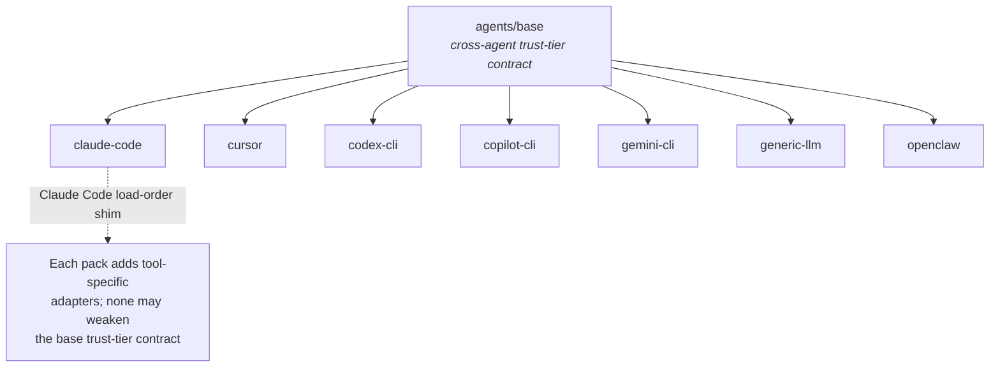
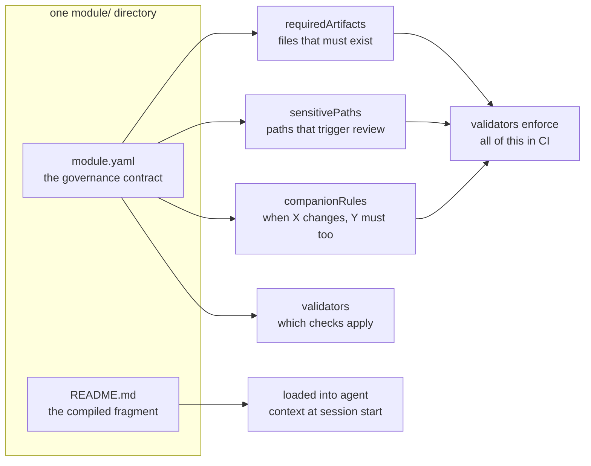

# auto-harness — Documentation Audit, Refresh #1

**Prepared:** 2026-05-25
**Supersedes status of:** `auto-harness-documentation-audit.md` (v1, 2026-05-24) — committed in the repo as `docs/QUALITY-AUDIT-2026-05-24-documentation.md`
**Merges:** the still-open findings of `docs/QUALITY-AUDIT-2026-05-18.md` (the 56-finding, five-lane OSS-launch-readiness audit)
**Method:** four parallel verification passes against the live repo (branch `feat/phase1-readme-rebuild`, HEAD `bf7265a`, v0.5.2) + a fact-verification pass
**Status:** Audit and plan only — no repository files were modified

---

## 1. Executive summary

Twelve hours is not much time, and the team used it well. This refresh exists to do three things: confirm what got fixed, catch what the fast pace broke, and fold in the unaddressed findings from the older 2026-05-18 quality audit so nothing falls through.

The headline is good news, stated plainly: **the v1 audit is being executed, and executed competently.** `ADR-0013` formally adopts the five-phase plan. Phase 0 (truth & wiring) and Phase 1 (the 60-second front door) are essentially complete — the README now leads with the project's name, a hero image, a plain-language hook, and a concrete manifest example above the fold; the buried value proposition is no longer buried. `docs/README.md` exists as a real governance-records index. The dangling `overview.md` artifact path is resolved by creating the file. Of the v1 audit's "if you do only five things" list, **four and a half are done.** Separately, the 2026-05-18 audit's three triage branches landed nearly whole — CI now runs a macOS matrix, a bootstrap-tests job, and a shellcheck job; the validator `--help` cliff is gone; markdownlint is policed; CODEOWNERS, dependabot, `.editorconfig`, and a root CHANGELOG all exist. Roughly 39 of that audit's 56 findings are fully resolved.

Now the part that isn't sugar-coated. **Speed re-introduced the exact failure mode both audits were written to catch.** Three things:

First, there is a **live CI-blocking error on the very branch doing the documentation work.** The rebuilt README uses `<strong>` inside its collapsed table-of-contents block; `<strong>` is not in the markdownlint allow-list; the markdownlint CI job fails on errors. The branch currently fails its own gate. This is a one-line fix and it is listed first below as urgent.

Second, the catalog grew from 26 to 34 modules and 7 to 8 validators in twelve hours, and **the count drift came back** — not in the files the `validate-catalog-counts.sh` validator watches (those held), but in eight files it doesn't: sample-project artifacts, the dependency log, the validators README, a Mermaid diagram label. The validator reports green while the drift is real. The drift class is not closed; it is partially fenced.

Third — and this is the one to sit with — **the brand-new `docs/README.md` index shipped already stale.** Its PRD table stops at PRD-0007; PRD-0008, 0009, and 0010 were merged hours later and never added. The newest navigational artifact in the repo, created specifically to fix a navigation gap, reproduced the drift it was meant to end. That is not a criticism of the work; it is the proof of a structural point: **a hand-maintained index without an enforcing validator will always lag a fast-moving catalog.** The fix is not "be more careful." The fix is to make `validate-catalog-counts.sh` (or a sibling) assert *list completeness*, not just integers.

The v1 thesis still holds and is now half-proven: this was never a writing problem, it is a sequencing, surfacing, and *enforcement* problem. Phases 0–1 proved the sequencing fix works. Phases 2–4 remain. And the enforcement gap is now the highest-leverage thing on the board, because without it every future fix in this document will drift again.

---

## 2. What changed in the last 12 hours

Nine commits, two tagged releases (v0.5.1, v0.5.2), and one active feature branch:

- **`ADR-0013` — Documentation Information Architecture.** Accepted, dated 2026-05-25, cites the v1 audit directly. It records the full five-phase plan as a single decision so the multi-commit README/HARNESS restructure satisfies the governance-entrypoint companion rule with one citation. This is exactly the recommendation from v1 §10 — done correctly.
- **README rebuild in flight** on branch `feat/phase1-readme-rebuild` (uncommitted working changes). H1 is now `auto-harness`; a hero image is embedded; the value hook and a concrete `harness.manifest.yaml` example sit in the first 30 lines; the 17-row TOC is collapsed into a `
` block; the 5-way adoption branch moved below the value section; "How It Works" embeds a real Mermaid flowchart.
- **`docs/README.md` created** — a governance-records index (ADR / PRD / OPP tables, knowledge surfaces, a "first-time users start at the README" banner, the OPP→PRD→ADR reading order).
- **`docs/architecture/overview.md` created** — resolves the dangling required-artifact path (v1 H7).
- **Catalog growth:** 8 new profile modules (`agent-skill-pack`, `browser-storage`, `embedded-key-value`, `self-hosted-oss`, `cryptographic-identity`, `eval-gated-testing`, `coffeescript`, `node-javascript`), 3 new PRDs (0008–0010), 5 new OPPs (0018–0022), 3 new templates, 2 new architecture diagrams (10, 11).
- **Phase 0 fixes** shipped in v0.5.1: validator/diagram counts corrected in the watched files, `ADR-0004` flipped to Accepted, `submodule-integration.md` added to the routing pages, `YOUR-ORG` placeholder removed, `platform/README.md` maturity label corrected.

The v1 audit and the 2026-05-18 audit both now live in `docs/` as committed artifacts.

---

## 3. URGENT — one live CI-blocking error

This is not a roadmap item. It blocks the merge of the README rebuild and should be fixed before anything else in this document.

**U1 — `<strong>` inside the README's `
` block fails the markdownlint CI gate.**

`README.md:87` reads `
<strong>Full table of contents</strong> — 17 sections; expand for navigation
`. The repo's `.markdownlint-cli2.jsonc:55` sets `"MD033": { "allowed_elements": ["!--", "br", "details", "summary", "img", "a"] }` — **`strong` is not on that list.** The `markdownlint` CI job (added by ADR-0011) fails the build on any error. The `feat/phase1-readme-rebuild` branch therefore currently fails its own markdownlint gate.

**Fix (pick one, ~1 minute):** add `"strong"` to the `allowed_elements` array, or drop the `<strong>` tags and let the summary text stand plain (markdown `**bold**` is not reliably parsed inside an HTML `
`, so adding the element to the allow-list is the cleaner choice). Either way, this should be the first commit on the branch.

---

## 4. Progress scorecard

### 4.1 The v1 documentation audit (2026-05-24)

Of 25 findings: **7 resolved, 8 in progress, 10 open.** Phases 0 and 1 are effectively complete; Phases 2–4 are barely started.

| v1 ID | Finding (short) | Status | Evidence |
|-------|-----------------|--------|----------|
| C1 | README buries its value | **Resolved** | Hook, hero image, manifest example now in first ~30 lines; TOC collapsed; adoption branch moved down |
| C2 | Core vocabulary undefined at contact | **In progress** | README has a Concepts section; "overlay" still undefined in `glossary.md`; `module-types.md` still has no "what is a module" block |
| C3 | Count contradictions | **In progress** | Validator/diagram counts fixed in watched files — but new 7→8 drift in unwatched files (see H-d) |
| C4 | Recommended path missing from routing | **Resolved** | `how-to-read.md:29` and `index.md:67` now list submodule-integration as recommended |
| H1 | Visuals not wired into concept docs | **In progress** | README "How It Works" now embeds a Mermaid flow; diagrams #4–#11 still only in `diagrams.md` |
| H2 | `trust-model.md` a 26-line spec | **Open** | Untouched — still the thinnest doc for the centerpiece concept |
| H3 | `$PLATFORM`/`$PLATFORM_ROOT` inconsistency | **Open** | `bootstrap-quickstart.md:73` and `troubleshooting.md:579` unchanged (see H-b) |
| H4 | "Agent Skill" undefined | **In progress** | `glossary.md:83` now defines it; individual `SKILL.md` files still don't |
| H5 | No index for `docs/` tree | **Resolved** | `docs/README.md` created |
| H6 | Examples index documents 1 of 5 samples | **Open** | `examples/README.md` still documents only `node-web-saas-postgres` |
| H7 | Dangling `overview.md` path | **Resolved** | `docs/architecture/overview.md` created |
| M1 | README does four jobs (~570 lines) | **In progress** | Front door now cleanly separated; file grew to ~633 lines; job-mixing remains |
| M2 | Project-name inconsistency | **Resolved** | H1 is now `auto-harness` |
| M3 | Module-catalog README inconsistency | **Open — worsened** | 8 new modules added two more heading patterns (see M-b) |
| M4 | Glossary gaps | **Open** | Bootstrap Complete, Harness Ready, lite manifest, install.sh, overlay still undefined |
| M5 | Doctrine docs are bare bullet lists | **Open** | Untouched |
| M6 | `validators/README.md` contributor-pitched | **Open** | Untouched (Phase 4) |
| M7 | `templates/README.md` placeholder-table-first | **Open — worsened** | Also now stale on the 3 new templates (see M-f) |
| M8 | Status drift (ADR-0004 etc.) | **In progress** | ADR-0004 → Accepted; knowledge-doc cadence not yet refreshed |
| M9 | Governance docs leak into newcomer paths | **In progress** | `docs/README.md` + HARNESS.md banners added; ADR/PRD/OPP dir banners pending (Phase 4) |
| L1 | `TOOLS.md` empty stubs | **Open** | `TOOLS.md:81` still `<!-- Fill in... -->` |
| L2 | Agent-pack status lines inconsistent | **Open** | Untouched |
| L3 | `index.md` bare link list | **Resolved** | Entries now carry one-line descriptions |
| L4 | `change-log.md` 1,600-word cell | **Open** | Untouched |
| L5 | `platform/SUMMARY.md` redirect stub | **Open** | Untouched |

**README rebuild verdict:** it passes the 60-second test now. A newcomer sees the wordmark, a hero image, the one-line "what this is," and the vivid before/after within the first 20 lines, then a concrete manifest example. That was the headline failure of v1 and it is genuinely fixed. Two residual nits: the before/after prose is near-duplicated at lines 17 and 39–43 (tighten to one), and the Concepts section still doesn't inline-link the glossary on first use of *module / overlay / composition* (Phase 2 work).

### 4.2 The 2026-05-18 quality audit (56 findings, five lanes)

**~39 resolved, ~17 still carrying something open.** The audit's own triage list — `fix/stale-catalog-counts`, `fix/validator-usability`, `fix/repo-hardening-and-ci-matrix` — landed nearly whole.

| Lane | Scope | Resolved | Still open |
|------|-------|----------|-----------|
| 1 — Launch embarrassment | 17 | 17 (3 were N/A by design) | none |
| 2 — Code correctness | 16 | 7 | 9 (all medium/low shell-robustness) |
| 3 — Security posture | 4 | 2 | L3-04 *cannot verify*, L3-07 partial |
| 4 — Onboarding UX | 14 | 9 | 5 (L4-04, L4-06, L4-11, L4-12, L4-14) |
| 5 — Lint & hygiene | 8 | 7 | L5-07 (cosmetic) |

The doc-relevant open items from Lane 4 are merged into §5 below. The code/CI/security open items from Lanes 2–3 are outside a documentation audit's remit but are carried in §7 so they are not lost. A full per-finding table is in the Appendix.

---

## 5. Live open findings — merged and severity-ranked

This is the consolidated to-do set after the refresh: still-open v1 findings, merged still-open Quality-Audit findings, and new findings from the last 12 hours. Provenance is shown so each traces back.

### High

| ID | Finding | Provenance | Evidence |
|----|---------|-----------|----------|
| H-a | **`trust-model.md` is still a 26-line spec for the centerpiece concept.** No narrative, no "why six tiers," references the undefined term "agent adapter." | v1 H2 | `platform/core/kernel/base/trust-model.md` |
| H-b | **`$PLATFORM` vs `$PLATFORM_ROOT` is still inconsistent and undocumented.** `bootstrap-quickstart.md:73` sets `PLATFORM=path/to/platform` (a placeholder with no replace-this instruction); `troubleshooting.md:579` uses bare `$PLATFORM` with zero `$PLATFORM_ROOT`; `ci-integration.md` uses `$PLATFORM_ROOT`. ADR-0013 lists this as a Phase 0 item — **it was not completed.** | v1 H3 = QA L4-11 | commands silently build wrong paths |
| H-c | **The new `docs/README.md` index is already stale.** Its PRD table (`docs/README.md:66–74`) stops at PRD-0007; PRD-0008/0009/0010 exist on disk and were merged hours after the index. | NEW | confirmed against `ls docs/requirements/` |
| H-d | **Validator count drifted 7→8 in eight files the catalog-counts validator does not watch.** Stale "seven validators" / "7 validators" in `validators/README.md:158`, `docs/project/dependency-log.md:17`, `docs/_assets/README.md:71`, `docs/architecture/diagrams.md:353` (a Mermaid label), and 4 sample-project artifacts (`milestones.md:27` / `release-checklist.md:31` × `node-web-saas-postgres` + `submodule-consumer`). `validate-catalog-counts.sh` exits 0 — **green despite real drift** — because its file/pattern coverage has gaps. | NEW (extends v1 C3 / QA L1-04) | `grep -rn "seven validators\|7 validators"` |
| H-e | **`examples/README.md` still documents 1 of 5 sample projects.** `agentic-ui-starter`, `interview-driven-hackathon`, `mcp-server-starter`, `submodule-consumer` are undiscoverable from the examples index, even though skills point newcomers at them. | v1 H6 | `platform/examples/README.md` |
| H-f | **Diagrams #4–#11 are still not embedded in the concept docs they explain.** README "How It Works" got its diagram (good); the other ten still live only in `diagrams.md`. Phase 3 not started. | v1 H1 (in progress) | no Mermaid blocks in `platform/core/`, `platform/reference/`, `platform/workflow/` |

### Medium

| ID | Finding | Provenance |
|----|---------|-----------|
| M-a | Core vocabulary still undefined at point of contact — "overlay" absent from `glossary.md`; `module-types.md` has no "what is a module" block. | v1 C2 |
| M-b | **Module-README inconsistency has worsened.** The 8 new modules split into two *new* sub-styles (5 "Overlay"-headed with a `See Also`; 3 "Module"-headed without) — neither matching the older catalog. The catalog now carries ~4 heading conventions. None of the 8 new READMEs has a fixed-position "Depends on / Conflicts with" callout. | v1 M3 + NEW |
| M-c | Glossary gaps: *Bootstrap Complete, Harness Ready, lite manifest, install.sh, overlay* still undefined. | v1 M4 |
| M-d | Doctrine docs (`doctrine.md`, `audit-model.md`, `enforcement-model.md`, `lifecycle-controls.md`) are still bare bullet lists — rules without rationale. | v1 M5 |
| M-e | `validators/README.md` is still contributor-pitched — half is Ruby/test internals; no worked failing-run example. | v1 M6 |
| M-f | `templates/README.md` still leads with a ~140-row placeholder table **and is now stale** — the 3 new templates (`self-hosting-guide.md`, `authoring-conventions.md`, `eval-strategy.md`) are missing from its directory map, which has no `Skills` or `Deployment` section. | v1 M7 + NEW |
| M-g | README rebuild residue: near-duplicated before/after prose (lines 17 and 39–43); file grew to ~633 lines (M1 job-mixing unresolved). | NEW |
| M-h | `platform/compositions/README.md:22–28` table still lists 7 of 9 compositions — missing `agentic-ui-saas.yaml` and `mcp-server-typescript.yaml`. (The README root table is correct.) | QA L4-04 |
| M-i | `bootstrap-quickstart.md` runs only 5 of 8 validators; its "Bootstrap Complete" criteria omit companions, doc-references, and catalog-counts. | QA L4-06 |
| M-j | **List-completeness drift is an unguarded class.** `validate-catalog-counts.sh` asserts integers, not the completeness of indexes and tables — so `docs/README.md`'s PRD table (H-c) and `templates/README.md`'s map (M-f) slipped past it entirely. This is the structural root of H-c and M-f. | NEW |

### Low

| ID | Finding | Provenance |
|----|---------|-----------|
| L-a | Governance-doc "for contributors, not first-timers" banners not yet on `docs/adr/`, `docs/requirements/`, `docs/opportunities/`. | v1 M9 (Phase 4) |
| L-b | `TOOLS.md:81` ships empty `<!-- Fill in... -->` stubs. | v1 L1 |
| L-c | Agent-pack status lines inconsistent (4 say R&D, 4 say nothing). | v1 L2 |
| L-d | `docs/project/change-log.md` 2026-05-24 row is a single ~1,600-word table cell. | v1 L4 |
| L-e | `platform/SUMMARY.md` is a 15-line redirect stub that can read as "platform docs empty." | v1 L5 |
| L-f | `link-skills.sh --help` prints 3 lines of SPDX copyright before the usage block. | QA L4-12 |
| L-g | `AGENTS.md` First-Session step 2 still has no command and no validate-before-proceed instruction. | QA L4-14 |
| L-h | One test fixture (`valid-doc-references/.../script.sh`) lacks the executable bit carried by all other `.sh` files. | QA L5-07 |

---

## 6. The 12-hour drift, and the lesson worth keeping

Three of the new findings — H-c, H-d, M-f — are the same defect wearing three coats: a hand-maintained list fell behind a fast catalog. It is worth being precise about why, because the project already has the vocabulary for it.

`validate-catalog-counts.sh` did its job. Every integer it watches stayed correct across an eight-module growth — there is no stale "26 modules" anywhere, and that is a real win for enforcement-in-code. But the validator watches *numbers in specific files*. It does not watch whether the `docs/README.md` PRD table has a row per PRD on disk, whether `templates/README.md` has an entry per template, or whether a Mermaid diagram label that happens to contain "7 validators" matches reality. Those are *list-completeness* assertions, and they are unguarded.

The project's own knowledge base already names this pattern — "doctrine in prose without enforcement in code is a recurring harness gap." H-c, H-d, and M-f are that gap, caught live, in the project's newest files. The forward-looking move is not to fix the three tables and move on. It is to **extend the count validator (or add a sibling) so that an index with a missing row fails CI the same way a wrong integer does.** Do that, and H-c/M-f cannot recur; skip it, and they will, every time the catalog grows. This is also a clean OPP candidate — it is exactly the kind of structural gap the opportunity-capture module exists to record.

The new PRDs (0008–0010), the new templates, ADR-0013, and the two new diagrams are otherwise high quality — well-formed, no unfilled placeholders, parallel structure. The drift is narrowly in the hand-maintained indexes, and it is fixable at the root.

---

## 7. Carried-over findings — outside documentation scope, still tracked

Per the instruction to merge *any* unaddressed Quality-Audit findings: these are the still-open Lane 2/3 items. They are code, CI, and security — outside what a documentation audit can fix — but they are listed here so the trail is unbroken. They belong on the maintainer's engineering backlog, not the documentation roadmap.

| QA ID | Finding | Severity | Note |
|-------|---------|----------|------|
| L3-04 | GitHub repo hardening — branch protection, secret scanning, push protection, merge-commit policy | High | **Cannot be verified from this environment.** Requires the maintainer to run `gh api repos/unclenate/auto-harness` and `gh api repos/unclenate/auto-harness/branches/main/protection`. If still unconfigured, this is the highest-priority non-doc item — a security control nobody can currently confirm is on. |
| L2-06 | `changed_files` swallows git errors — a bad base ref silently turns `validate-companions` into a no-op | Medium | Security-adjacent — disables governance enforcement quietly |
| L2-08 | `realpath --relative-to=` is GNU-only; auto-detect silently dead on macOS | Medium | macOS is the primary install platform |
| L2-10 | `--mount-path ../foo` traversal not rejected | Medium | |
| L2-11 | `validate-placeholders.sh` discards `rg` stderr — opaque diagnostics | Medium | |
| L2-12 | `$force_flag` unquoted in `install.sh` | Medium | The SC2086 case the new shellcheck job will flag at stricter severity |
| L2-13 | `smoke_test_validators` has no test coverage | Medium | |
| L2-14 / L2-15 / L2-16 | Trailing-slash mount-path; `extract_field` regex concat (comment added, not enforced); `print_usage` comment coupling | Low | |
| L3-07 | `--skills` tokens validated by directory-existence, not a regex | Low | Safe today |
| L3-03 | Base-branch shell injection — **fixed** — but a bad base branch still leaks a raw Ruby stack trace instead of a clean `✗`/exit 2 | Low | Same UX class L2-04 fixed for manifests; the `changed_files` path was missed |
| L5-07 | One test fixture missing the executable bit | Low | Cosmetic |

---

## 8. Updated roadmap

ADR-0013's five phases still hold. Here is where they stand and what the merge adds.

**Phase 0.5 — Hotfix (now, ~15 minutes).** Fix U1 (the `<strong>` markdownlint blocker) so the README-rebuild branch passes CI. Bundle in H-c (add PRD-0008/0009/0010 to `docs/README.md`) and H-d (correct the eight stale "7 validators" references) — both are pure find-and-replace and both are actively wrong right now.

**Phase 0 — Truth & wiring.** Done, except H-b. The `$PLATFORM`/`$PLATFORM_ROOT` standardization was scoped into Phase 0 by ADR-0013 and missed. Close it: pick `$PLATFORM_ROOT`, define it once at the top of `troubleshooting.md` and `bootstrap-quickstart.md` with the literal copy-mode and submodule-mode values, and update every use.

**Phase 1 — The 60-second front door.** Done. Residual polish only (M-g: de-duplicate the before/after prose).

**Phase 2 — Make the mental model click.** Not started. Unchanged from v1: Core Concepts block in `module-types.md`, inline glossary links, expand `trust-model.md` (H-a), rationale in the doctrine docs (M-d), close the glossary gaps (M-c), one "anatomy of a module" walkthrough.

**Phase 3 — The visual program.** One diagram embedded (README). Remaining: embed diagrams #4–#11 in their concept docs (H-f); add the missing visuals; finalize the two designed SVGs already staged at `docs/_assets/proposed-visuals/`; **and extend `validate-catalog-counts.sh` to cover diagram labels and — per M-j — list completeness.** That validator-hardening step is now the most important item in Phase 3, because it is what stops H-c/H-d/M-f from recurring.

**Phase 4 — Navigation & catalog hygiene.** `docs/README.md` done (but see H-c). Remaining: standardize all module READMEs onto one template — and this is now *more* urgent because the 8 new modules added two fresh patterns (M-b); the longer this waits, the more there is to converge. Plus the examples-index refresh (H-e), the templates-README refresh (M-f), and the governance-doc banners (L-a).

**Net:** Phase 0.5 is new and urgent. Phases 0–1 are done bar H-b and M-g. Phases 2–4 are the bulk of the remaining work, and the single highest-leverage item across all of them is the Phase 3 validator-hardening, because it converts every other fix from "stays fixed if everyone is careful" to "stays fixed."

---

## 9. The visual program — status and two more ready-to-drop diagrams

Nathan's standing request is "more visuals," so concrete ones, not just recommendations.

**Status.** The README now embeds a Mermaid flow in "How It Works" — the highest-value single placement, done. The two designed hero SVGs from v1 are staged at `docs/_assets/proposed-visuals/hero-before-after.svg` and `trust-tier-ladder.svg`; the hero is wired into the README, the trust-tier ladder is staged for `trust-model.md` (and pairs naturally with the H-a expansion). Diagrams #4–#11 remain unembedded (H-f).

Two more diagrams, ready to paste, both recommended in v1 and still undone:

**Agent-pack inheritance tree** — proposed for `platform/agents/base/README.md`. Replaces eight prose paragraphs that each restate "depends on base."

**Anatomy of a module** — proposed for `platform/core/registry/module-types.md`. Gives the newcomer the "what is a module" picture the doc currently never draws.

---

## 10. If you do only five things

Refreshed for where the project actually is today:

1. **Fix U1** — add `strong` to the markdownlint allow-list. The README-rebuild branch fails CI until you do. ~1 minute.
2. **Fix H-c + H-d** — add the three missing PRDs to `docs/README.md`, correct the eight stale "7 validators" strings. Both are find-and-replace; both are wrong right now.
3. **Close H-b** — finish the `$PLATFORM_ROOT` standardization that Phase 0 was supposed to include. It is the last copy-paste-breaks-the-command bug in the quickstart path.
4. **Harden the count validator (Phase 3, M-j)** — make `validate-catalog-counts.sh` assert list completeness, not just integers. This is the one item that stops the drift from coming back a third time.
5. **Standardize the module READMEs now (Phase 4, M-b)** — before the catalog grows again. Eight new modules just added two new patterns; every week of delay adds more to converge.

Items 1–3 are under an hour combined. Item 4 is the highest-leverage engineering task in the whole plan. Item 5 gets cheaper the sooner it happens and more expensive every day it waits.

The project is in genuinely good shape and moving fast in the right direction. The single discipline to add: **when the catalog grows, a validator — not a person — should be the thing that notices the docs didn't keep up.**

---

## Appendix A — Full 2026-05-18 Quality-Audit status

| Finding | Status | | Finding | Status |
|---------|--------|---|---------|--------|
| L1-01 wrong email | Resolved | | L2-13 smoke_test untested | Open |
| L1-02 Beta label | Resolved | | L2-14 trailing-slash mount | Open (low) |
| L1-03 skill count | Resolved | | L2-15 extract_field regex | Partial |
| L1-04 validator count | Resolved* | | L2-16 print_usage coupling | Open (low) |
| L1-05 YOUR-ORG | Resolved | | L3-03 base-branch injection | Resolved (UX nit) |
| L1-06 how-to-read counts | Resolved | | L3-04 repo hardening | **Cannot verify** |
| L1-07 Ruby version | Resolved | | L3-07 `--skills` sanitization | Partial (safe) |
| L1-08 Bash version | Resolved | | L3-08 history secrets scan | N/A (clean) |
| L1-09 CHANGELOG.md | Resolved | | L4-01 broken validate cmd | Resolved |
| L1-10 CODEOWNERS | Resolved | | L4-02 Bash-4 warning | Resolved |
| L1-11 dependabot.yml | Resolved | | L4-03 validator `--help` | Resolved |
| L1-12 legacy/README | Resolved | | L4-04 compositions table | **Open (M-h)** |
| L1-13 FUNDING.yml | N/A (optional) | | L4-06 quickstart validators | **Open (M-i)** |
| L1-14 skill-dir links | Resolved | | L4-07 add-license `--help` | Resolved |
| L1-15 sandbox note | N/A | | L4-08 duplicate sample manifest | Resolved |
| L1-16 CoC duplicate URL | N/A | | L4-09 discovery rubric gap | Resolved |
| L1-17 OPP-0001 SPDX | Resolved | | L4-10 undocumented maturity | Resolved |
| L2-01 CI matrix | Resolved | | L4-11 `$PLATFORM` undocumented | **Open (H-b)** |
| L2-02 bootstrap tests in CI | Resolved | | L4-12 link-skills `--help` SPDX | **Open (L-f)** |
| L2-03 shellcheck in CI | Resolved | | L4-14 AGENTS.md step 2 | **Open (L-g)** |
| L2-04 NoMethodError leak | Resolved | | L5-01 MD060 lint | Resolved |
| L2-05 exit codes | Resolved | | L5-02 MD022 | Resolved |
| L2-06 changed_files git errors | Open | | L5-03 MD031 | Resolved |
| L2-07 ReDoS timeout | Resolved | | L5-04 MD034 bare URLs | Resolved |
| L2-08 realpath GNU flag | Open | | L5-05 MD040 fence langs | Resolved |
| L2-09 manifest shape guards | Resolved | | L5-06 .editorconfig | Resolved |
| L2-10 mount-path traversal | Open | | L5-07 fixture exec bit | **Open (L-h)** |
| L2-11 rg stderr discarded | Open | | L5-08 frontmatter quoting | N/A |
| L2-12 `$force_flag` unquoted | Open | | | |

\* L1-04 resolved, but the count then drifted again 7→8 — see finding H-d.

---

*Refresh #1 prepared 2026-05-25. No repository files were modified. Companion to `auto-harness-documentation-audit.md` (v1) and `proposed-hero-before-after.svg` / `proposed-trust-tier-ladder.svg` in this folder.*
