<!--
Copyright 2026 Nate DiNiro <UncleNate@gmail.com>
SPDX-License-Identifier: MIT OR Apache-2.0
Part of auto-harness — see LICENSE-MIT and LICENSE-APACHE at repository root.
-->

# Architecture Diagrams — Composition, Flows, and Decision Paths

This page is the visual reference for **how auto-harness is composed and
how governance flows through it**. Each diagram is the canonical picture
for one slice of the system; individual docs link back here when they
need the picture in context.

> **Source format.** Diagrams are written in Mermaid. GitBook renders
> them natively in the published book; GitHub renders them in the
> repository view. Edit a diagram by editing the Mermaid block in this
> file — there is no separate image to regenerate.

Sixteen diagrams below, grouped by what they answer:

| # | Question the diagram answers | Section |
|---|------------------------------|---------|
| 1 | *How are the pieces composed?* | [Component Composition](#1-component-composition) |
| 2 | *What is the agent allowed to do?* | [Trust Tier Decision Flow](#2-trust-tier-decision-flow) |
| 3 | *When does a companion rule fire and how is it satisfied?* | [Companion Rule Firing](#3-companion-rule-firing) |
| 4 | *How does an idea become an accepted decision?* | [Opportunity → PRD → ADR Lifecycle](#4-opportunity--prd--adr-lifecycle) |
| 5 | *How is cycle-end distillation triggered?* | [Distillation Trigger Composition](#5-distillation-trigger-composition) |
| 6 | *How does a consumer project adopt the harness?* | [Consumer Adoption Flow](#6-consumer-adoption-flow) |
| 7 | *How do paired mechanisms catch each other's bugs?* | [Paired Mechanism Dynamic](#7-paired-mechanism-dynamic) |
| 8 | *How does the OPP→PRD→ADR pipeline surface design questions?* | [OPP → PRD Design-Pressure Cascade](#8-opp--prd-design-pressure-cascade) |
| 9 | *How does `validate-catalog-counts.sh` work?* | [Catalog-Counts Assertion Flow](#9-catalog-counts-assertion-flow) |
| 10 | *How does the canonical-position artifact compose with citation + ratification?* (PRD-0007, v0.6.0) | [Canonical-Position Artifact Flow](#10-canonical-position-artifact-flow) |
| 11 | *How does anchor-satellite OPP filing produce better PRD scoping?* | [Anchor-Satellite Filing Pattern](#11-anchor-satellite-filing-pattern) |
| 12 | *How does a deep-domain module family compose, and where does jurisdiction belong?* | [Healthcare Domain Family](#12-healthcare-domain-family) |
| 13 | *What is the AEC module family composition, and where do standards, jurisdiction, and security belong?* | [AEC Domain Family](#13-aec-domain-family) |
| 14 | *How does the digital-twin overlay compose, and what does its forcing artifact gate?* | [Digital Twin Overlay Family](#14-digital-twin-overlay-family) |
| 15 | *What is the geospatial family composition, where does the CRS forcing artifact belong, and how does it bridge to AEC?* | [Geospatial Domain Family](#15-geospatial-domain-family) |
| 16 | *How does a dispatched agent's actual diff get checked against the work-package scope it was given?* | [Work-Package Lane Contract](#16-work-package-lane-contract) |

---

## 1. Component Composition

**Question:** *How are the pieces composed?*

The `harness.manifest.yaml` file is the project-local activation
record — it names which modules are in play. Each module's
`module.yaml` declares its required artifacts, companion rules,
sensitive paths, and agent adapters. Validators read both layers at PR
time and gate the merge. Skills, templates, and workflows are
consumer-facing surfaces — *supporting* the contract, not enforcing it.

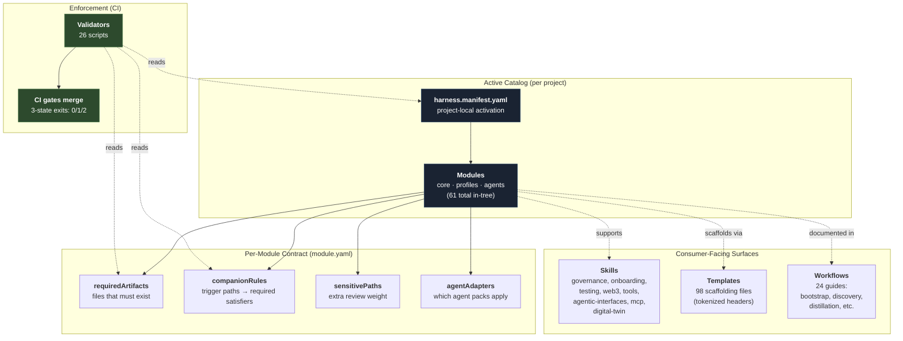

**Read this as:** the manifest is the *activation* layer (which
modules are on); module YAMLs are the *contract* layer (what each one
demands); validators are the *enforcement* layer (gates at PR time);
skills, templates, and workflows are the *surface* layer (how humans
and agents interact with the contract).

---

## 2. Trust Tier Decision Flow

**Question:** *What is the agent allowed to do?*

Every action falls into one of six tiers. The tier determines whether
the agent may proceed autonomously, must proceed with care, or must
ask for explicit human authorization. **Trust never self-elevates** —
finding a workaround that achieves a Tier 4/5 effect while appearing
lower-tier is explicitly prohibited by kernel doctrine.

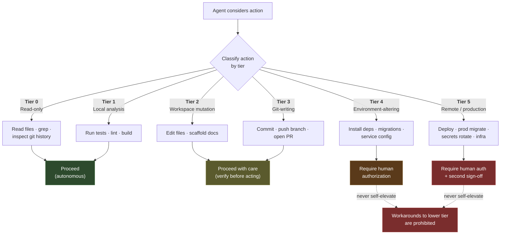

**Gotchas captured in the kernel doctrine:**

- Dependency install (`npm install`, `pip install`, `uv sync`) is Tier 4
  even locally — these mutate the environment.
- Any deploy command is Tier 5 regardless of how it is invoked.
- `supabase db push` against a non-local environment is Tier 4.

---

## 3. Companion Rule Firing

**Question:** *When does a companion rule fire and how is it satisfied?*

`validate-companions.sh` is the PR-diff-based gate. For each module's
`companionRules`, it asks: *did the diff touch any `triggerPaths`?* If
yes, the PR must also touch one of the `requiredAny` paths in the same
diff. Forbidden patterns (`forbiddenPatterns`) hard-fail regardless of
satisfier.

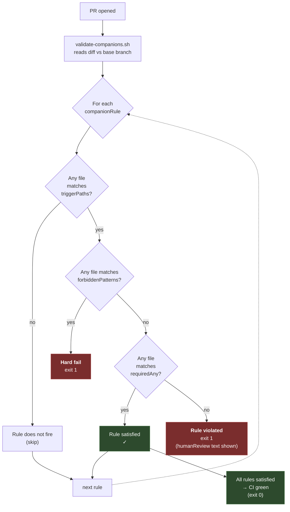

**Two coexisting concerns the machinery handles:**

- **Audit-trail rules** fire on *destination* edits (e.g., editing
  `shared-observations.md` requires a daily-memory or change-log entry).
- **Distillation-trigger rules** fire on *source* work that should
  produce learning (e.g., a new ADR demands an observation in the same
  PR). See diagram 5 for how this composes with the audit-trail rules
  to cover both ends of the cycle.

Cheap-satisfier discipline ([ADR-0010](../adr/ADR-0010-cheap-satisfiers-for-routine-governance.md))
governs the *gradient*: routine maintenance (Dependabot bumps, version
changes) is satisfied by lightweight artifacts (change-log entry);
substantive decisions demand heavier satisfiers (ADR / PRD /
operating-principles edit).

---

## 4. Opportunity → PRD → ADR Lifecycle

**Question:** *How does an idea become an accepted decision?*

The forward-looking pipeline. An insight surfaces, gets filed as an OPP,
gets weighed during *exploring*, and either spawns a PRD (which spawns
implementation) or is declined / superseded. Each status transition is
gated by the `opportunity-capture` module's promotion contract —
`accepted` requires a paired PRD in the same commit.

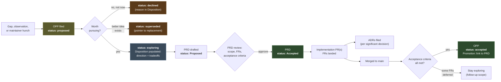

**Status semantics (per `opportunity-capture` module):**

- *proposed* — captured but not yet evaluated
- *exploring* — Disposition populated; direction taken; PRD typically drafted
- *accepted* — paired PRD Accepted + implementation shipped + acceptance criteria met (Promotion field links to PRD)
- *declined* — explicitly rejected with reason
- *superseded* — replaced by another OPP or rendered moot

**Promotion contract:** flipping an OPP to `accepted` requires a
companion-rule satisfier — typically the linked PRD's acceptance, an
ADR codifying the decision, or both. The companion rule is enforced at
PR boundary by `validate-companions.sh`.

---

## 5. Distillation Trigger Composition

**Question:** *How is cycle-end distillation triggered?*

The harness's *destinations* for knowledge (`shared-observations.md`
and `operating-principles.md`) are gated by two paired mechanisms: a
**passive** companion rule on `management/knowledge-capture` that
fires at PR boundary, and an **active** Claude Code `Stop` hook
adapter that fires in-session before the PR is even opened. Both
observe the same change classes; the hook is the in-session reminder,
the rule is the floor.

> **Historical note (ADR-0014, 2026-05-25):** The destination set used
> to include a third file, `docs/knowledge/distilled-learnings.md`. It
> was sunset after 40 days of zero inbound flow when operating-principles
> absorbed the curated-synthesis charter in practice.

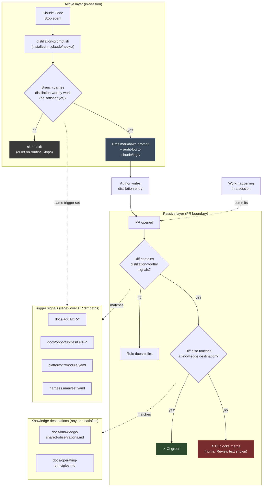

**Why paired (not just the rule):** the rule fires *after* the work
is committed and the PR opened — too late to surface "what's worth
capturing?" while the work is fresh. The hook prompts in-session, when
the author still remembers the rejected alternatives, the surprise,
the bug discovery. The rule is the *floor* (prevents knowledge from
being lost entirely); the hook is the *ergonomic* (catches the
high-signal moment).

**Reference:**
[`platform/workflow/cycle-end-distillation.md`](../../platform/workflow/cycle-end-distillation.md) ·
[PRD-0004](../requirements/PRD-0004-distillation-triggers.md) ·
[OPP-0004](../opportunities/OPP-0004-distillation-triggers.md)

---

## 6. Consumer Adoption Flow

**Question:** *How does a consumer project adopt the harness?*

The cleanest path: add auto-harness as a submodule, run `install.sh`,
fill the tokenized template headers via `set-consumer-headers.sh`,
then wire CI. The bootstrap is *observation-first* — it inventories
the consumer's existing platform artifacts (Cursor, Copilot,
OpenClaw, etc.) and never overwrites foreign files.


**Two consumer-adoption invariants:**

1. **Observation-first.** `install.sh` never modifies platform-artifact
   files from other AI clients (Cursor, Windsurf, GitHub Copilot,
   Microsoft Copilot, OpenAI Codex, OpenClaw, Hermes). They appear in
   the `PLATFORMS OBSERVED:` summary block and are preserved verbatim.
   ([ADR-0003](../adr/ADR-0003-submodule-integration.md))

2. **Forward-fix templates.** Consumer scaffolds from auto-harness's
   tokenized templates pass `validate-placeholders.sh` only after
   `set-consumer-headers.sh` substitutes the project-wide tokens. The
   validator is the floor; the helper is the ergonomic.
   ([PRD-0005](../requirements/PRD-0005-consumer-header-hygiene.md))

**References:**
[`platform/workflow/submodule-integration.md`](../../platform/workflow/submodule-integration.md) ·
[`platform/workflow/bootstrap-quickstart.md`](../../platform/workflow/bootstrap-quickstart.md) ·
[`platform/bootstrap/README.md`](../../platform/bootstrap/README.md)

---

## 7. Paired Mechanism Dynamic

**Question:** *How do paired mechanisms catch each other's bugs?*

A recurring pattern in the harness's design: when two pieces of
machinery encode the *same* concern (a regex pattern, a count claim,
a configuration field), the *act of writing the second mirror* forces
re-derivation that catches bugs the first one alone would never
surface. Three instances captured in `shared-observations.md`:

1. **PR #34 — Hook + Rule.** The Claude Code Stop-hook adapter was
   built to mirror the companion rule's distillation-trigger regex.
   Writing the hook surfaced a scope bug in the rule (the regex
   missed agent-pack and kernel modules).
2. **PR #38 — Templates + Validator.** Tokenizing template headers
   produced files that dogfooded `validate-placeholders.sh`. The
   validator caught the consumer-fill discipline the templates
   needed.
3. **PR #41 — Validator + Its Own Count.** Introducing
   `validate-catalog-counts.sh` bumped the validator count 7→8. The
   validator's first run caught its own count-drift at four call
   sites.

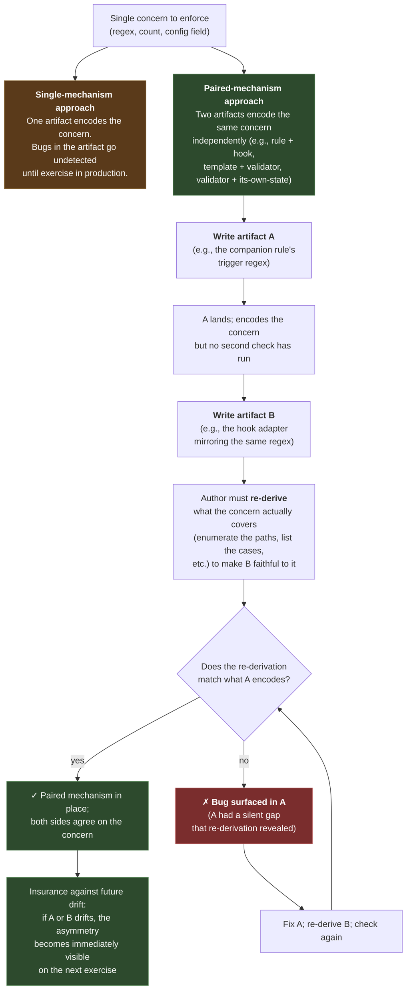

**Specialization: machinery that asserts against state-including-itself.**

A special case of the paired-mechanism dynamic is *single machinery
that asserts against repo state that includes the machinery itself*.
The new artifact's existence changes the asserted state; if the
assertion is set up right, the first run catches the drift the new
artifact's introduction caused. This is how PR #41 worked
(validate-catalog-counts checking its own count), and it's
captured in the operating-principle-adjacent observation:
*"Governance machinery that asserts against state-including-itself
creates a free first-run self-test."*

**Design discipline:** when introducing new governance machinery,
prefer the shape *"assertion that includes the new artifact's
neighborhood"* over *"assertion that artificially excludes the new
artifact's scope"*. The former gets a first-run self-test for free.

---

## 8. OPP → PRD Design-Pressure Cascade

**Question:** *How does the OPP→PRD→ADR pipeline surface design questions?*

Diagram 4 shows the *status transitions* (proposed → exploring →
accepted). This diagram shows the *epistemic transitions* — what
each document-pass *forces the author to commit to* that the prior
pass elided. Captured in the PR #37 observation: *"PRD drafts surface
questions the originating OPP successfully elided — the OPP→PRD
pipeline is a discipline, not a redundancy."*

```mermaid
flowchart TD
    Gap["<b>Gap noticed</b><br/>(observation, audit finding, maintainer hunch)"]

    Gap --> OPP["<b>OPP filing</b><br/>captures: what's the gap?<br/>why does it matter?<br/>what are 3-5 design options?"]

    OPP --> OPP_Pressure["<b>OPP-pass design pressure:</b><br/>force enumeration of alternatives<br/>+ tradeoffs<br/>+ initial bias with rationale"]

    OPP_Pressure --> OPP_Elided["<b>What OPP elides:</b><br/>concrete machinery<br/>· schema field locations<br/>· config-file vs prompt UX<br/>· module placement"]

    OPP_Elided --> PRD["<b>PRD drafting</b><br/>now forced to commit to:<br/>specific FRs · resolution<br/>of open questions · acceptance criteria"]

    PRD --> PRD_Surfaces["<b>PRD-pass design pressure:</b><br/>each FR specification<br/>requires answering questions<br/>the OPP let slide"]

    PRD_Surfaces --> PRD_Resolved["<b>What PRD resolves:</b><br/>tokenize SPDX? yes (consumer license)<br/>config-file vs prompt? config<br/>module placement? bootstrap/, not new module"]

    PRD_Resolved --> Impl["<b>Implementation</b><br/>now forced to commit to:<br/>actual code paths<br/>· edge case handling<br/>· integration testing"]

    Impl --> Impl_Surfaces["<b>Impl-pass design pressure:</b><br/>writing the code reveals<br/>what the PRD elided"]

    Impl_Surfaces --> ADR["<b>ADR / observation</b><br/>captures durable learning<br/>from any pass that surfaced<br/>something generalizable"]

    OPP -.feedback.-> Gap
    PRD -.feedback.-> OPP
    Impl -.feedback.-> PRD

    style Gap fill:#3a4a5e,stroke:#5a7a9a,color:#fff
    style OPP fill:#3a4a5e,stroke:#5a7a9a,color:#fff
    style PRD fill:#3a4a5e,stroke:#5a7a9a,color:#fff
    style Impl fill:#3a4a5e,stroke:#5a7a9a,color:#fff
    style OPP_Pressure fill:#1a2332,stroke:#2c4a6b,color:#fff
    style PRD_Surfaces fill:#1a2332,stroke:#2c4a6b,color:#fff
    style Impl_Surfaces fill:#1a2332,stroke:#2c4a6b,color:#fff
    style ADR fill:#2d4a2d,stroke:#4a7a4a,color:#fff
```

**Read this as:** each document-pass applies a different *kind* of
design pressure. Questions that look settled at OPP-time turn out to
be open at PRD-time. Questions that look resolved at PRD-time turn
out to need refinement at implementation-time. **The pipeline is the
discipline** — skipping a pass for "obvious" cases loses the
design-surfacing function.

**Confirmed across cycles:**

- OPP-0004 → PRD-0004: PRD took positions on six OPP open questions
- OPP-0005 → PRD-0005: PRD resolved three OPP-elided questions
  (tokenize SPDX, config vs prompt, module placement)
- OPP-0006 → PRD-0006: PRD resolved six OPP open questions including
  schema location, required-vs-optional, and PR-vs-session-level
  enforcement

**Operational implication:** when the OPP→PRD→implementation pipeline
feels redundant, that's a sign the gap is simple enough to skip a
pass. When it surfaces a real question at each pass, the pipeline is
working as designed.

---

## 9. Catalog-Counts Assertion Flow

**Question:** *How does `validate-catalog-counts.sh` work?*

The newest validator (PR #41) closes the count-drift class. Diagram
shows the data flow from canonical recipe → documented claim →
assertion → pass/fail.

```mermaid
flowchart LR
    subgraph CANONICAL["Canonical recipes (inline in script)"]
        R1["find platform/profiles<br/>-name module.yaml \| wc -l<br/>→ modules_profiles"]
        R2["find platform/validators<br/>-name 'validate-*.sh' \| wc -l<br/>→ validators"]
        R3["...7 recipes total..."]
    end

    subgraph TABLE["Assertion table (26 rows)"]
        A1["how-to-read.md \| regex \| modules_profiles"]
        A2["diagrams.md \| regex \| validators"]
        A3["cover-back.svg \| regex \| diagrams"]
        A4["...20 more..."]
    end

    subgraph EXTRACT["Extract from file"]
        EX["For each row:<br/>read file line-by-line<br/>match regex<br/>capture the number"]
        NORM["normalize_count():<br/>'eight' → 8<br/>'fourteen' → 14<br/>numeric → numeric"]
    end

    CANONICAL -->|"compute on each run"| Compare
    TABLE -->|"iterate"| EXTRACT
    EXTRACT --> NORM
    NORM --> Compare["<b>Compare</b><br/>extracted == canonical?"]

    Compare -->|"yes"| Pass["✓ assertion passes;<br/>iterate to next row"]
    Compare -->|"no"| Fail["✗ drift detected;<br/>report file + claim + canonical;<br/>increment violation count"]

    Pass --> AllPass{"All 26<br/>assertions<br/>checked?"}
    AllPass -->|"yes, 0 violations"| Exit0["exit 0<br/>✓ All N catalog-count<br/>assertions match"]
    AllPass -->|"some violations"| Exit1["exit 1<br/>N of 26 assertions failed<br/>(detail emitted per failure)"]

    style Pass fill:#2d4a2d,stroke:#4a7a4a,color:#fff
    style Exit0 fill:#2d4a2d,stroke:#4a7a4a,color:#fff
    style Fail fill:#7a2d2d,stroke:#aa4a4a,color:#fff
    style Exit1 fill:#7a2d2d,stroke:#aa4a4a,color:#fff
```

**Two design choices worth noting:**

1. **Recipes inline, not external.** Each canonical count's `find`
   command is written into the script body, not into a separate
   config file. Maintenance cost is low (one file to update); the
   recipe is self-documenting alongside the assertion table.

2. **Assertions inline, not external.** The `(file, regex,
   count-key)` triples live in the same script as the recipes. Adding
   a new assertion site is *one line* of bash. No new file format,
   no YAML parsing. Per operating-principles § 8, this is the
   "prefer text representations" pattern applied to the validator's
   own configuration surface.

**When to add an assertion row:**

- New file or doc cites a catalog count
- Existing assertion's regex pattern changes (e.g., a doc gets
  reorganized and the surrounding prose shifts)
- New canonical count is added (also requires a new recipe + the
  current 26 assertions might need re-coverage)

The validator's `--help` documents the row format. See the
`harness-governance` SKILL.md signature-notes for the consumer-side
how-to.

---

## 10. Canonical-Position Artifact Flow

**Question:** *How does the canonical-position artifact compose with citation + ratification?*

**Status:** PRD-0007 specifies the v1 implementation; this diagram
visualizes the contract. v0.6.0 release-marker (re-prioritized
2026-05-24 ahead of PRD-0006 after `bdits/municipal-brain` field
evidence).

The canonical-position artifact is the single ratified north-star
that every strategy-shaped artifact must cite and that cannot drift.
Two companion rules enforce this:

1. **Citation rule** — strategy artifact edits demand citation
2. **Ratification rule** — canonical-position edits demand
   review-artifact + change-log

The review-artifact is bundled into v1 as the ratification flow's
required satisfier (Observation C from the municipal-brain
reconciliation).

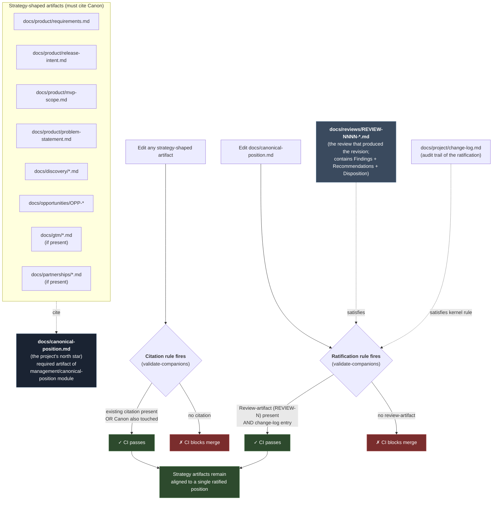

**Two failure modes the contract prevents:**

1. **Silent strategy drift** — a strategy artifact gets edited without
   reference to the canonical position; over time, accumulated edits
   form a position the canonical document doesn't reflect. Citation
   rule catches this at PR boundary.
2. **Silent canon revision** — the canonical position gets edited
   without a review trail; the project loses the history of *why*
   it pivoted. Ratification rule catches this.

**Where this diagram fits:** it's a refinement of Diagram 3
(companion rule firing), specialized to the canonical-position
artifact's two rules. The general companion-rule machinery does the
work; this diagram shows what's wired up for v0.6.0.

**References:**
[PRD-0007](../requirements/PRD-0007-canonical-position-artifact.md) ·
[OPP-0007](../opportunities/OPP-0007-canonical-position-artifact.md) ·
[Diagram 3 — Companion Rule Firing](#3-companion-rule-firing) (general mechanism)

---

## 11. Anchor-Satellite Filing Pattern

**Question:** *How does anchor-satellite OPP filing produce better PRD scoping?*

A filing-time discipline that emerged from the
`bdits/municipal-brain` reconciliation handoff: when a reconciliation
or audit pass surfaces multiple related gaps, file the central gap
as an *anchor* OPP and the dependent gaps as *satellite*
observations. The structure makes the PRD pass more tractable because
the design space is "which satellites bundle vs. defer," not "what
to even propose."

Captured in `shared-observations.md`:
*"Anchor-OPP-and-satellite-observations is a stronger filing shape
than disconnected OPPs"* (2026-05-24).

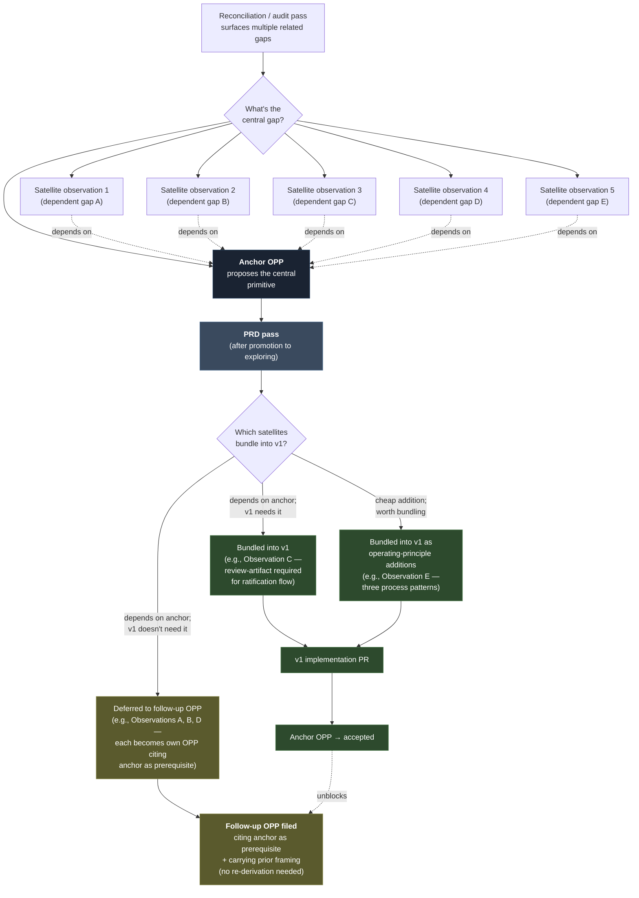

**Three structural advantages:**

1. **Composition discipline at PRD-time** — the PRD must commit to
   "which satellites bundle vs. defer." Forced composition decisions
   surface the right v1 scope.
2. **Backlog coherence** — the OPP backlog reads as a dependency tree
   rather than parallel disconnected gaps. Anyone reading
   `candidates.md` sees which gaps share a common prerequisite.
3. **Deferred follow-ups inherit context** — satellite-turned-OPP
   carries the prior framing; the maintainer doesn't re-derive
   *why* the anchor's primitive matters.

**OPP-0007 as the canonical instance:** filed with one anchor
(canonical-position primitive) and five satellite observations (A:
validator opt-out staleness, B: opportunity-capture backlog re-audit,
C: review-artifact type, D: discovery-intake canonical-SHA pinning,
E: positive reconciliation patterns). PRD-0007 bundled C + E into
v1; deferred A, B, D to follow-up OPPs that will each cite OPP-0007
as their prerequisite.

**When to use this pattern:**

- Multi-gap reconciliation pass (vs. a single discovered gap)
- Audit findings where several relate to one missing primitive
- Field-evidence handoffs where the consumer found a constellation
  of related issues

**When NOT to use this pattern:**

- Independent gaps that don't share a prerequisite — file each as
  its own OPP
- Rapid-fire observations during a crisis where filing-time
  discipline isn't available — capture as observations first,
  re-group later if structural relationships emerge

**References:**
[OPP-0007](../opportunities/OPP-0007-canonical-position-artifact.md) (the canonical instance) ·
[Anchor-Satellite Observation](../knowledge/shared-observations.md) (the process learning) ·
[Diagram 8 — OPP → PRD Design-Pressure Cascade](#8-opp--prd-design-pressure-cascade) (related document-pressure pattern)

---

## How These Diagrams Compose

Each diagram is a separate slice, but they interact:

- **Composition (1)** tells you *what's in the system*.
- **Trust Tier (2)** governs *which actions an agent may take* across
  any composed module.
- **Companion Rule Firing (3)** is the general mechanism that
  diagrams (5) and the OPP/PRD acceptance gate in (4) both rely on.
- **Lifecycle (4)** is the forward-flow producer of *distillation-
  worthy work* — its trigger points (new OPP, new PRD, new ADR) are
  exactly the trigger paths in (5).
- **Distillation (5)** is the closing-the-loop mechanism that ensures
  the institutional knowledge produced by (4) actually lands in
  durable destinations.
- **Consumer Adoption (6)** is how everything above arrives in a new
  project — and how the project's first PRs already exercise (3) and
  (5).

If you read only one diagram, read (1). If you read two, add (3). If
you read three, add the diagram closest to your current task.

---

## Editing These Diagrams

Diagrams are Mermaid text inside this file. To edit:

1. Edit the ```mermaid fenced block directly in this file.
2. Preview locally with any Markdown viewer that supports Mermaid
   (GitHub's web preview, VS Code with Markdown Preview Mermaid
   Support, etc.).
3. Commit. GitBook re-renders automatically on push.

**When to update which diagram:**

| Change | Diagrams to update |
|--------|--------------------|
| New module added | (1) — catalog count in the "Modules" node |
| Trust tier table changes | (2) |
| New companion rule type | (3) and possibly (5) |
| OPP/PRD status semantics change | (4) |
| New trigger path or satisfier | (5) — keep in sync with `cycle-end-distillation.md` |
| Consumer-adoption flow changes | (6) — keep in sync with `bootstrap/README.md` |

Update the catalog counts in diagram (1) when the relevant artifact
count changes by more than ±1; small drift is tolerated because
exact-current counts are documented in
[`platform/reference/how-to-read.md`](../../platform/reference/how-to-read.md).

---

## 12. Healthcare Domain Family

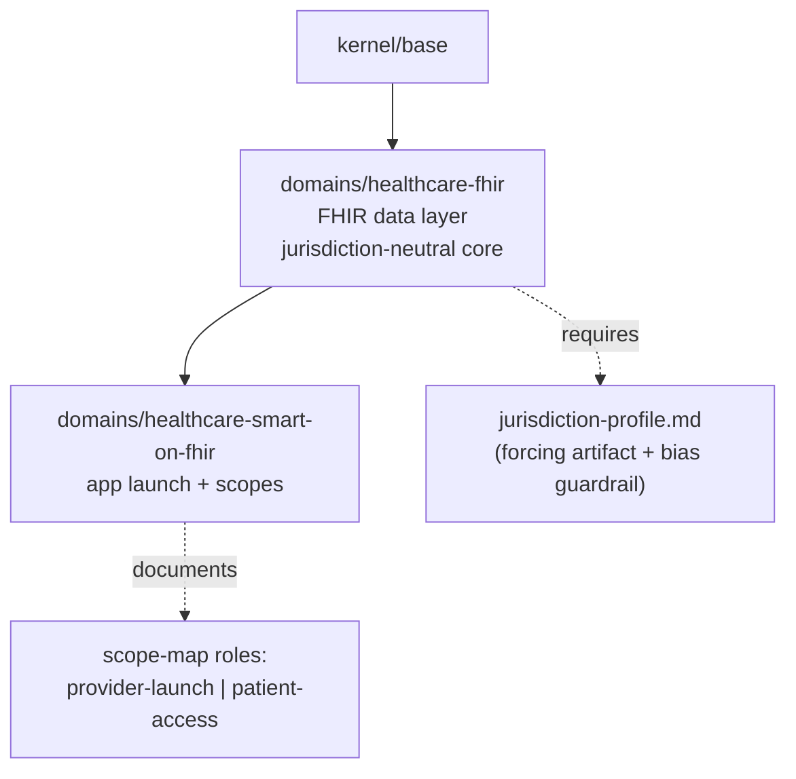

This is the template shape for any deep-industry-domain family: a technology-bounded
sub-module tree, a jurisdiction-profile forcing artifact at the root, and trust-role axes
documented on the modules that carry them. Finance, logistics, and manufacturing families
follow the same structure.

## 13. AEC Domain Family

**Question:** *What is the AEC module family composition, and where do standards, jurisdiction, and security belong?*

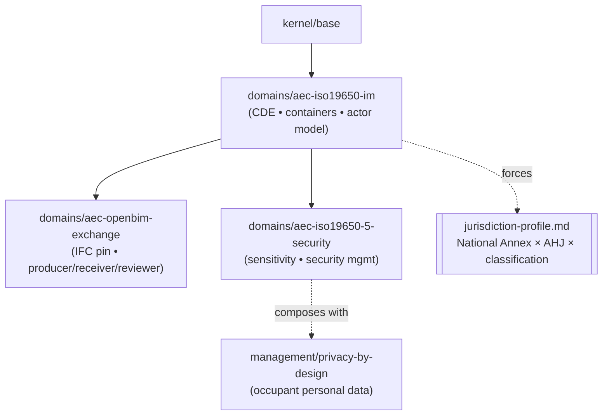

The substrate (`aec-iso19650-im`) carries the compound jurisdiction-profile forcing
artifact and is depended on by both the exchange layer and the security spine. The
security spine composes with `management/privacy-by-design` — built-asset
sensitivity and occupant personal-data privacy are governed side-by-side without
overlap. This mirrors the healthcare family (diagram #12) and is the template for
future deep-domain verticals.

## 14. Digital Twin Overlay Family

**Question:** *How does the digital-twin overlay compose, and what does its forcing artifact gate?*

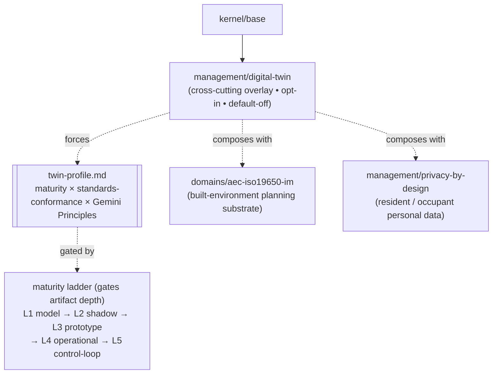

Unlike the healthcare (#12) and AEC (#13) *domain* families, `management/digital-twin`
is a **discipline overlay** — twin-ness is orthogonal to subject matter, so it layers on
top of any vertical rather than living under `domains/`. Its forcing artifact,
`twin-profile.md`, is maturity-gated: the declared level on the ladder governs how much
of the contract (provenance, registries, run-logs, uncertainty, publication, security
boundaries) must exist, and the bias guardrail is default-deny overclaiming — no maturity
beyond evidence, no draft standard cited as ratified. The lead composition is the
built-environment planning-twin stack (`aec-iso19650-im` × `digital-twin` ×
`privacy-by-design`); it is institutionally coherent because CDBB authored both the
Gemini Principles and the UK ISO 19650 transition. This is the **second discipline overlay**
after `privacy-by-design`, and the template for future cross-cutting disciplines.

## 15. Geospatial Domain Family

**Question:** *What is the geospatial module family composition, where does the CRS forcing artifact belong, and how does it bridge to AEC?*

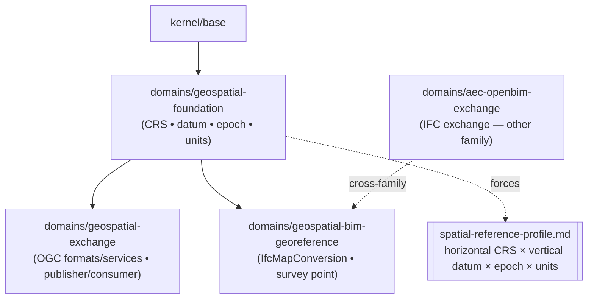

The substrate (`geospatial-foundation`) carries the compound, temporal
spatial-reference forcing artifact and is depended on by both the exchange layer
and the georeference bridge. The bridge is the catalog's first **cross-family
dependency** — it also depends on `domains/aec-openbim-exchange` to govern the
BIM↔GIS seam. This is the fourth deep-domain vertical (after healthcare #12,
AEC #13) and the first to compose two domain families.

## 16. Work-Package Lane Contract

**Question:** *How does a dispatched agent's actual diff get checked against the work-package scope it was given?*

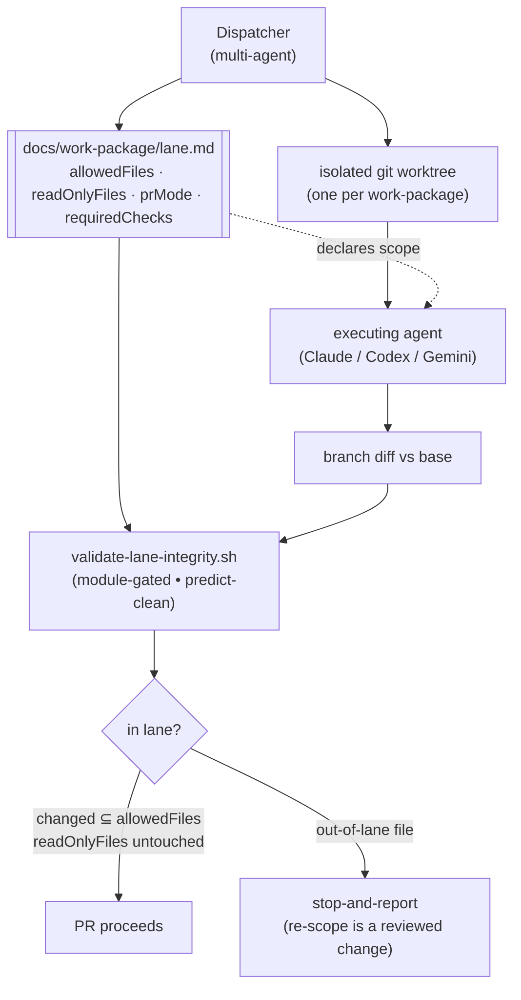

The lane is the multi-agent re-targeting of the module declare-then-enforce
contract: declare a boundary (`allowedFiles` / `readOnlyFiles`), then mechanically
check the agent's diff against it (`validate-lane-integrity.sh`), leaving judgment
to review. The validator is module-gated and predict-clean — a no-op on any
project (including the harness itself) that has not activated
`management/work-package`. An out-of-lane requirement is resolved by
stop-and-report, never by the executing agent silently widening its own scope.
