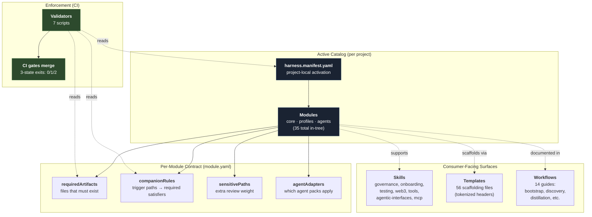
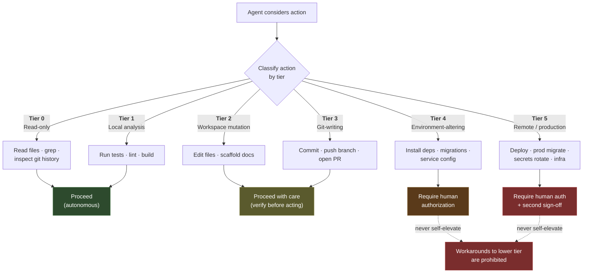
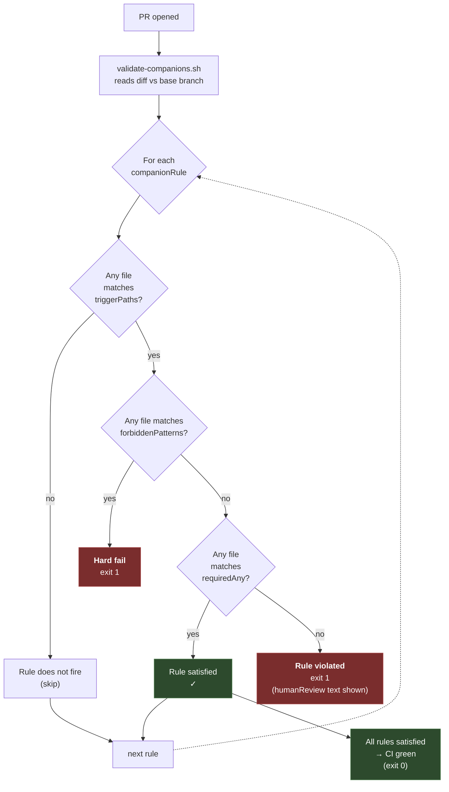
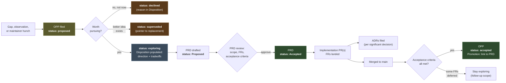
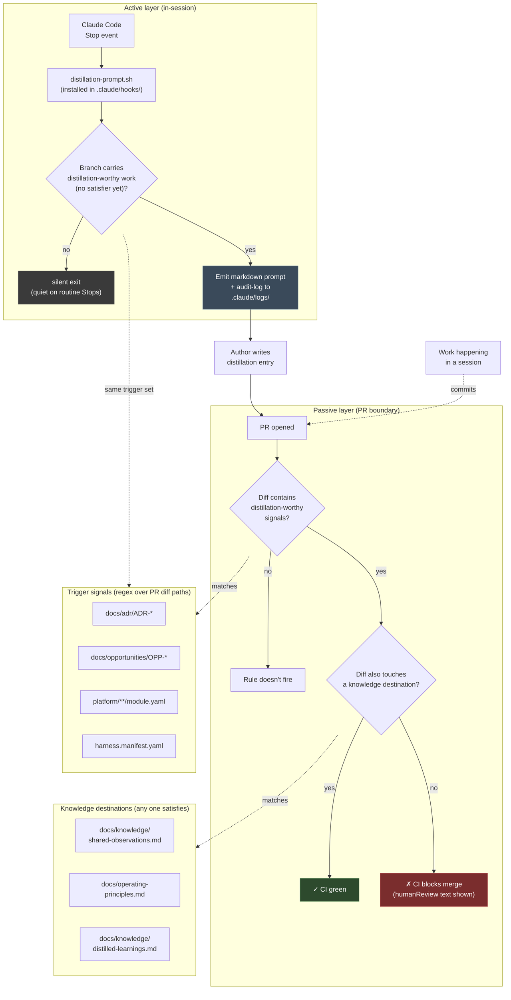
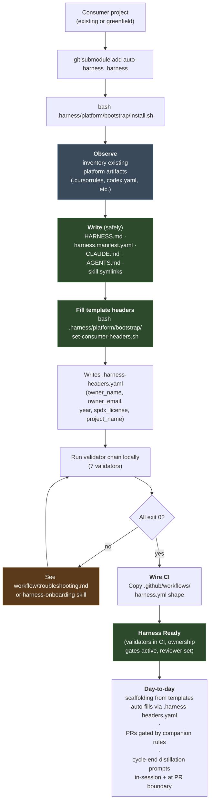

<!--
Copyright 2026 Nate DiNiro <UncleNate@gmail.com>
SPDX-License-Identifier: MIT OR Apache-2.0
Part of auto-harness — see LICENSE-MIT and LICENSE-APACHE at repository root.
-->

# Architecture Diagrams — Composition, Flows, and Decision Paths

This page is the visual reference for **how auto-harness is composed and
how governance flows through it**. Each diagram is the canonical picture
for one slice of the system; individual docs link back here when they
need the picture in context.

> **Source format.** Diagrams are written in Mermaid. GitBook renders
> them natively in the published book; GitHub renders them in the
> repository view. Edit a diagram by editing the Mermaid block in this
> file — there is no separate image to regenerate.

Six diagrams below, grouped by what they answer:

| # | Question the diagram answers | Section |
|---|------------------------------|---------|
| 1 | *How are the pieces composed?* | [Component Composition](#1-component-composition) |
| 2 | *What is the agent allowed to do?* | [Trust Tier Decision Flow](#2-trust-tier-decision-flow) |
| 3 | *When does a companion rule fire and how is it satisfied?* | [Companion Rule Firing](#3-companion-rule-firing) |
| 4 | *How does an idea become an accepted decision?* | [Opportunity → PRD → ADR Lifecycle](#4-opportunity--prd--adr-lifecycle) |
| 5 | *How is cycle-end distillation triggered?* | [Distillation Trigger Composition](#5-distillation-trigger-composition) |
| 6 | *How does a consumer project adopt the harness?* | [Consumer Adoption Flow](#6-consumer-adoption-flow) |

---

## 1. Component Composition

**Question:** *How are the pieces composed?*

The `harness.manifest.yaml` file is the project-local activation
record — it names which modules are in play. Each module's
`module.yaml` declares its required artifacts, companion rules,
sensitive paths, and agent adapters. Validators read both layers at PR
time and gate the merge. Skills, templates, and workflows are
consumer-facing surfaces — *supporting* the contract, not enforcing it.



**Read this as:** the manifest is the *activation* layer (which
modules are on); module YAMLs are the *contract* layer (what each one
demands); validators are the *enforcement* layer (gates at PR time);
skills, templates, and workflows are the *surface* layer (how humans
and agents interact with the contract).

---

## 2. Trust Tier Decision Flow

**Question:** *What is the agent allowed to do?*

Every action falls into one of six tiers. The tier determines whether
the agent may proceed autonomously, must proceed with care, or must
ask for explicit human authorization. **Trust never self-elevates** —
finding a workaround that achieves a Tier 4/5 effect while appearing
lower-tier is explicitly prohibited by kernel doctrine.



**Gotchas captured in the kernel doctrine:**

- Dependency install (`npm install`, `pip install`, `uv sync`) is Tier 4
  even locally — these mutate the environment.
- Any deploy command is Tier 5 regardless of how it is invoked.
- `supabase db push` against a non-local environment is Tier 4.

---

## 3. Companion Rule Firing

**Question:** *When does a companion rule fire and how is it satisfied?*

`validate-companions.sh` is the PR-diff-based gate. For each module's
`companionRules`, it asks: *did the diff touch any `triggerPaths`?* If
yes, the PR must also touch one of the `requiredAny` paths in the same
diff. Forbidden patterns (`forbiddenPatterns`) hard-fail regardless of
satisfier.



**Two coexisting concerns the machinery handles:**

- **Audit-trail rules** fire on *destination* edits (e.g., editing
  `shared-observations.md` requires a daily-memory or change-log entry).
- **Distillation-trigger rules** fire on *source* work that should
  produce learning (e.g., a new ADR demands an observation in the same
  PR). See diagram 5 for how this composes with the audit-trail rules
  to cover both ends of the cycle.

Cheap-satisfier discipline ([ADR-0010](../adr/ADR-0010-cheap-satisfiers-for-routine-governance.md))
governs the *gradient*: routine maintenance (Dependabot bumps, version
changes) is satisfied by lightweight artifacts (change-log entry);
substantive decisions demand heavier satisfiers (ADR / PRD /
operating-principles edit).

---

## 4. Opportunity → PRD → ADR Lifecycle

**Question:** *How does an idea become an accepted decision?*

The forward-looking pipeline. An insight surfaces, gets filed as an OPP,
gets weighed during *exploring*, and either spawns a PRD (which spawns
implementation) or is declined / superseded. Each status transition is
gated by the `opportunity-capture` module's promotion contract —
`accepted` requires a paired PRD in the same commit.



**Status semantics (per `opportunity-capture` module):**

- *proposed* — captured but not yet evaluated
- *exploring* — Disposition populated; direction taken; PRD typically drafted
- *accepted* — paired PRD Accepted + implementation shipped + acceptance criteria met (Promotion field links to PRD)
- *declined* — explicitly rejected with reason
- *superseded* — replaced by another OPP or rendered moot

**Promotion contract:** flipping an OPP to `accepted` requires a
companion-rule satisfier — typically the linked PRD's acceptance, an
ADR codifying the decision, or both. The companion rule is enforced at
PR boundary by `validate-companions.sh`.

---

## 5. Distillation Trigger Composition

**Question:** *How is cycle-end distillation triggered?*

The harness's *destinations* for knowledge (`shared-observations.md`,
`operating-principles.md`, `distilled-learnings.md`) are gated by two
paired mechanisms: a **passive** companion rule on
`management/knowledge-capture` that fires at PR boundary, and an
**active** Claude Code `Stop` hook adapter that fires in-session
before the PR is even opened. Both observe the same change classes;
the hook is the in-session reminder, the rule is the floor.



**Why paired (not just the rule):** the rule fires *after* the work
is committed and the PR opened — too late to surface "what's worth
capturing?" while the work is fresh. The hook prompts in-session, when
the author still remembers the rejected alternatives, the surprise,
the bug discovery. The rule is the *floor* (prevents knowledge from
being lost entirely); the hook is the *ergonomic* (catches the
high-signal moment).

**Reference:**
[`platform/workflow/cycle-end-distillation.md`](../../platform/workflow/cycle-end-distillation.md) ·
[PRD-0004](../requirements/PRD-0004-distillation-triggers.md) ·
[OPP-0004](../opportunities/OPP-0004-distillation-triggers.md)

---

## 6. Consumer Adoption Flow

**Question:** *How does a consumer project adopt the harness?*

The cleanest path: add auto-harness as a submodule, run `install.sh`,
fill the tokenized template headers via `set-consumer-headers.sh`,
then wire CI. The bootstrap is *observation-first* — it inventories
the consumer's existing platform artifacts (Cursor, Copilot,
OpenClaw, etc.) and never overwrites foreign files.



**Two consumer-adoption invariants:**

1. **Observation-first.** `install.sh` never modifies platform-artifact
   files from other AI clients (Cursor, Windsurf, GitHub Copilot,
   Microsoft Copilot, OpenAI Codex, OpenClaw, Hermes). They appear in
   the `PLATFORMS OBSERVED:` summary block and are preserved verbatim.
   ([ADR-0003](../adr/ADR-0003-submodule-integration.md))

2. **Forward-fix templates.** Consumer scaffolds from auto-harness's
   tokenized templates pass `validate-placeholders.sh` only after
   `set-consumer-headers.sh` substitutes the project-wide tokens. The
   validator is the floor; the helper is the ergonomic.
   ([PRD-0005](../requirements/PRD-0005-consumer-header-hygiene.md))

**References:**
[`platform/workflow/submodule-integration.md`](../../platform/workflow/submodule-integration.md) ·
[`platform/workflow/bootstrap-quickstart.md`](../../platform/workflow/bootstrap-quickstart.md) ·
[`platform/bootstrap/README.md`](../../platform/bootstrap/README.md)

---

## How These Diagrams Compose

Each diagram is a separate slice, but they interact:

- **Composition (1)** tells you *what's in the system*.
- **Trust Tier (2)** governs *which actions an agent may take* across
  any composed module.
- **Companion Rule Firing (3)** is the general mechanism that
  diagrams (5) and the OPP/PRD acceptance gate in (4) both rely on.
- **Lifecycle (4)** is the forward-flow producer of *distillation-
  worthy work* — its trigger points (new OPP, new PRD, new ADR) are
  exactly the trigger paths in (5).
- **Distillation (5)** is the closing-the-loop mechanism that ensures
  the institutional knowledge produced by (4) actually lands in
  durable destinations.
- **Consumer Adoption (6)** is how everything above arrives in a new
  project — and how the project's first PRs already exercise (3) and
  (5).

If you read only one diagram, read (1). If you read two, add (3). If
you read three, add the diagram closest to your current task.

---

## Editing These Diagrams

Diagrams are Mermaid text inside this file. To edit:

1. Edit the ```mermaid fenced block directly in this file.
2. Preview locally with any Markdown viewer that supports Mermaid
   (GitHub's web preview, VS Code with Markdown Preview Mermaid
   Support, etc.).
3. Commit. GitBook re-renders automatically on push.

**When to update which diagram:**

| Change | Diagrams to update |
|--------|--------------------|
| New module added | (1) — catalog count in the "Modules" node |
| Trust tier table changes | (2) |
| New companion rule type | (3) and possibly (5) |
| OPP/PRD status semantics change | (4) |
| New trigger path or satisfier | (5) — keep in sync with `cycle-end-distillation.md` |
| Consumer-adoption flow changes | (6) — keep in sync with `bootstrap/README.md` |

Update the catalog counts in diagram (1) when the relevant artifact
count changes by more than ±1; small drift is tolerated because
exact-current counts are documented in
[`platform/reference/how-to-read.md`](../../platform/reference/how-to-read.md).
