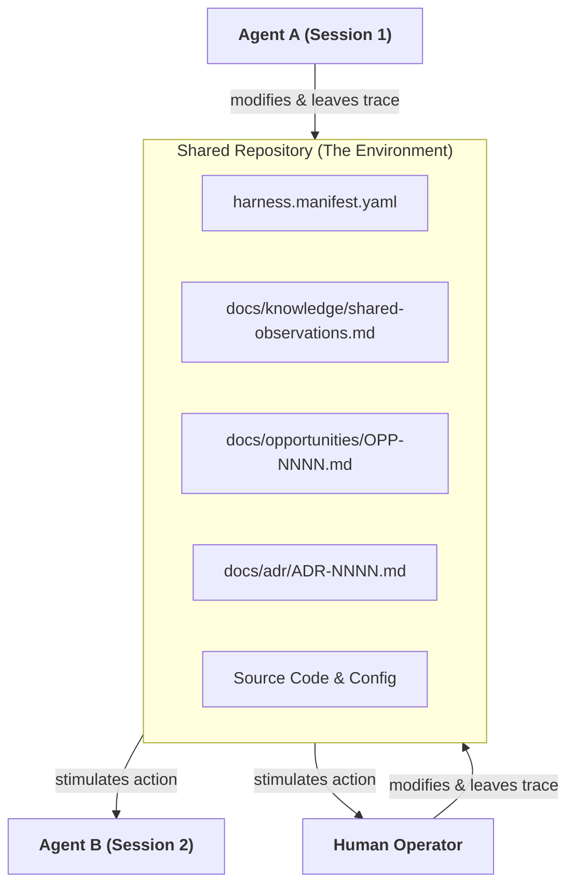
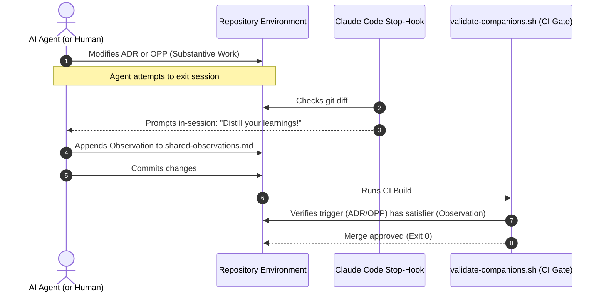

<!--
Copyright 2026 Nate DiNiro <UncleNate@gmail.com>
SPDX-License-Identifier: MIT OR Apache-2.0
Part of auto-harness — see LICENSE-MIT and LICENSE-APACHE at repository root.
-->

# Stigmergic Coordination Model — Indirect Multi-Agent Collaboration

This document explains the **stigmergic nature of auto-harness**. Stigmergy is the mechanism of indirect coordination where actions leave traces in the environment that stimulate subsequent actions. In auto-harness, this is not just an abstract concept—it is the core coordination paradigm that allows humans and multiple AI agents to work together without centralized orchestration or direct communication.

---

## 1. What is Stigmergy?

The term **stigmergy** comes from the Greek words *stigma* (mark/sign) and *ergon* (work)—essentially meaning **"work-driven by signs."**

* **Classical Example:** Termites building a mound do not follow a master architect or communicate directly. A termite drops a mud pellet laced with pheromones. The higher concentration of pheromones at that spot stimulates other termites to drop their mud pellets there. Over time, complex pillars, arches, and chambers emerge.
* **Software Example:** Wikipedia or open-source repositories. A contributor leaves a draft or code (the trace). Another contributor sees the state of the repository (the environment) and edits it (the action), gradually building a coherent structure without central management.

In the context of AI-assisted engineering, **auto-harness elevates this mechanism to coordinate agents and humans.**

---

## 2. The Repository as the Stigmergic Environment

In typical multi-agent systems, agents coordinate via message passing (direct APIs, orchestrator nodes, or message buses). This creates:

1. **Context Bloat:** Agents must parse logs of prior interactions.
2. **Synchronization Bottlenecks:** Agents must wait for each other's responses.
3. **Fragility:** If an agent fails mid-run, its context is lost.

**Auto-harness rejects direct coordination in favor of stigmergy.** The repository itself (code, configuration, and documentation) is the only environment. Agents do not talk to each other; they read and modify the repository.

---

## 3. Pheromones and Traces in auto-harness

Every governance artifact in auto-harness acts as a "pheromone trail" guiding subsequent work:

### A. OPP Status (Pheromone Intensity)

* **The Mark:** An opportunity is filed under `docs/opportunities/OPP-NNNN-slug.md` with status `proposed`.
* **The Stimulation:** A triage agent or human inspects the backlog. Seeing the `proposed` trace, they investigate it and update the status to `exploring`, adding options and tradeoffs in the `Disposition` field.
* **The Follow-up:** A subsequent implementation agent reads the `exploring` status, writes a PRD/ADR, implements the capability, and flips the OPP to `accepted`.

### B. Shared Observations (Longitudinal Memory)

* **The Mark:** During cycle-end distillation, an agent appends a structured observation to `docs/knowledge/shared-observations.md` describing a convention drift (e.g., "word-form counts in README files are prone to drift").
* **The Stimulation:** A subsequent agent starting a new session reads `shared-observations.md`. Recognizing the pattern of drift, the agent is stimulated to write `validate-catalog-counts.sh` to mechanize the count check.

### C. Catalog Totals (System Pressure)

* **The Mark:** Adding a new diagram increments the actual diagram count, causing `validate-catalog-counts.sh` to fail because the prose count in `HARNESS.md` now disagrees with reality.
* **The Stimulation:** The broken validator (an environmental block) stimulates the agent to update the entrypoint prose in the same change-class commit, keeping documentation clean.

---

## 4. Forced Traces: Gating the Feedback Loop

For stigmergy to work, individuals must be reliable in leaving traces. In biology, chemical synthesis is automatic. In software engineering, **auto-harness uses validators and hooks to force the creation of traces.**

1. **Companion Rules (Passive Enforcement):** If an agent modifies a trigger path (like a manifest or an ADR), `validate-companions.sh` enforces that a satisfier path (like `shared-observations.md` or `change-log.md`) is also modified. The agent *cannot* commit code without leaving a trace.
2. **In-Session Hooks (Active Prompting):** The `distillation-prompt.sh` hook runs before commits are finalized, reminding the agent to capture the trace while it is fresh in context.
3. **Structured-Agent-Ledger Gates (Shape Enforcement):** Forcing a trace to *exist* is not the same as forcing it to be *well-formed*. A **structured-agent-ledger gate** is a validator that lints each newly-added record in an append-only, agent-emitted ledger against a declared schema — diff-based against the base branch (history is grandfathered), BLOCK posture, module-gated. Two instances run this pattern on two different ledgers:
   * **`validate-observation-hygiene.sh`** (the *knowledge* ledger) — lints each observation added to `shared-observations.md` against the ADR-0002 six-field shape (both enums, an ISO-dated attribution). Without it, companion rules force a trace to exist and connect but never guard its shape, and a ratified schema drifts (PRD-0034 / OPP-0053).
   * **`validate-coordination-verdicts.sh`** (the *verdict* ledger) — lints each cross-provider review verdict against the coordination schema so an adjudicating core can tally them (OPP-0052).

   The two are the same species retargeted onto two seams; the reuse is a **named convention, not shared code** — separate module homes (`management/knowledge-capture` vs. `management/coordination`), because a Markdown field-parser and a JSON schema-validator barely overlap. Naming the species here is the reconciliation: recognizing that shape-enforcement on an agent ledger is a reusable move, applied concretely twice rather than abstracted prematurely.

---

## 5. Architectural Benefits for Multi-Agent Fleets

By anchoring coordination in the repository environment rather than agent-to-agent communication, the harness enables high-performance collaboration:

| Benefit | How it works | Impact |
| --- | --- | --- |
| **Context Efficiency** | Agents do not need to read transcripts of other agents' runs. They inspect the on-disk repository state (ADRs, PRDs, observations). | Minimizes token usage and eliminates context-window exhaustion. |
| **Concurrency & Replayability** | Multiple agents can work on independent lanes (work-packages) and synchronize their results via git merges and validators. | Enables parallel development safely. |
| **Zero Orchestration Overhead** | Coordination is emergent. The environment itself governs what is allowed and what needs to be done. | Eliminates the need for a complex, stateful orchestrator. |
| **Human-in-the-Loop Integration** | Humans interact with the same environment (reading/writing ADRs, PRDs, observations), seamlessly blending with agent behavior. | Promotes hybrid human-agent teamwork. |

---

## 6. Summary: Stigmergy as the Core Strength

Traditional software development governance assumes human-centric, synchronous processes (meetings, slack threads, direct chats). auto-harness is built on the realization that **in an agent-dense future, coordination must be asynchronous, decentralized, and environmental.**

By turning the repository into a self-enforcing, stigmergic medium, auto-harness ensures that every action leaves a structured mark, and every mark guides the next action. The result is a coherent, high-integrity system that evolves safely at the speed of inference.
