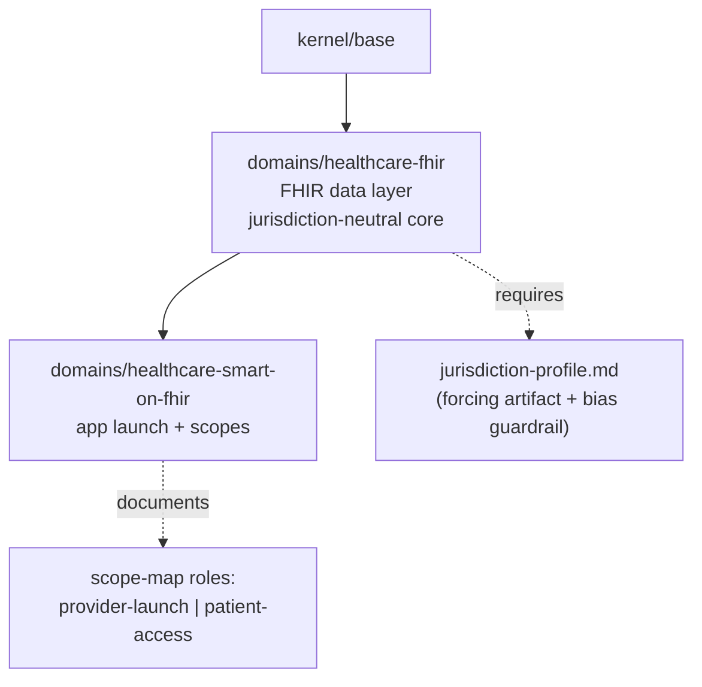

<!--
Copyright 2026 Nate DiNiro <UncleNate@gmail.com>
SPDX-License-Identifier: MIT OR Apache-2.0
Part of auto-harness — see LICENSE-MIT and LICENSE-APACHE at repository root.
-->

# Healthcare Wedge (FHIR + SMART on FHIR) Implementation Plan

> **For agentic workers:** REQUIRED SUB-SKILL: Use superpowers:subagent-driven-development (recommended) or superpowers:executing-plans to implement this plan task-by-task. Steps use checkbox (`- [ ]`) syntax for tracking.

**Goal:** Ship the first deep-industry-domain wedge — two catalog domain modules (`domains/healthcare-fhir` + `domains/healthcare-smart-on-fhir`) with a jurisdiction-neutral core, a forcing `jurisdiction-profile.md` artifact, a reusable bias guardrail, and SMART's two trust roles modeled as a documented axis.

**Architecture:** Two governance overlays under `platform/profiles/domains/`. `healthcare-smart-on-fhir` depends on `healthcare-fhir` (intra-family composition, like `supabase` → `relational-postgres`). Modules are markdown + YAML; the 14-validator suite is the test harness. Work splits into two PRs: a design-only PR (PRD-0017 + OPP-0013 disposition) and an implementation PR (modules, templates, docs, visualization, count propagation, sample composition).

**Tech Stack:** YAML module definitions, markdown governance docs, bash validators (`platform/validators/validate-*.sh`), Ruby validator library, GitBook/markdownlint CI.

**Source spec:** `docs/superpowers/specs/2026-06-01-deep-industry-domains-healthcare-wedge-design.md`

---

## Conventions every task must follow

- **Attribution:** all SPDX headers use `Nate DiNiro <UncleNate@gmail.com>` (NOT the work email).
- **Module/template files live under `platform/`** → exempt from the placeholder validator (`.placeholder-ignore` has `platform/**`). They use the `[[TOKEN]]` convention freely.
- **PRD + OPP files live under `docs/`** → NOT exempt. Use the real date `2026-06-01`; never write a bare `YYYY-MM-DD` or unfilled `[[TOKEN]]` in them.
- **Validator run (planning-folder caveat):** the untracked `documentation-audit-2026-05-27/` folder pollutes `validate-placeholders.sh` and `validate-doc-references.sh`. Before running the suite, stash it: `mv documentation-audit-2026-05-27 /tmp/au-stash && <run> ; mv /tmp/au-stash documentation-audit-2026-05-27`.
- **Full suite command** (used repeatedly below — call it `RUN_VALIDATORS`):

```bash
mv documentation-audit-2026-05-27 /tmp/au-stash 2>/dev/null
for v in manifest module-graph required-artifacts placeholders agent-pack companions \
         doc-references catalog-counts list-completeness trust-tier sensitive-paths \
         knowledge-redaction skill-content sast-coverage; do
  "platform/validators/validate-$v.sh" >/dev/null 2>&1 && echo "$v OK" || echo "$v FAIL"
done
mv /tmp/au-stash documentation-audit-2026-05-27 2>/dev/null
```

- **Git base:** branch off `main` (PR #87 / Wave 4.2 is independent). New module READMEs follow the Wave 4.2 standardized shape (H1 `# Domain Overlay: <Name>`, a `**Depends on:** … / **Conflicts with:** …` callout under the H1, a `## See Also` footer).

---

# PHASE 1 — Design contract (design-only PR)

Branch: `deep-domains-healthcare-prd`. Produces PRD-0017 + OPP-0013 disposition update. No modules yet.

### Task 1: Author PRD-0017

**Files:**
- Create: `docs/requirements/PRD-0017-healthcare-fhir-smart-wedge.md`

- [ ] **Step 1: Read the PRD template and one recent PRD for shape**

Run: `sed -n '1,60p' platform/templates/product/prd.md` and `sed -n '1,40p' docs/requirements/PRD-0016-security-static-analysis-module.md`
Purpose: match the exact section order, the `**Status:**` line format, and the §10 Claim Classification block convention.

- [ ] **Step 2: Write the PRD file**

Create `docs/requirements/PRD-0017-healthcare-fhir-smart-wedge.md` with this content (fill the body sections following PRD-0016's structure; the header and the load-bearing blocks are fixed):

```markdown
<!--
Copyright 2026 Nate DiNiro <UncleNate@gmail.com>
SPDX-License-Identifier: MIT OR Apache-2.0
Part of auto-harness — see LICENSE-MIT and LICENSE-APACHE at repository root.
-->

# PRD-0017 — Healthcare FHIR + SMART-on-FHIR Wedge

**Status:** Proposed
**Owner:** @unclenate
**Last Updated:** 2026-06-01
**Origin:** OPP-0013 (healthcare domain family — partial promotion: the FHIR + SMART-on-FHIR sub-modules)
**Design context:** docs/superpowers/specs/2026-06-01-deep-industry-domains-healthcare-wedge-design.md

## Problem

The harness has no `domains/healthcare-*` coverage. Two grounded consumers exist:
OpenEMR (provider/server-launch role) and Tula (patient-authorized-client role).
The slice exercised by both is FHIR (data layer) + SMART on FHIR (app launch + scopes),
which is where the trust-role and global-jurisdiction questions concentrate.

## Goals / Non-Goals

(Goals: two modules, jurisdiction-neutral core + forcing artifact, role-as-axis,
discoverability fixes. Non-Goals: the other 10 OPP-0013 sub-modules; OPP-0022 patient
agent-safety overlay; the abstract framework operating-principle — harvested later.)

## Must-Have Requirements

- M1: `domains/healthcare-fhir` module (dependsOn kernel/base) with required artifacts
  `docs/healthcare/fhir-resource-map.md` and `docs/healthcare/jurisdiction-profile.md`.
- M2: `domains/healthcare-smart-on-fhir` module (dependsOn kernel/base, healthcare-fhir)
  with required artifact `docs/healthcare/smart-scope-map.md` (provider-launch +
  patient-access sections + trust-model note).
- M3: `platform/templates/healthcare/` with three templates, including the bias guardrail
  in `jurisdiction-profile.md`.
- M4: discoverability — SUMMARY.md, catalog README, harness-onboarding skill, diagrams.md.

## Should-Have Requirements

- S1: a sample composition activating both modules.

## §10 Claim Classification

| Claim | Class | Mechanism |
|-------|-------|-----------|
| Required artifacts exist when module is active | Enforced | validate-required-artifacts.sh |
| Sensitive-path edits pair with governance doc | Enforced | validate-companions.sh |
| Jurisdiction is declared, never assumed | Asserted-only | review gate + bias guardrail text |
| Provider/patient scope boundary respected | Asserted-only | review gate (humanReview) |

## Verification

- All 14 validators green with both modules on disk.
- A sample composition activates both modules and validates clean.

## Open Questions

- Exact sensitive-path regexes (validated against OpenEMR + Tula trees at implementation).
- Sample artifact as composition vs full sample-project.
```

- [ ] **Step 3: Add the list-completeness catalog row for the PRD**

`validate-list-completeness.sh` requires every `docs/requirements/PRD-NNNN-*.md` to have a row in `docs/README.md`. Open `docs/README.md`, find the PRD list/table (search `PRD-0016`), and add immediately after it:

```markdown
| [PRD-0017](requirements/PRD-0017-healthcare-fhir-smart-wedge.md) | Healthcare FHIR + SMART-on-FHIR wedge | Proposed |
```

(Match the exact column shape of the existing PRD rows — copy the PRD-0016 row and edit.)

- [ ] **Step 4: Run list-completeness — expect PASS**

Run: `platform/validators/validate-list-completeness.sh` → Expected: exit 0. If it reports PRD-0017 missing, the row column shape doesn't match; fix to mirror PRD-0016's row exactly.

- [ ] **Step 5: Run RUN_VALIDATORS — expect all 14 OK**

If `placeholders` FAILs, scan the PRD for a bare `YYYY-MM-DD` or unfilled `[[TOKEN]]` and replace with real content.

- [ ] **Step 6: markdownlint the new + changed files**

Run (planning folder stashed): `mv documentation-audit-2026-05-27 /tmp/au-stash; npx --no-install markdownlint-cli2 'docs/requirements/PRD-0017-*.md' 'docs/README.md'; mv /tmp/au-stash documentation-audit-2026-05-27`
Expected: `0 error(s)`. Watch the soft-wrap-`+` MD004 trap: never start a wrapped prose line with `+ `.

- [ ] **Step 7: Commit**

```bash
git add docs/requirements/PRD-0017-healthcare-fhir-smart-wedge.md docs/README.md
git commit -m "[Healthcare wedge PRD] PRD-0017 — FHIR + SMART-on-FHIR (design-only)"
```

### Task 2: Update OPP-0013 disposition to partially-accepted

**Files:**
- Modify: `docs/opportunities/OPP-0013-domain-family-healthcare-decomposed.md` (Status line + Disposition + Promotion sections)
- Modify: `docs/opportunities/candidates.md` (status annotation)

- [ ] **Step 1: Change the Status line**

In `OPP-0013-…md`, change `**Status:** proposed` to:

```markdown
**Status:** partially-accepted
```

- [ ] **Step 2: Fill the Disposition section**

Replace the `<!-- Empty: status is proposed -->` under `## Disposition` with:

```markdown
**Partially accepted 2026-06-01.** The two role-spanning sub-modules —
`domains/healthcare-fhir` and `domains/healthcare-smart-on-fhir` — are promoted to a v1
wedge (see PRD-0017). The remaining ten sub-modules (hl7v2, ccda, ePrescribing, cdr, cqm,
phi-encryption, audit-log, direct-messaging, ehi-export, patient-portal) stay `proposed`
pending consumer demand. The patient-facing agent-safety surface remains OPP-0022.
```

- [ ] **Step 3: Fill the Promotion section**

Replace the `<!-- Empty: not yet accepted -->` under `## Promotion` with:

```markdown
Promoted sub-modules: `domains/healthcare-fhir`, `domains/healthcare-smart-on-fhir`
(PRD-0017, 2026-06-01). Decomposition pattern + jurisdiction-profile forcing artifact +
bias guardrail are slated for harvest into an operating-principle in a later pass.
```

- [ ] **Step 4: Update the candidates.md annotation**

In `docs/opportunities/candidates.md`, find the `OPP-0013` line item and change its `(proposed 2026-05-24)` annotation to `(partially-accepted 2026-06-01; PRD-0017; fhir + smart-on-fhir promoted)`.

- [ ] **Step 5: Run companions + list-completeness — expect PASS**

Run: `platform/validators/validate-companions.sh && platform/validators/validate-list-completeness.sh`
Expected: both exit 0. Note: editing an OPP record triggers the opportunity-capture companion rule requiring an audit-trail entry — the change-log entry in Step 6 satisfies it.

- [ ] **Step 6: Add a change-log entry**

Prepend to `docs/project/change-log.md` (after the intro `---`):

```markdown
## OPP-0013 partial promotion — healthcare FHIR + SMART-on-FHIR wedge

OPP-0013 moves from `proposed` to `partially-accepted`: the FHIR + SMART-on-FHIR
sub-modules are promoted to a v1 wedge via PRD-0017. The other ten sub-modules remain
proposed. Rationale and design context: PRD-0017 +
docs/superpowers/specs/2026-06-01-deep-industry-domains-healthcare-wedge-design.md.

---
```

- [ ] **Step 7: Run RUN_VALIDATORS — expect all 14 OK**

- [ ] **Step 8: Commit**

```bash
git add docs/opportunities/OPP-0013-domain-family-healthcare-decomposed.md \
        docs/opportunities/candidates.md docs/project/change-log.md
git commit -m "[Healthcare wedge PRD] OPP-0013 → partially-accepted (fhir + smart-on-fhir)"
```

- [ ] **Step 9: Push + open the design-only PR; confirm CI green before Phase 2.**

---

# PHASE 2 — Implementation (modules PR)

Branch: `deep-domains-healthcare-modules` (off `main`, after Phase 1 PR merges so PRD-0017 exists for cross-reference). Builds the two modules, templates, docs, visualization, count propagation, and a sample composition.

### Task 3: Create `domains/healthcare-fhir` module definition

**Files:**
- Create: `platform/profiles/domains/healthcare-fhir/module.yaml`

- [ ] **Step 1: Write module.yaml**

```yaml
# Copyright 2026 Nate DiNiro <UncleNate@gmail.com>
# SPDX-License-Identifier: MIT OR Apache-2.0
id: healthcare-fhir
type: domain
version: 1.0.0
summary: FHIR data-layer domain overlay — governs FHIR resources, the API surface, and PHI exposure, with a jurisdiction-neutral core and a forcing jurisdiction-profile artifact.
dependsOn:
  - kernel/base
conflictsWith: []
requiredArtifacts:
  - docs/healthcare/fhir-resource-map.md
  - docs/healthcare/jurisdiction-profile.md
optionalArtifacts:
  - docs/healthcare/bulk-export-readiness.md
sensitivePaths:
  - description: FHIR implementation and PHI-touching surfaces
    patterns:
      - ^fhir/
      - ^src/FHIR/
      - patient
      - observation
      - bundle
      - phi
companionRules:
  - description: FHIR resource-map or jurisdiction-profile changes require an ADR or change-log entry
    triggerPaths:
      - ^docs/healthcare/fhir-resource-map\.md$
      - ^docs/healthcare/jurisdiction-profile\.md$
    requiredAny:
      - ^docs/adr/ADR-
      - ^docs/project/change-log\.md$
    humanReview: Reviewers confirm the declared jurisdiction profile is intentional and PHI exposure is bounded.
  - description: PHI-schema-touching changes require a risk-register update
    triggerPaths:
      - ^src/FHIR/
      - ^fhir/
    requiredAny:
      - ^docs/security/risk-register\.md$
      - ^docs/adr/ADR-
    humanReview: Reviewers verify PHI flows and access scope changes are tracked.
validators:
  - validate-companions
reviewGates:
  - Human review is required for any change widening PHI exposure or changing a declared jurisdiction profile.
agentAdapters:
  - platform/agents/base
compiledFragments:
  - platform/profiles/domains/healthcare-fhir/README.md
recommendedSkills:
  - harness-governance   # trust tiers and companion rules (source: platform/skills/)
```

- [ ] **Step 2: Run manifest + module-graph — expect PASS**

Run: `platform/validators/validate-manifest.sh && platform/validators/validate-module-graph.sh`
Expected: exit 0 (the module is well-formed YAML; it is not manifest-active so no dependency resolution is demanded yet).

- [ ] **Step 3: Commit**

```bash
git add platform/profiles/domains/healthcare-fhir/module.yaml
git commit -m "[Healthcare wedge] domains/healthcare-fhir module.yaml"
```

### Task 4: Write `domains/healthcare-fhir` README

**Files:**
- Create: `platform/profiles/domains/healthcare-fhir/README.md`

- [ ] **Step 1: Write the README (Wave 4.2 standardized shape)**

```markdown
<!--
Copyright 2026 Nate DiNiro <UncleNate@gmail.com>
SPDX-License-Identifier: MIT OR Apache-2.0
Part of auto-harness — see LICENSE-MIT and LICENSE-APACHE at repository root.
-->

# Domain Overlay: Healthcare FHIR

**Depends on:** `kernel/base`.
**Conflicts with:** None.

This overlay governs a **FHIR data layer** — the HL7 FHIR resources a system exposes, its
API surface, and the PHI those resources carry. It is the foundation of the healthcare
domain family; `domains/healthcare-smart-on-fhir` builds on it for app launch and scopes.

The overlay's core is **jurisdiction-agnostic**. FHIR is an international standard; the
profiles layered on top (US Core, the International Patient Summary, UK/AU profiles) are
jurisdictional. This overlay makes no jurisdiction the default — it forces the consumer to
declare theirs in a required artifact.

---

## What This Overlay Requires

| Artifact | Purpose |
|----------|---------|
| `docs/healthcare/fhir-resource-map.md` | Which FHIR resources and version the system implements, and which profiles apply |
| `docs/healthcare/jurisdiction-profile.md` | The forcing artifact — declares region(s) and applicable profiles; carries the bias guardrail |

Optional: `docs/healthcare/bulk-export-readiness.md` (FHIR Bulk Data / `$export`).

Templates for all three live in `platform/templates/healthcare/`.

---

## Sensitive Paths and Companion Rules

Sensitive paths cover FHIR implementation and PHI-touching code (`fhir/`, `src/FHIR/`, and
paths containing `patient`, `observation`, `bundle`, `phi`). Two companion rules apply:

- Changes to `fhir-resource-map.md` or `jurisdiction-profile.md` require an ADR or a
  change-log entry.
- PHI-schema-touching changes under `src/FHIR/` or `fhir/` require a risk-register update.

---

## Review Gate

Human review is required for any change that widens PHI exposure or changes a declared
jurisdiction profile. These are not stylistic decisions — they determine what protected
health information leaves the system and under which legal regime.

---

## See Also

- Module definition: [`module.yaml`](module.yaml)
- Active modules table: [`HARNESS.md`](../../../../HARNESS.md)
- Built on by: [`domains/healthcare-smart-on-fhir`](../healthcare-smart-on-fhir/README.md)
- Templates: `platform/templates/healthcare/`
- Origin: [`OPP-0013`](../../../../docs/opportunities/OPP-0013-domain-family-healthcare-decomposed.md), [`PRD-0017`](../../../../docs/requirements/PRD-0017-healthcare-fhir-smart-wedge.md)
```

- [ ] **Step 2: Verify no trailing-slash markdown links**

Run: `grep -nE '\]\([^)]*/\)' platform/profiles/domains/healthcare-fhir/README.md`
Expected: no output. (The `templates/healthcare/` reference is intentionally backtick inline code, not a link — GitBook 404s on directory link targets.)

- [ ] **Step 3: Run doc-references — expect PASS**

Run (folder stashed): `mv documentation-audit-2026-05-27 /tmp/au-stash; platform/validators/validate-doc-references.sh; mv /tmp/au-stash documentation-audit-2026-05-27`
Expected: exit 0. If a link is broken, the relative depth is wrong — module READMEs are four levels above repo root (`../../../../`).

- [ ] **Step 4: Commit**

```bash
git add platform/profiles/domains/healthcare-fhir/README.md
git commit -m "[Healthcare wedge] domains/healthcare-fhir README"
```

### Task 5: Create `domains/healthcare-smart-on-fhir` module definition

**Files:**
- Create: `platform/profiles/domains/healthcare-smart-on-fhir/module.yaml`

- [ ] **Step 1: Write module.yaml**

```yaml
# Copyright 2026 Nate DiNiro <UncleNate@gmail.com>
# SPDX-License-Identifier: MIT OR Apache-2.0
id: healthcare-smart-on-fhir
type: domain
version: 1.0.0
summary: SMART-on-FHIR app-launch and OAuth-scope domain overlay — models provider-launch and patient-access trust roles as a documented axis on top of the FHIR data layer.
dependsOn:
  - kernel/base
  - healthcare-fhir
conflictsWith: []
requiredArtifacts:
  - docs/healthcare/smart-scope-map.md
optionalArtifacts: []
sensitivePaths:
  - description: SMART app launch, OAuth scope, and token-handling surfaces
    patterns:
      - ^src/FHIR/SMART/
      - ^auth/
      - scope
      - launch
      - token
      - oauth
companionRules:
  - description: SMART scope-map changes require an ADR or change-log entry
    triggerPaths:
      - ^docs/healthcare/smart-scope-map\.md$
    requiredAny:
      - ^docs/adr/ADR-
      - ^docs/project/change-log\.md$
    humanReview: Reviewers confirm scope grants and launch-context changes are intentional.
  - description: Patient-access scope changes require a risk-register update (patient is the resource owner)
    triggerPaths:
      - ^src/FHIR/SMART/
      - ^auth/
    requiredAny:
      - ^docs/security/risk-register\.md$
      - ^docs/adr/ADR-
    humanReview: Reviewers verify the provider-launch vs patient-access scope boundary is preserved.
validators:
  - validate-companions
reviewGates:
  - Human review is required for scope grants, launch-context changes, and any provider-to-patient scope-boundary edit.
agentAdapters:
  - platform/agents/base
compiledFragments:
  - platform/profiles/domains/healthcare-smart-on-fhir/README.md
recommendedSkills:
  - harness-governance   # trust tiers and companion rules (source: platform/skills/)
```

- [ ] **Step 2: Run module-graph — expect PASS (dependency resolves to healthcare-fhir)**

Run: `platform/validators/validate-module-graph.sh`
Expected: exit 0. The `dependsOn: healthcare-fhir` resolves because Task 3 created that module on disk. If FAIL "missing dependency", confirm Task 3 is committed/present.

- [ ] **Step 3: Commit**

```bash
git add platform/profiles/domains/healthcare-smart-on-fhir/module.yaml
git commit -m "[Healthcare wedge] domains/healthcare-smart-on-fhir module.yaml"
```

### Task 6: Write `domains/healthcare-smart-on-fhir` README

**Files:**
- Create: `platform/profiles/domains/healthcare-smart-on-fhir/README.md`

- [ ] **Step 1: Write the README**

```markdown
<!--
Copyright 2026 Nate DiNiro <UncleNate@gmail.com>
SPDX-License-Identifier: MIT OR Apache-2.0
Part of auto-harness — see LICENSE-MIT and LICENSE-APACHE at repository root.
-->

# Domain Overlay: Healthcare SMART on FHIR

**Depends on:** `kernel/base`, `healthcare-fhir`.
**Conflicts with:** None.

This overlay governs **SMART on FHIR** — the OAuth-based app-launch and scope layer that
lets an application access FHIR data. It sits on top of `domains/healthcare-fhir` (SMART is
an authorization layer over a FHIR server).

SMART serves **two trust roles**, modeled here as a documented axis in one artifact rather
than as duplicate modules:

- **Provider-launch** — an EHR launches the app and supplies context (`launch/patient`,
  provider-scoped grants). The provider operates the system.
- **Patient-access** — a patient authorizes an app to read their *own* records
  (`patient/*.read`). The patient is the resource owner; the trust model differs in kind.

---

## What This Overlay Requires

| Artifact | Purpose |
|----------|---------|
| `docs/healthcare/smart-scope-map.md` | Declares scopes per role (provider-launch section + patient-access section) and a trust-model note stating who owns the resource in each role |

Template: `platform/templates/healthcare/smart-scope-map.md`.

---

## Sensitive Paths and Companion Rules

Sensitive paths cover SMART launch, OAuth scope, and token handling (`src/FHIR/SMART/`,
`auth/`, and paths containing `scope`, `launch`, `token`, `oauth`). Companion rules:

- Scope-map changes require an ADR or change-log entry.
- Changes touching patient-access scopes require a risk-register update — the patient is the
  resource owner, so the bar is higher than for provider-launch scopes.

---

## Review Gate

Human review is required for scope grants, launch-context changes, and any edit to the
provider-launch vs patient-access scope boundary. Granting an app a broader scope is an
authorization change, not a configuration tweak.

---

## See Also

- Module definition: [`module.yaml`](module.yaml)
- Active modules table: [`HARNESS.md`](../../../../HARNESS.md)
- Required dependency: [`domains/healthcare-fhir`](../healthcare-fhir/README.md)
- Templates: `platform/templates/healthcare/`
- Origin: [`OPP-0013`](../../../../docs/opportunities/OPP-0013-domain-family-healthcare-decomposed.md), [`PRD-0017`](../../../../docs/requirements/PRD-0017-healthcare-fhir-smart-wedge.md)
- Patient-agent safety (separate, future): [`OPP-0022`](../../../../docs/opportunities/OPP-0022-patient-facing-health-agent-safety.md)
```

- [ ] **Step 2: Verify no trailing-slash markdown links**

Run: `grep -nE '\]\([^)]*/\)' platform/profiles/domains/healthcare-smart-on-fhir/README.md` → Expected: no output.

- [ ] **Step 3: Run doc-references — expect PASS** (folder stashed, as Task 4 Step 3).

- [ ] **Step 4: Commit**

```bash
git add platform/profiles/domains/healthcare-smart-on-fhir/README.md
git commit -m "[Healthcare wedge] domains/healthcare-smart-on-fhir README"
```

### Task 7: Create the three healthcare templates

**Files:**
- Create: `platform/templates/healthcare/fhir-resource-map.md`
- Create: `platform/templates/healthcare/jurisdiction-profile.md`
- Create: `platform/templates/healthcare/smart-scope-map.md`

- [ ] **Step 1: Write `fhir-resource-map.md`**

```markdown
<!--
Copyright [[YEAR]] [[OWNER_NAME]] <[[OWNER_EMAIL]]>
SPDX-License-Identifier: [[SPDX_LICENSE]]
-->

# FHIR Resource Map — [[PROJECT_NAME]]

> Owner: [[OWNER]]
> Last updated: YYYY-MM-DD

Required artifact for projects using the `healthcare-fhir` domain overlay. Records which
FHIR resources and version this system implements, and which jurisdictional profiles apply
(see the companion `jurisdiction-profile.md`).

## FHIR Version

[[FHIR_VERSION]]  (e.g., R4 / R4B / R5)

## Implemented Resources

| Resource | Profile(s) | Read | Write | Notes |
|----------|-----------|------|-------|-------|
| [[RESOURCE]] | [[PROFILE]] | yes/no | yes/no | [[NOTES]] |

## PHI Exposure

Which resources carry PHI, and how access is bounded.
```

- [ ] **Step 2: Write `jurisdiction-profile.md` (carries the bias guardrail)**

```markdown
<!--
Copyright [[YEAR]] [[OWNER_NAME]] <[[OWNER_EMAIL]]>
SPDX-License-Identifier: [[SPDX_LICENSE]]
-->

# Jurisdiction Profile — [[PROJECT_NAME]]

> Owner: [[OWNER]]
> Last updated: YYYY-MM-DD

Required artifact for the `healthcare-fhir` domain overlay. Forces an explicit declaration
of the regulatory jurisdiction(s) this system operates under.

> **Bias guardrail.** This module makes no jurisdiction the default. Declare yours below.
> Do not assume US (or any single region) norms, code sets, or legal regimes. FHIR is an
> international standard; profiles such as US Core and the International Patient Summary (IPS)
> are jurisdictional and must be named explicitly.

## Declared Jurisdiction(s)

| Region | Applicable profile | Regulatory regime |
|--------|-------------------|-------------------|
| [[REGION]] | [[PROFILE]] (US Core / IPS / UK Core / AU Base / …) | [[REGIME]] (HIPAA / GDPR / …) |

## Code Systems and Terminologies

Which code systems apply in the declared jurisdiction(s) (e.g., ICD-10-CM vs ICD-10,
SNOMED CT edition, local value sets).
```

- [ ] **Step 3: Write `smart-scope-map.md`**

```markdown
<!--
Copyright [[YEAR]] [[OWNER_NAME]] <[[OWNER_EMAIL]]>
SPDX-License-Identifier: [[SPDX_LICENSE]]
-->

# SMART Scope Map — [[PROJECT_NAME]]

> Owner: [[OWNER]]
> Last updated: YYYY-MM-DD

Required artifact for the `healthcare-smart-on-fhir` domain overlay. Declares the SMART
scopes this system grants, separated by trust role.

## Provider-Launch Scopes

The EHR launches the app and supplies context. List the launch contexts and provider-scoped
grants (e.g., `launch/patient`, `user/Observation.read`).

| Scope | Purpose | Tier |
|-------|---------|------|
| [[SCOPE]] | [[PURPOSE]] | [[TIER]] |

## Patient-Access Scopes

The patient authorizes the app to read their own records. List patient-scoped grants
(e.g., `patient/*.read`).

| Scope | Purpose | Tier |
|-------|---------|------|
| [[SCOPE]] | [[PURPOSE]] | [[TIER]] |

## Trust Model

State who owns the resource in each role. In provider-launch the operator governs access;
in patient-access the patient is the resource owner. Note where the two boundaries must not
be crossed (a patient-access token must never receive provider-launch scopes).
```

- [ ] **Step 4: Run placeholders — expect PASS (platform/** is exempt)**

Run: `platform/validators/validate-placeholders.sh` (stash planning folder first). Expected: exit 0. The `[[TOKEN]]` / `YYYY-MM-DD` tokens are fine here because `.placeholder-ignore` excludes `platform/**`.

- [ ] **Step 5: Commit**

```bash
git add platform/templates/healthcare/
git commit -m "[Healthcare wedge] templates/healthcare — resource-map, jurisdiction-profile (bias guardrail), scope-map"
```

### Task 8: Register the template subdir in the templates README

**Files:**
- Modify: `platform/templates/README.md` (TOC anchor list + table rows)

- [ ] **Step 1: Observe the failure first**

Run: `platform/validators/validate-list-completeness.sh`
Expected: FAIL — reports the new `platform/templates/healthcare/` subdir has no entry in `platform/templates/README.md`. This confirms the gap (rule 5: template dirs → templates README).

- [ ] **Step 2: Add a Healthcare section + rows**

In `platform/templates/README.md`, add `[Healthcare](#healthcare-templates)` to the TOC line (near the existing `[Web3](#web3-templates)` link), and add a section with rows:

```markdown
## Healthcare Templates

| Template | Module | Path |
|----------|--------|------|
| FHIR resource map | `domains/healthcare-fhir` | `templates/healthcare/fhir-resource-map.md` |
| Jurisdiction profile | `domains/healthcare-fhir` | `templates/healthcare/jurisdiction-profile.md` |
| SMART scope map | `domains/healthcare-smart-on-fhir` | `templates/healthcare/smart-scope-map.md` |
```

- [ ] **Step 3: Run list-completeness — expect PASS**

Run: `platform/validators/validate-list-completeness.sh` → Expected: exit 0.

- [ ] **Step 4: Commit**

```bash
git add platform/templates/README.md
git commit -m "[Healthcare wedge] register templates/healthcare in templates README"
```

### Task 9: Add both modules to SUMMARY.md (list-completeness rule 6)

**Files:**
- Modify: `SUMMARY.md` (the `### Domains` section, ~lines 153-158)

- [ ] **Step 1: Observe the failure first**

Run: `platform/validators/validate-list-completeness.sh`
Expected: FAIL — both new profile modules are missing from `SUMMARY.md`.

- [ ] **Step 2: Add the entries**

In `SUMMARY.md` under `### Domains`, add (keep alphabetical-ish grouping with the other healthcare-adjacent entries):

```markdown
* [Healthcare FHIR](platform/profiles/domains/healthcare-fhir/README.md) — FHIR data layer, jurisdiction-neutral core, PHI exposure governance
* [Healthcare SMART on FHIR](platform/profiles/domains/healthcare-smart-on-fhir/README.md) — SMART app launch + OAuth scopes across provider-launch and patient-access roles
```

- [ ] **Step 3: Run list-completeness — expect PASS**

- [ ] **Step 4: Commit**

```bash
git add SUMMARY.md
git commit -m "[Healthcare wedge] add both modules to SUMMARY.md TOC"
```

### Task 10: Propagate catalog counts (modules 36→38, modules_all 45→47, templates 63→66)

**Files:**
- Modify: `platform/reference/how-to-read.md` (lines ~10 and ~88)
- Modify: `docs/architecture/diagrams.md` (lines ~53 and ~73)
- Modify: `docs/_assets/cover-back.svg`

- [ ] **Step 1: Observe the failure first**

Run: `platform/validators/validate-catalog-counts.sh`
Expected: FAIL — documented counts (36 modules / 45 in-tree / 63 templates) no longer match the canonical `find` counts (38 / 47 / 66).

- [ ] **Step 2: Update `how-to-read.md`**

- Line ~10: `The harness documentation is large — 36 modules, 63 templates, 14 validators, 7 skills, 18 workflows —` → change `36 modules` to `38 modules` and `63 templates` to `66 templates`.
- Line ~88: `(36 modules)` → `(38 modules)`.

- [ ] **Step 3: Update `diagrams.md`**

- Line ~53: `(45 total in-tree)` → `(47 total in-tree)`.
- Line ~73: `63 scaffolding files` → `66 scaffolding files`.

- [ ] **Step 4: Update `cover-back.svg`**

- `>45 modules<` → `>47 modules<`
- `>63 templates<` → `>66 templates<`

- [ ] **Step 5: Run catalog-counts — expect PASS**

Run: `platform/validators/validate-catalog-counts.sh` → Expected: exit 0. If still failing, run it and read the file/line/expected/actual it prints; an assertion site was missed.

- [ ] **Step 6: Commit**

```bash
git add platform/reference/how-to-read.md docs/architecture/diagrams.md docs/_assets/cover-back.svg
git commit -m "[Healthcare wedge] propagate catalog counts (+2 modules, +3 templates)"
```

### Task 11: Add FHIR/SMART awareness to the onboarding skill + catalog README

**Files:**
- Modify: `platform/skills/harness-onboarding/SKILL.md` (Module Catalog § domains)
- Modify: `README.md` (the Domains row, ~line 267, and the tree comment, ~line 551)

- [ ] **Step 1: Add to the onboarding skill's domain catalog**

In `platform/skills/harness-onboarding/SKILL.md`, find the domains list in the Module Catalog section and add:

```markdown
- `domains/healthcare-fhir` — FHIR data layer; required when a codebase implements FHIR resources / a FHIR server. Pairs with `healthcare-smart-on-fhir`.
- `domains/healthcare-smart-on-fhir` — SMART app launch + OAuth scopes; required when a codebase does SMART-on-FHIR auth (provider-launch or patient-access).
```

- [ ] **Step 2: Update `README.md` domain mentions**

- Line ~267 Domains row: add `healthcare-fhir` to the example list.
- Line ~551 tree comment: add `healthcare-fhir` / `healthcare-smart-on-fhir` to the `domains/` comment.

- [ ] **Step 3: Run skill-content + RUN_VALIDATORS — expect all OK**

Run: `platform/validators/validate-skill-content.sh` then RUN_VALIDATORS. Expected: all green.

- [ ] **Step 4: Commit**

```bash
git add platform/skills/harness-onboarding/SKILL.md README.md
git commit -m "[Healthcare wedge] onboarding-skill + catalog README awareness"
```

### Task 12: Add the healthcare-family diagram (visualization + reusable template)

**Files:**
- Modify: `docs/architecture/diagrams.md` (append a new `## N. Healthcare Domain Family` section)
- Re-check: `docs/_assets/cover-back.svg` / count assertions if the diagram count is asserted

- [ ] **Step 1: Check whether diagram count is asserted**

Run: `grep -nE 'diagrams' platform/validators/validate-catalog-counts.sh`
If `COUNT_diagrams` is referenced by any ASSERTIONS row (it counts `^## [0-9]+\.` headings), note the current asserted value so Step 3 can update it. (If no assertion site references diagrams, skip the count update.)

- [ ] **Step 2: Append the diagram**

Add a new numbered section to `docs/architecture/diagrams.md` (use the next sequential number N):

````markdown
## N. Healthcare Domain Family



This is the template shape for any deep-industry-domain family: a technology-bounded
sub-module tree, a jurisdiction-profile forcing artifact at the root, and trust-role axes
documented on the modules that carry them. Finance, logistics, and manufacturing families
follow the same structure.
````

- [ ] **Step 3: If diagram count is asserted, update it**

If Step 1 found an assertion site, increment the asserted diagram count by 1 and run `platform/validators/validate-catalog-counts.sh` → Expected: exit 0.

- [ ] **Step 4: markdownlint diagrams.md** (folder stashed) → Expected: `0 error(s)`.

- [ ] **Step 5: Commit**

```bash
git add docs/architecture/diagrams.md docs/_assets/cover-back.svg
git commit -m "[Healthcare wedge] healthcare-family diagram (doubles as deep-domain template)"
```

### Task 13: Add a sample composition activating both modules

**Files:**
- Create: `platform/compositions/healthcare-fhir-app.yaml`
- Modify: `platform/compositions/README.md` (list-completeness rule 4)
- Modify: `README.md` (root) if it enumerates compositions (rule 4 lists both)

- [ ] **Step 1: Write the composition**

```yaml
# Copyright 2026 Nate DiNiro <UncleNate@gmail.com>
# SPDX-License-Identifier: MIT OR Apache-2.0
# Starter composition for a FHIR + SMART-on-FHIR application. Activates the healthcare
# data layer and the SMART app-launch/scope overlay together. Serves both provider-launch
# (EHR-side) and patient-access (patient-app) roles via the scope-map artifact.
# References:
#   - platform/profiles/domains/healthcare-fhir/README.md
#   - platform/profiles/domains/healthcare-smart-on-fhir/README.md
#   - docs/requirements/PRD-0017-healthcare-fhir-smart-wedge.md
schemaVersion: 1
project:
  id: example-healthcare-fhir-app
  name: Example FHIR + SMART-on-FHIR App
  maturity: prototype
  criticality: high
modules:
  core:
    - kernel/base
  domains:
    - healthcare-fhir
    - healthcare-smart-on-fhir
overrides: {}
```

- [ ] **Step 2: Observe list-completeness failure, then register**

Run: `platform/validators/validate-list-completeness.sh` → Expected: FAIL (composition missing from `platform/compositions/README.md` and root `README.md`). Add a row to `platform/compositions/README.md` (copy the `agentic-ui-saas.yaml` row shape) and to the root `README.md` composition list if present.

- [ ] **Step 3: Run list-completeness + module-graph — expect PASS**

Run: `platform/validators/validate-list-completeness.sh && platform/validators/validate-module-graph.sh`
Expected: both exit 0 (module-graph validates the composition's dependency closure: `healthcare-smart-on-fhir` → `healthcare-fhir` → `kernel/base`, all present).

- [ ] **Step 4: Commit**

```bash
git add platform/compositions/healthcare-fhir-app.yaml platform/compositions/README.md README.md
git commit -m "[Healthcare wedge] sample composition: healthcare-fhir-app"
```

### Task 14: Full-suite gate + markdownlint + push

- [ ] **Step 1: Run RUN_VALIDATORS — expect all 14 OK**

If any FAIL, read its output, fix forward (new commit, not amend), re-run.

- [ ] **Step 2: markdownlint all changed markdown** (folder stashed)

Run: `mv documentation-audit-2026-05-27 /tmp/au-stash; npx --no-install markdownlint-cli2 'platform/**/*.md' 'docs/**/*.md' 'SUMMARY.md' 'README.md'; mv /tmp/au-stash documentation-audit-2026-05-27`
Expected: `0 error(s)`. MD004 soft-wrap-`+` is the top trap — no wrapped prose line may start with `+ `.

- [ ] **Step 3: Push and open the implementation PR**

```bash
git push -u origin deep-domains-healthcare-modules
gh pr list --state open   # check for parallel PRs first
gh pr create --base main --title "[Healthcare wedge] domains/healthcare-fhir + healthcare-smart-on-fhir (PRD-0017)" --body "<summary referencing PRD-0017 + the spec; lists the 2 modules, 3 templates, sample composition, and the propagation edits>"
```

- [ ] **Step 4: Confirm CI green on the PR before requesting merge. Do not merge to main without explicit direction.**

---

## Self-review checklist (run after writing, before execution)

- [ ] Spec coverage: M1 (Task 3-4), M2 (Task 5-6), M3 (Task 7), M4 (Task 9, 11, 12), S1 (Task 13). Bias guardrail = Task 7 Step 2. Role-as-axis = Task 6 + Task 7 Step 3. Harvest framework = explicitly deferred (spec "Harvest plan"), not in this plan.
- [ ] Placeholder scan: PRD/OPP use real date `2026-06-01`; template `[[TOKEN]]`s are intentional and platform-exempt.
- [ ] Type/name consistency: module ids `healthcare-fhir` / `healthcare-smart-on-fhir`, artifact paths `docs/healthcare/{fhir-resource-map,jurisdiction-profile,smart-scope-map}.md`, and the `dependsOn: healthcare-fhir` reference all match across tasks.
- [ ] Count math: 36→38 modules, 45→47 in-tree, 63→66 templates — consistent in Task 10.
