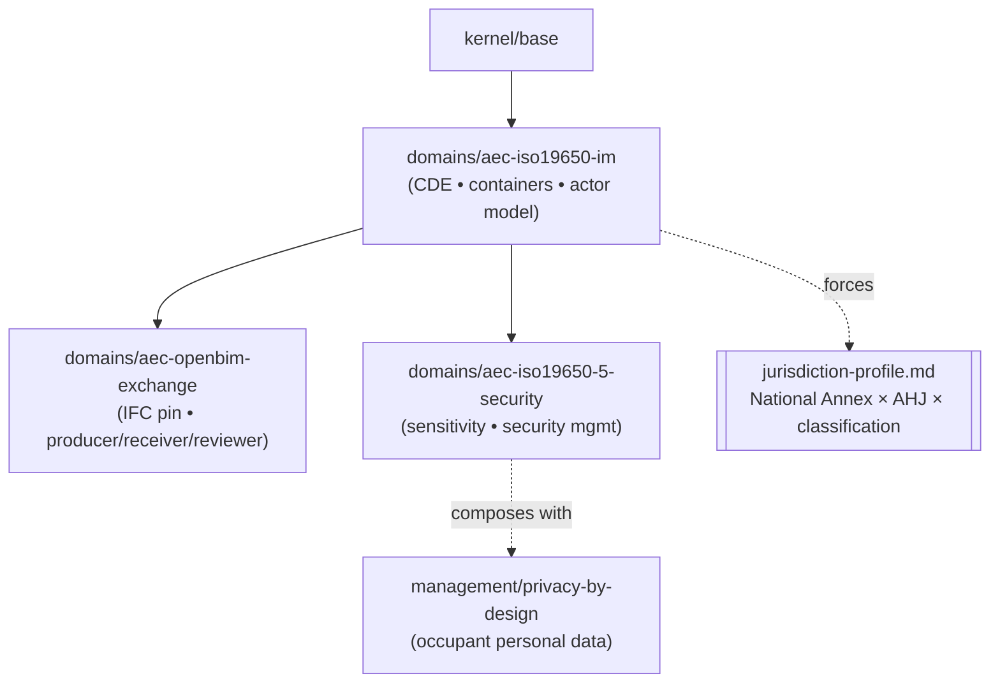

<!--
Copyright 2026 Nate DiNiro <UncleNate@gmail.com>
SPDX-License-Identifier: MIT OR Apache-2.0
Part of auto-harness — see LICENSE-MIT and LICENSE-APACHE at repository root.
-->

# AEC / Construction Deep-Domain Wedge Implementation Plan

> **For agentic workers:** REQUIRED SUB-SKILL: Use superpowers:subagent-driven-development (recommended) or superpowers:executing-plans to implement this plan task-by-task. Steps use checkbox (`- [ ]`) syntax for tracking.

**Goal:** Ship the second built deep-industry-domain vertical — a thin 3-module AEC/construction wedge (`aec-iso19650-im` + `aec-openbim-exchange` + `aec-iso19650-5-security`) plus templates, discoverability, a diagram, and a sample composition — grounding the deep-domain framework harvest in a second domain.

**Architecture:** Two phases mirroring healthcare (PRD-0017) and privacy (PRD-0018). **Phase 1** is a design-only PR (OPP-0039 + PRD-0019, citing the committed spec + research brief as evidence). **Phase 2** is the implementation PR: 3 `domains/aec-*` modules, 5 `platform/templates/aec/` artifacts, discoverability propagation, one architecture diagram, a sample composition, and catalog-count propagation. The new modules are **catalog-only** — auto-harness does NOT activate them in its own `harness.manifest.yaml`, so the validator suite stays predict-clean (exactly as healthcare did).

**Tech Stack:** YAML module manifests, Markdown templates with `[[TOKEN]]` placeholders, Bash 3.2 + system-Ruby validators (no new validator added), GitBook `SUMMARY.md`, Mermaid diagrams. No new runtime dependencies.

---

## Governing facts (verified against `main` at plan time)

- **Numbering:** OPP-0037 is the highest in-repo OPP; **OPP-0038 is claimed by open PR #96** (adopter attribution boundary) → AEC opportunity is **OPP-0039**. PRD-0018 is the highest in-repo PRD → AEC PRD is **PRD-0019**. *(The committed spec says "next is OPP-0038" — that reference is now stale and is corrected in Task 1.)*
- **Catalog counts after Phase 2** (recipes live in `platform/validators/validate-catalog-counts.sh`):
  - `modules_profiles` (`find platform/profiles -name module.yaml | wc -l`): **39 → 42** (+3 modules)
  - `modules_all` (`find platform -name module.yaml | wc -l`): **48 → 51** (+3)
  - `templates` (`find platform/templates -type f -name '*.md' ! -name 'README.md' | wc -l`): **69 → 74** (+5)
  - `diagrams` (`grep -cE '^## [0-9]+\.' docs/architecture/diagrams.md`): **12 → 13** (+1)
  - `validators` stays **15**; `skills` stays **7**; `workflows` stays **18** — so all *word-form* assertions ("fifteen", "seven") and those counts are UNCHANGED.
- **Validator chain = 15.** No new validator. AEC governance is expressed through `validate-required-artifacts.sh` + `validate-companions.sh` + `validate-sensitive-paths.sh` + review gates, exactly as healthcare.
- **`domain` module type is already accepted** by `validate-module-graph.sh` (healthcare-fhir / healthcare-smart-on-fhir ship as `type: domain` on main). No validator patch needed.
- **Compositions are NOT required-artifact-checked in CI** (the healthcare composition references `docs/healthcare/*.md` that do not exist in the harness root, yet CI is green). So Phase 2 does not need `docs/aec/*` artifacts to exist for the composition to validate.
- **Attribution:** every new file carries `Copyright 2026 Nate DiNiro <UncleNate@gmail.com>` + `SPDX-License-Identifier: MIT OR Apache-2.0`. Markdown uses the HTML-comment header; YAML uses `#` comment lines. **Never** use `nate@bdits.io`.
- **Branch:** work continues on `aec-construction-wedge-design` (already rebased onto current `main`, carrying the two spec files). Phase 1 and Phase 2 may be one branch with two commits/PRs or two branches — maintainer's call at execution; default to two PRs off this branch (design-only first).

---

## File Structure

**Phase 1 (design-only) creates:**

- `docs/opportunities/OPP-0039-domain-family-aec-decomposed.md` — the AEC family opportunity (6-module roadmap; 3 promoted to the wedge, 3 deferred).
- `docs/requirements/PRD-0019-aec-iso19650-openbim-wedge.md` — the wedge design contract with a §10 Claim Classification block.
- Edits: the spec (OPP-0038→OPP-0039 fix), `SUMMARY.md` (PRD + OPP rows), `docs/README.md` (PRD + OPP rows for list-completeness), `docs/opportunities/candidates.md` (ADD an OPP-0039 row — every OPP needs a candidates token), `docs/knowledge/shared-observations.md` (the OPP's distillation entry — REQUIRED in the Phase-1 PR, PRD-0004 rule fires on the new OPP), `docs/project/change-log.md` (one entry).

**Phase 2 (implementation) creates:**

- `platform/profiles/domains/aec-iso19650-im/{module.yaml,README.md}`
- `platform/profiles/domains/aec-openbim-exchange/{module.yaml,README.md}`
- `platform/profiles/domains/aec-iso19650-5-security/{module.yaml,README.md}`
- `platform/templates/aec/{information-management-plan.md,jurisdiction-profile.md,exchange-requirements.md,sensitivity-assessment.md,security-management-plan.md}`
- `platform/compositions/aec-bim-project.yaml`
- One new diagram section `## 13. AEC Domain Family` in `docs/architecture/diagrams.md`
- Edits (discoverability): `SUMMARY.md`, `README.md`, `platform/skills/harness-onboarding/SKILL.md`, `platform/workflow/discovery-to-composition.md`
- Edits (counts): `platform/reference/how-to-read.md`, `docs/architecture/diagrams.md`, `docs/_assets/cover-back.svg`, `platform/templates/README.md`, `platform/compositions/README.md`
- Edits (governance): `docs/knowledge/shared-observations.md` (distillation), `docs/project/change-log.md`

---

# PHASE 1 — Design-only PR (OPP-0039 + PRD-0019)

### Task 1: Correct the stale OPP reference in the committed spec

**Files:**
- Modify: `docs/superpowers/specs/2026-06-03-aec-construction-wedge-design.md`

- [ ] **Step 1: Fix the OPP number.** In the spec, line ~124 reads `analog of OPP-0013; next is OPP-0038`. Replace `OPP-0038` with `OPP-0039` (OPP-0038 is claimed by PR #96). Exact edit:

  - Old: `OPP-0013; next is OPP-0038) + a **PRD**`
  - New: `OPP-0013; next is OPP-0039) + a **PRD**`

- [ ] **Step 2: Verify no other `OPP-0038` reference remains in the spec.**

```bash
grep -n "OPP-0038" docs/superpowers/specs/2026-06-03-aec-construction-wedge-design.md
```
Expected: no output.

- [ ] **Step 3: Commit.**

```bash
git add docs/superpowers/specs/2026-06-03-aec-construction-wedge-design.md
git commit -m "[AEC wedge] Fix stale OPP reference in spec (OPP-0038 claimed by #96 → OPP-0039)"
```

---

### Task 2: Author OPP-0039 (AEC domain family)

**Files:**
- Create: `docs/opportunities/OPP-0039-domain-family-aec-decomposed.md`

- [ ] **Step 1: Write the OPP file** with this exact content:

```markdown
<!--
Copyright 2026 Nate DiNiro <UncleNate@gmail.com>
SPDX-License-Identifier: MIT OR Apache-2.0
Part of auto-harness — see LICENSE-MIT and LICENSE-APACHE at repository root.
-->

# OPP-0039 — AEC Domain Family (decomposed `domains/aec-*`)

**Status:** accepted
**Owner:** @unclenate
**Created:** 2026-06-04
**Last Updated:** 2026-06-04 *(accepted — partial promotion: iso19650-im + openbim-exchange + iso19650-5-security promoted to a v1 wedge via PRD-0019; the deferred sub-modules remain proposed within this OPP; see Disposition)*
**Confidence:** high

---

## Thesis

The harness has no `domains/aec-*` (Architecture / Engineering / Construction)
coverage. AEC is one of the largest information-governed industries — the built
environment runs on ISO 19650 information management, openBIM (IFC/BCF/IDS)
exchange, and (for critical assets) ISO 19650-5 security-minded handling. It is
the **explicit second built deep-domain vertical** the framework harvest requires
after healthcare: a second independent instance of the jurisdiction-neutral-core +
forcing-artifact + bias-guardrail + trust-role primitives, plus two enrichments a
single domain could not surface — a **compound** forcing artifact and a **domain ×
cross-cutting composition**.

Apply the harness's per-concern module granularity (as healthcare did) and ship
AEC as a **decomposed family**. This OPP ratifies the family shape; PRD-0019
promotes the thin three-module wedge.

### Sub-modules (each per-activation, each with its own required artifacts)

| Sub-module | What it governs | Required artifact(s) | Disposition |
|---|---|---|---|
| `domains/aec-iso19650-im` | CDE structure, information-container status codes (S0–S7), the appointing/lead-appointed/appointed-party actor model, status-transition policy | `information-management-plan.md`, `jurisdiction-profile.md` | **Wedge (PRD-0019)** |
| `domains/aec-openbim-exchange` | IDS-style exchange requirements, the pinned IFC version, the producer/receiver/reviewer role axis (ISO 19650-4) | `exchange-requirements.md` | **Wedge (PRD-0019)** |
| `domains/aec-iso19650-5-security` | Security-minded sensitivity assessment + security-management plan for built-asset / infrastructure sensitivity | `sensitivity-assessment.md`, `security-management-plan.md` | **Wedge (PRD-0019)** |
| `domains/aec-aps-tooling` | Autodesk Platform Services / Revit OAuth scopes, Design-Automation elevated-automation tier | `aps-scope-map.md` (proposed) | Deferred |
| `domains/aec-bluebeam-review` | Bluebeam Studio Sessions / markup review surface | `review-session-policy.md` (proposed) | Deferred |
| `domains/aec-permitting-ahj` | Permit-set governance + AHJ-as-review-role (extracted from the jurisdiction-profile field) | `permit-set-map.md` (proposed) | Deferred |

### Templates

A new `platform/templates/aec/` directory. Five wedge templates ship with
PRD-0019; deferred sub-modules add their own when promoted.

### Convenience composition

A `platform/compositions/aec-bim-project.yaml` starter that activates the
three wedge modules together (plus `management/privacy-by-design` for occupant
personal data — the first domain × cross-cutting composition in the catalog).

## Origin / Evidence

- **Research brief:** `docs/superpowers/specs/2026-06-03-construction-bim-research-brief.md`
  (committed alongside this OPP) — cites ISO 19650 parts 1–6, the UK National
  Annex / BS EN, openBIM (IFC4 / IFC4.3, BCF, IDS, COBie), Autodesk Platform
  Services, and Bluebeam Studio. The wedge boundary is lifted from its
  substrate / access-layer / security-spine analysis.
- **Design spec:** `docs/superpowers/specs/2026-06-03-aec-construction-wedge-design.md`
  — the user-confirmed three-module wedge, the compound jurisdiction-profile,
  and the security × privacy composition boundary.
- **Structural analog (grounding, not speculation).** The wedge mirrors the
  proven healthcare shape one-to-one: `aec-iso19650-im` ≈ `healthcare-fhir`
  (substrate); `aec-openbim-exchange` ≈ `healthcare-smart-on-fhir` (access
  layer carrying the trust-role axis); `aec-iso19650-5-security` is the
  sensitivity spine (the PHI-handling analog). The intra-family dependency
  (`openbim-exchange → iso19650-im`) is the same pattern as
  `smart-on-fhir → fhir` and `supabase → relational-postgres`.
- **Internal precedent for module granularity.** As with `delivery/` and the
  `healthcare-*` family, a consumer doing IFC-exchange-only work does not need
  the security-management plan; bundling would force irrelevant required-artifact
  debt. The decomposition matches observable subsystem boundaries in real AEC
  delivery (CDE / model-exchange / security are distinct ISO 19650 concerns).

## Why Now

- **The harvest needs a second built domain.** Healthcare alone cannot ground a
  general "deep-domain framework" operating-principle. AEC is the designated
  second vertical; once it ships, the three primitives have three independent
  reuse instances (healthcare domain, privacy cross-cutting, AEC domain) and two
  new enrichments (compound forcing artifact; domain × cross-cutting composition),
  which is the evidence bar the design spec set for promotion.
- **AEC is a large, standards-rich, governance-shaped industry.** ISO 19650,
  IFC/BCF/IDS, and ISO 19650-5 are well-defined international standards with
  jurisdictional national annexes — exactly the neutral-core + forcing-artifact
  shape the harness governs well.
- **Security × privacy is a real, unmodeled boundary.** A built-asset model can
  reveal how to attack a building; occupant data is personal data. The catalog
  has `management/privacy-by-design` (shipped #98) but no asset-sensitivity
  counterpart, and no documented boundary between them. The wedge produces both.

## Risks / Open Questions

- **UK / BS EN over-documentation bias (cross-cutting, architectural).** The
  most heavily documented ISO 19650 path is the UK National Annex + Uniclass +
  BS EN mandate. There is a real risk of baking UK norms into module shapes as
  if universal. **Required before freezing any artifact:** the
  `jurisdiction-profile.md` template default-denies the UK path and forces an
  explicit `{National Annex} × {AHJ + code edition} × {classification system}`
  declaration. See the AEC-bias observation slated for `shared-observations.md`.
- **AHJ as field vs module.** The Authority Having Jurisdiction is recorded as a
  jurisdiction-profile *field* in the wedge; a dedicated `aec-permitting-ahj`
  module (permit-set governance + AHJ-as-review-role) is deferred until a
  grounded consumer surfaces permit-set workflows.
- **Tooling modules deferred.** `aec-aps-tooling` (Autodesk Platform Services)
  and `aec-bluebeam-review` are vendor-SDK surfaces; the wedge governs the
  standards/exchange/security layer, not vendor APIs. Verify-at-implementation
  flags carried from the brief (not wedge-blocking): current COBie version /
  NBIMS-US V4 COBie centrality; Bluebeam dev-API auth model + regional gating.
- **No grounded consumer codebase yet.** Unlike healthcare (OpenEMR + Tula), the
  AEC wedge is grounded in standards + the research brief, not a brownfield
  onboarding. Initial bias: ship the standards-anchored wedge; refine
  sensitive-path regexes against a real AEC repo when one onboards.

## Disposition

**Accepted 2026-06-04 — partial promotion.** The three wedge sub-modules —
`domains/aec-iso19650-im`, `domains/aec-openbim-exchange`, and
`domains/aec-iso19650-5-security` — are promoted to a v1 wedge (see PRD-0019).
The deferred sub-modules (`aec-aps-tooling`, `aec-bluebeam-review`,
`aec-permitting-ahj`) stay `proposed` pending consumer demand.

## Promotion

Promoted sub-modules: `domains/aec-iso19650-im`, `domains/aec-openbim-exchange`,
`domains/aec-iso19650-5-security` (PRD-0019, 2026-06-04). The compound
jurisdiction-profile and the domain × cross-cutting (security × privacy)
composition are the two enrichments slated for the deep-domain framework harvest
(a separate later cycle; see `project-deep-industry-domains` memory).

## Related

- Predecessor vertical (first built domain): [OPP-0013](OPP-0013-domain-family-healthcare-decomposed.md)
- Cross-cutting reused by the security spine: `management/privacy-by-design` (PRD-0018, shipped)
- Design spec: `docs/superpowers/specs/2026-06-03-aec-construction-wedge-design.md`
- Research brief: `docs/superpowers/specs/2026-06-03-construction-bim-research-brief.md`
- Wedge design contract: [PRD-0019](../requirements/PRD-0019-aec-iso19650-openbim-wedge.md)
```

- [ ] **Step 2: Verify markdownlint + doc-references pass on the new file.**

```bash
npx markdownlint-cli2 "docs/opportunities/OPP-0039-domain-family-aec-decomposed.md"
bash platform/validators/validate-doc-references.sh .
```
Expected: markdownlint clean; doc-references exits 0.

---

### Task 3: Author PRD-0019 (the wedge design contract)

**Files:**
- Create: `docs/requirements/PRD-0019-aec-iso19650-openbim-wedge.md`

- [ ] **Step 1: Write the PRD file** with this exact content:

```markdown
<!--
Copyright 2026 Nate DiNiro <UncleNate@gmail.com>
SPDX-License-Identifier: MIT OR Apache-2.0
Part of auto-harness — see LICENSE-MIT and LICENSE-APACHE at repository root.
-->

# PRD-0019 — AEC ISO 19650 + openBIM Wedge

**Version:** 1.0 | **Owner:** @unclenate | **Last Updated:** 2026-06-04 | **Review Cycle:** On-change

**Status:** Proposed
**Date:** 2026-06-04
**Author:** @unclenate
**Reviewers:** @unclenate

## Cross-references

- **Origin OPP:** [OPP-0039](../opportunities/OPP-0039-domain-family-aec-decomposed.md) —
  AEC domain family (decomposed). This PRD is a partial promotion:
  `aec-iso19650-im`, `aec-openbim-exchange`, and `aec-iso19650-5-security`
  only. The three deferred OPP-0039 sub-modules stay `proposed`.
- **Design context:** `docs/superpowers/specs/2026-06-03-aec-construction-wedge-design.md`
  and `docs/superpowers/specs/2026-06-03-construction-bim-research-brief.md` —
  the brainstorming spec and research brief grounding this PRD.
- **Predecessor vertical:** [PRD-0017](PRD-0017-healthcare-fhir-smart-wedge.md) —
  the first deep-domain wedge; this PRD mirrors its two-phase structure, its
  intra-family dependency shape, and its §10 vocabulary.
- **Cross-cutting reused:** [PRD-0018](PRD-0018-privacy-by-design.md) —
  `management/privacy-by-design`; the security module composes with it (built-asset
  sensitivity vs occupant personal data).
- **Related operating principles:**
  - [§ 9 Split Design from Implementation](../operating-principles.md#9-split-design-from-implementation) —
    this PRD ships the design contract; the implementing PR ships the modules,
    templates, and propagation.
  - [§ 10 Classify Claims Before Enforcing Them](../operating-principles.md#10-classify-claims-before-enforcing-them) —
    see §10 Claim Classification block below.

## Overview

The harness has no `domains/aec-*` coverage. The built environment is governed by
ISO 19650 (information management over the asset life cycle), openBIM (IFC/BCF/IDS
model exchange), and — for critical assets — ISO 19650-5 (security-minded
information handling). This PRD specifies a thin three-module wedge plus templates,
discoverability, a diagram, and a sample composition. v1 is **design-only** per § 9;
the implementing PR builds the scaffolding.

The wedge is intentionally minimal — the three deferred OPP-0039 sub-modules
(`aec-aps-tooling`, `aec-bluebeam-review`, `aec-permitting-ahj`) are out of scope —
so that the implementing PR is a single bounded unit and the framework primitives
emerge from a second working domain rather than speculation.

## Goals & Non-Goals

**Goals** — outcomes this PRD commits to delivering:

- Ship `platform/profiles/domains/aec-iso19650-im/` (`module.yaml` + `README.md`)
  declaring `type: domain`, `dependsOn: [kernel/base]`, the two required artifacts,
  sensitive paths, companion rules, and the Published/As-Built review gate.
- Ship `platform/profiles/domains/aec-openbim-exchange/` declaring
  `dependsOn: [kernel/base, aec-iso19650-im]`, the exchange-requirements artifact,
  the pinned-IFC-version and role-axis sensitive paths/companion rules, and the
  IFC-version / exchange-grant review gate. The intra-family dependency teaches the
  composition pattern (as `smart-on-fhir → fhir` did).
- Ship `platform/profiles/domains/aec-iso19650-5-security/` declaring
  `dependsOn: [kernel/base, aec-iso19650-im]`, the two security artifacts,
  sensitivity/classification sensitive paths/companion rules, and the
  declassification review gate.
- Ship `platform/templates/aec/` with five tokenized templates:
  `information-management-plan.md`, `jurisdiction-profile.md` (carrying the
  compound bias guardrail), `exchange-requirements.md`, `sensitivity-assessment.md`,
  `security-management-plan.md`.
- Close the discoverability gap: all three modules appear in `SUMMARY.md`, the
  catalog `README.md` Module table, `platform/skills/harness-onboarding/SKILL.md`,
  and `platform/workflow/discovery-to-composition.md` Step 6.
- Add one AEC domain family diagram (`## 13.`) to `docs/architecture/diagrams.md`.
- Ship a sample composition (`platform/compositions/aec-bim-project.yaml`) that
  activates all three modules plus `management/privacy-by-design`.
- **Document the security × privacy composition boundary** in the
  `aec-iso19650-5-security` README and the `sensitivity-assessment.md` template
  (built-asset sensitivity vs personal-data privacy; the sensitivity-assessment
  references the privacy-profile's declared regime).
- Pass the full 15-validator suite with all three modules on disk (predict-clean:
  the harness does not activate them).

**Non-Goals** — explicitly out of scope:

- **The three deferred OPP-0039 sub-modules** (`aec-aps-tooling`,
  `aec-bluebeam-review`, `aec-permitting-ahj`). Each is a separate future PRD.
- **A Revit / Bluebeam / Autodesk Platform Services integration.** The wedge
  governs the standards/exchange/security layer, not vendor SDKs.
- **A dedicated `aec-permitting-ahj` module.** The AHJ is a jurisdiction-profile
  field in this wedge.
- **The abstract deep-domain framework operating-principle / ADR.** Authored in a
  later harvest pass once the AEC wedge ships and the primitives have a second
  domain instance.
- **A new AEC-specific validator.** All enforced claims are expressed through the
  existing 15-validator chain.

## §10 Claim Classification

Per the [§10 operating principle](../operating-principles.md#10-classify-claims-before-enforcing-them),
this PRD names each load-bearing claim and its enforcement mechanism:

| Claim | Class | Mechanism |
|-------|-------|-----------|
| Required artifacts exist when an AEC module is active | Enforced | `validate-required-artifacts.sh` |
| Sensitive-path edits (CDE / IFC / security surfaces) pair with a governance document | Enforced | `validate-companions.sh` |
| Intra-family dependencies (`openbim-exchange → iso19650-im`, `iso19650-5-security → iso19650-im`) resolve cleanly | Enforced | `validate-module-graph.sh` |
| Sensitive paths are companion-rule covered | Enforced | `validate-sensitive-paths.sh` (per-module self-coverage) |
| National Annex / AHJ / classification system is declared, never assumed | Asserted-only | review gate + bias-guardrail text in `jurisdiction-profile.md` template |
| The pinned IFC version is honored on exchange | Asserted-only | review gate (`humanReview`) on any IFC-version change |
| Producer / receiver / reviewer exchange boundary is respected | Asserted-only | review gate on exchange-grant edits |
| Publishing a container (Published / As-Built) is human-signed-off | Asserted-only | review gate (`humanReview`) on container promotion |
| Built-asset sensitivity and personal-data privacy are governed without overlap or gap | Asserted-only | documented composition boundary (security README + `sensitivity-assessment` references the `privacy-profile` regime) |

**Claims explicitly NOT converted by v1** (remain Asserted-only):

- **IFC payloads structurally conform to the pinned schema.** v1 validates the
  governance *declaration* (`exchange-requirements.md` exists and pins a version);
  it does not invoke an IFC/IDS validator. Runtime conformance is out of scope.
- **The sensitivity classification is complete and correct.** v1 requires the
  `sensitivity-assessment.md` artifact exists; it does not assess whether every
  sensitive element was identified. That is a review-gate behavior.
- **The declared jurisdiction is legally sufficient.** The bias guardrail forces
  an explicit National Annex / AHJ / classification declaration; it does not verify
  the declared regime's legal requirements are met.

## Target Audience

| Persona | Who they are | What they need from this |
|---------|-------------|--------------------------|
| Harness maintainer | Repository's primary owner | The second deep-domain wedge lands, grounding the framework harvest with a compound forcing artifact and a domain × cross-cutting composition. |
| AEC consumer maintainer | A team adopting auto-harness for an ISO 19650 / openBIM delivery | Catalog modules with clear required artifacts; templates that force a National-Annex/AHJ/classification declaration and an IFC-version pin; discoverability from the onboarding skill. |
| Harness contributor | Outside contributor adding an AEC module or template | A second concrete precedent for deep-domain family modules and the intra-family dependency pattern. |
| Future vertical designer | Someone designing the next deep-domain wedge | The compound (3-axis) forcing artifact and the documented security × privacy composition boundary are the two enrichments the harvest generalizes. |

## User Stories

- As an **AEC consumer maintainer**, I want to activate `domains/aec-iso19650-im`
  and have the harness require `information-management-plan.md` and
  `jurisdiction-profile.md`, so contributors cannot silently omit the CDE/actor
  model or assume a National Annex.
- As an **AEC consumer maintainer**, I want `domains/aec-openbim-exchange` on top
  of `aec-iso19650-im` to require `exchange-requirements.md` with a pinned IFC
  version and the producer/receiver/reviewer role axis, so exchange boundaries are
  documented and reviewable.
- As an **AEC consumer maintainer building critical infrastructure**, I want
  `domains/aec-iso19650-5-security` to require a sensitivity assessment and a
  security-management plan, and to compose with `management/privacy-by-design` for
  occupant data, so asset sensitivity and personal-data privacy are both governed
  without a gap.
- As a **harness maintainer**, I want all three modules to pass the full
  15-validator suite clean (no new validators, no weakened assertion), so the wedge
  lands without harness-side churn.
- As a **future vertical designer**, I want the compound `jurisdiction-profile.md`
  template (3 axes) to be copyable as the pattern for multi-axis jurisdictions in
  other domains.

## Functional Requirements

### Must Have

| ID | Requirement | Acceptance Criteria | Notes |
|----|-------------|---------------------|-------|
| FR-001 | `domains/aec-iso19650-im` scaffolding | `module.yaml` + `README.md` at the module path. `module.yaml` declares `type: domain`, `dependsOn: [kernel/base]`, `requiredArtifacts: [docs/aec/information-management-plan.md, docs/aec/jurisdiction-profile.md]`, sensitive paths, two companion rules, and the Published/As-Built review gate. | The substrate module (≈ `healthcare-fhir`). |
| FR-002 | `domains/aec-openbim-exchange` scaffolding | `module.yaml` + `README.md`. Declares `type: domain`, `dependsOn: [kernel/base, aec-iso19650-im]`, `requiredArtifacts: [docs/aec/exchange-requirements.md]`, sensitive paths, two companion rules, and the IFC-version/exchange-grant review gate. | Intra-family dependency must resolve in `validate-module-graph.sh`. |
| FR-003 | `domains/aec-iso19650-5-security` scaffolding | `module.yaml` + `README.md`. Declares `type: domain`, `dependsOn: [kernel/base, aec-iso19650-im]`, `requiredArtifacts: [docs/aec/sensitivity-assessment.md, docs/aec/security-management-plan.md]`, sensitive paths, two companion rules, and the declassification review gate. README documents the security × privacy composition boundary. | The sensitivity spine. |
| FR-004 | `platform/templates/aec/` with five templates | `information-management-plan.md`, `jurisdiction-profile.md` (compound bias guardrail), `exchange-requirements.md`, `sensitivity-assessment.md` (references the privacy-profile regime), `security-management-plan.md`. All carry tokenized SPDX headers. | Bias-guardrail text: default-deny the UK BS EN + Uniclass path; force an explicit National-Annex/AHJ/classification declaration. |
| FR-005 | Discoverability propagation | All three modules appear in `SUMMARY.md`, catalog `README.md` Module table, `harness-onboarding/SKILL.md` domain catalog, and `discovery-to-composition.md` Step 6. | Companion-rule propagation per `CLAUDE.md`. |
| FR-006 | AEC domain family diagram | One diagram `## 13. AEC Domain Family` in `docs/architecture/diagrams.md`: the `iso19650-im ← {openbim-exchange, iso19650-5-security}` dependency, the role axis, the compound jurisdiction overlay, and the privacy-by-design composition edge. | Index table updated 12→13; prose "Twelve"→"Thirteen". |
| FR-007 | Sample composition | `platform/compositions/aec-bim-project.yaml` activates all three modules + `management/privacy-by-design`; listed in `platform/compositions/README.md` and root `README.md`. | Integration reference for the intra-family dependency. |
| FR-008 | Catalog-count propagation | All catalog-count sites updated: modules 39→42 / 48→51, templates 69→74, diagrams 12→13. `validate-catalog-counts.sh` and `validate-list-completeness.sh` exit 0. | See plan's "Governing facts" for the exact site list. |
| FR-009 | Full 15-validator suite passes | All 15 validators exit 0 with the three modules on disk; the harness does not activate them (predict-clean). | No new validator added. |

### Should Have

| ID | Requirement | Acceptance Criteria | Notes |
|----|-------------|---------------------|-------|
| FR-S01 | One distillation observation in `docs/knowledge/shared-observations.md` | Captures the second-domain harvest evidence: the compound (3-axis) forcing artifact and the domain × cross-cutting composition as the two enrichments healthcare could not surface. | Mirrors the PRD-0017 knowledge-capture convention. |
| FR-S02 | "When to activate" guidance in each module README | Each README names the ISO 19650 concern it governs and when a consumer activates it. | Reduces activation friction. |

### Out of Scope

| Feature | Reason excluded | When to revisit |
|---------|----------------|-----------------|
| IFC/IDS payload conformance validation | Runtime concern; v1 governs declarations | If a consumer mounts an IDS validator in CI |
| `aec-aps-tooling`, `aec-bluebeam-review`, `aec-permitting-ahj` | Deferred OPP-0039 sub-modules | Per OPP-0039 decomposition / consumer demand |
| Abstract deep-domain framework operating-principle | Authored post-wedge in the harvest pass | After the wedge ships and validates |
| A new AEC-specific validator | Existing chain covers all enforced claims | If an AEC-specific structural assertion proves mechanizable |

## Implementation Deferral

Per § 9, this PRD ships the design contract; the implementing PR adds the
scaffolding, templates, discoverability, diagram, composition, and distillation.

| Deferred implementation | Deferred to | Why deferred |
|-------------------------|-------------|--------------|
| Three module YAML + README files | Implementing PR (Phase 2) | Design-first per § 9 |
| Five AEC templates | Implementing PR (Phase 2) | Same |
| Discoverability + diagram + composition + counts | Implementing PR (Phase 2) | Same |
| Distillation observation (FR-S01) | Implementing PR (Phase 2) | Captured during implementation |
| Abstract framework operating-principle + finance/logistics stress-test | Post-wedge harvest pass | Must be grounded in two shipped domains first |

## Technical Constraints

- **Module type: `domain`** — already accepted by `validate-module-graph.sh`
  (healthcare ships as `domain`). No validator patch needed.
- **Catalog-only.** The three modules are NOT added to `harness.manifest.yaml`;
  the harness's own suite stays predict-clean.
- **Per-module sensitive-path self-coverage.** Each module's `sensitivePaths`
  patterns must be fully overlapped by its own `companionRules.triggerPaths` so a
  consumer activating any single module passes `validate-sensitive-paths.sh`.
- **Bash 3.2 + system Ruby** — no new dependencies.
- **SPDX dual-license headers** on all new files; `UncleNate@gmail.com`.

## CI/CD Gates

| Gate | Required? | Notes |
|------|-----------|-------|
| markdownlint + shellcheck | Yes | All new `.md` pass; no new shell scripts |
| Full 15-validator suite exits 0 | Yes | Predict-clean on the harness's own CI |
| `validate-catalog-counts.sh` correct after bumps | Yes | Modules/templates/diagrams bumped exactly |
| `validate-list-completeness.sh` exits 0 | Yes | New modules in SUMMARY; templates dir indexed; composition in both READMEs |
| Change-log updated | Yes | One entry per PR |

## Success Metrics

| KPI | Target | How measured |
|-----|--------|-------------|
| Dogfood pass rate at implementing PR | 100% — harness's 15-validator suite passes (modules present, not activated) | Implementing PR CI |
| Sample composition validates clean | All three modules + privacy active; suite exits 0 | `aec-bim-project.yaml` |
| Discoverability coverage | All three modules reachable from onboarding skill, SUMMARY, discovery-to-composition | Spot-check post-merge |
| Compound guardrail propagation | `jurisdiction-profile.md` carries the 3-axis declaration + bias guardrail verbatim | Template review |
| Composition boundary documented | Security README + sensitivity-assessment reference the privacy regime | README review |

## Dependencies

- `platform/validators/lib/harness_registry.rb` — module enumeration (existing).
- `management/privacy-by-design` (shipped PRD-0018) — the cross-cutting the
  security module composes with.
- `platform/profiles/domains/healthcare-*` — the structural precedent.
- Bash 3.2 + system Ruby.

## Verification

The wedge is verified, not asserted:

- All 15 validators pass with the three modules on disk (module-graph resolves
  both intra-family dependencies; required-artifacts, companions, sensitive-paths,
  catalog-counts, list-completeness, doc-references, and the rest of the chain).
- The sample composition's dependency closure
  (`aec-openbim-exchange → aec-iso19650-im → kernel/base`;
  `aec-iso19650-5-security → aec-iso19650-im → kernel/base`) resolves.
- markdownlint passes on all new and changed markdown.

## Open Questions

- [ ] **Exact sensitive-path regexes** — validated against a real ISO 19650 / IFC
  repo at implementation time. Design spec names candidates (`^cde/`,
  `^containers/`, `^ifc/`, `^exchange/`, substrings `models`, `bep`, `midp`, `bcf`,
  `federation`, `sensitive`, `classified`, `redaction`). **Bias: use the spec
  candidates as v1; refine if false positives appear.**
- [ ] **`aec-iso19650-5-security` dependency on privacy** — `dependsOn` vs
  compose-with. **Bias: compose-with (no hard dependency), documented in both the
  security README and the `aec-bim-project.yaml` composition.**
- [ ] **Composition required artifacts** — compositions are not required-artifact-
  checked in CI (confirmed: healthcare composition references nonexistent docs and
  CI is green). **Bias: ship `aec-bim-project.yaml` with the required-artifact
  references; no `docs/aec/*` files needed in the harness tree.**
```

- [ ] **Step 2: Verify markdownlint + doc-references.**

```bash
npx markdownlint-cli2 "docs/requirements/PRD-0019-aec-iso19650-openbim-wedge.md"
bash platform/validators/validate-doc-references.sh .
```
Expected: clean; exit 0.

---

### Task 4: Phase-1 discoverability rows, list-completeness, change-log, commit

**Files:**
- Modify: `SUMMARY.md`, `docs/README.md`, `docs/project/change-log.md`
- Modify: `docs/opportunities/candidates.md` (**ADD an OPP-0039 row** — `validate-list-completeness.sh` Check 3 requires EVERY `OPP-*.md` to have a candidates token, accepted included; section placement is a maintainer-domain call) *[corrected post-Phase-1: the original plan wrongly assumed accepted OPPs are omitted]*

- [ ] **Step 1: Add the PRD + OPP rows where the catalog lists them.** `validate-list-completeness.sh` requires new ADRs/PRDs/OPPs to appear in `docs/README.md`. Find the PRD list and OPP list in `docs/README.md` and add, in numeric order:

```markdown
- [PRD-0019](requirements/PRD-0019-aec-iso19650-openbim-wedge.md) — AEC ISO 19650 + openBIM wedge
```
```markdown
- [OPP-0039](opportunities/OPP-0039-domain-family-aec-decomposed.md) — AEC domain family (decomposed)
```
Match the exact bullet/row format already used in `docs/README.md` (inspect the PRD-0018 / OPP-0037 rows first and mirror them — table cell vs bullet).

- [ ] **Step 2: Add PRD + OPP rows to `SUMMARY.md`** in the same sections the existing PRD-0018 / OPP-0037 entries live (inspect and mirror format/placement).

- [ ] **Step 3: Confirm `candidates.md` needs no row.** Accepted OPPs with a paired PRD are not candidates (OPP-0013 is absent from `candidates.md`). Verify:

```bash
grep -n "OPP-0037\|OPP-0013" docs/opportunities/candidates.md || echo "accepted OPPs not listed — OPP-0039 needs no candidates.md row"
```

- [ ] **Step 4: Add a change-log entry** to `docs/project/change-log.md` (mirror the newest entry's format):

```markdown
- **2026-06-04 — [AEC wedge] OPP-0039 + PRD-0019 (design-only).** Filed the AEC
  domain-family opportunity (decomposed; 3-module wedge promoted, 3 deferred) and
  the wedge design contract (PRD-0019, §10 Claim Classification). Phase 1 of the
  second deep-domain vertical; design-only per § 9. Implementation deferred to Phase 2.
```

- [ ] **Step 5: Run the relevant validators.**

```bash
bash platform/validators/validate-list-completeness.sh .
bash platform/validators/validate-doc-references.sh .
bash platform/validators/validate-catalog-counts.sh .
npx markdownlint-cli2 "docs/**/*.md" "SUMMARY.md"
```
Expected: all exit 0 (catalog-counts unchanged — Phase 1 adds no modules/templates/diagrams).

- [ ] **Step 6: Commit Phase 1.**

```bash
git add docs/opportunities/OPP-0039-domain-family-aec-decomposed.md \
        docs/requirements/PRD-0019-aec-iso19650-openbim-wedge.md \
        SUMMARY.md docs/README.md docs/project/change-log.md
git commit -m "[AEC wedge] OPP-0039 + PRD-0019 — AEC ISO 19650 + openBIM wedge (design-only)"
```

- [ ] **Step 7: Open the Phase-1 PR** (after pushing the branch), CI green, request Copilot review, resolve any cross-doc findings (the holistic + Copilot net), then **stop for merge authorization** — do not merge without an explicit nod.

---

# PHASE 2 — Implementation PR (3 modules + 5 templates + propagation)

> Phase 2 begins after Phase 1 merges (or on a stacked branch if the maintainer
> prefers). Each module task creates `module.yaml` + `README.md`, then runs
> `validate-module-graph` + `validate-companions` (PR-diff mode) + a
> per-module `validate-sensitive-paths` self-coverage check via the sample
> composition in Task 9.

### Task 5: Module `aec-iso19650-im` (the substrate)

**Files:**
- Create: `platform/profiles/domains/aec-iso19650-im/module.yaml`
- Create: `platform/profiles/domains/aec-iso19650-im/README.md`

- [ ] **Step 1: Write `module.yaml`:**

```yaml
# Copyright 2026 Nate DiNiro <UncleNate@gmail.com>
# SPDX-License-Identifier: MIT OR Apache-2.0
id: aec-iso19650-im
type: domain
version: 1.0.0
summary: ISO 19650 information-management substrate — governs the Common Data Environment, information-container status codes (S0–S7), the appointing / lead-appointed / appointed-party actor model, and a compound jurisdiction-profile forcing artifact.
dependsOn:
  - kernel/base
conflictsWith: []
requiredArtifacts:
  - docs/aec/information-management-plan.md
  - docs/aec/jurisdiction-profile.md
optionalArtifacts: []
sensitivePaths:
  - description: Common Data Environment, information-container, and BIM model surfaces
    patterns:
      - ^cde/
      - ^containers/
      - models
      - bep
      - midp
companionRules:
  - description: CDE-structure or container status-transition changes require an information-management-plan update or an ADR
    triggerPaths:
      - ^docs/aec/information-management-plan\.md$
      - ^cde/
      - ^containers/
      - models
      - bep
      - midp
    requiredAny:
      - ^docs/adr/ADR-
      - ^docs/project/change-log\.md$
    humanReview: Reviewers confirm CDE-structure and container status-transition changes are intentional and the actor model still holds.
  - description: jurisdiction-profile changes require a change-log entry or an ADR
    triggerPaths:
      - ^docs/aec/jurisdiction-profile\.md$
    requiredAny:
      - ^docs/project/change-log\.md$
      - ^docs/adr/ADR-
    humanReview: Reviewers confirm the declared National Annex, AHJ, and classification system are intentional.
validators:
  - validate-companions
reviewGates:
  - Human review is required to promote an information container to Published or As-Built status (a published container is contractually binding) or to change a declared jurisdiction profile.
agentAdapters:
  - platform/agents/base
compiledFragments:
  - platform/profiles/domains/aec-iso19650-im/README.md
recommendedSkills:
  - harness-governance   # trust tiers and companion rules (source: platform/skills/)
```

- [ ] **Step 2: Write `README.md`:**

```markdown
<!--
Copyright 2026 Nate DiNiro <UncleNate@gmail.com>
SPDX-License-Identifier: MIT OR Apache-2.0
Part of auto-harness — see LICENSE-MIT and LICENSE-APACHE at repository root.
-->

# Domain Overlay: AEC ISO 19650 Information Management

**Depends on:** `kernel/base`.
**Conflicts with:** None.

This overlay governs an **ISO 19650 information-management substrate** — the Common
Data Environment (CDE), the information containers moving through it and their
status codes (S0 WIP → shared → published → S7 archived), the actor model
(appointing party / lead appointed party / appointed party), and the
status-transition policy (who may promote a container). It is the foundation of the
AEC domain family; `domains/aec-openbim-exchange` and
`domains/aec-iso19650-5-security` build on it.

The overlay's core is **jurisdiction-agnostic**. ISO 19650 is an international
standard; the National Annexes, the Authority Having Jurisdiction (AHJ) + code
edition, and the classification system are jurisdictional. This overlay makes none
the default — it forces the consumer to declare theirs in a required artifact.

## When To Activate

Activate when a project delivers built-environment information under ISO 19650 — a
CDE with information containers, a BIM Execution Plan (BEP), or a Master Information
Delivery Plan (MIDP). Pairs with `domains/aec-openbim-exchange` (model exchange) and
`domains/aec-iso19650-5-security` (security-minded handling).

## What This Overlay Requires

| Artifact | Purpose |
|----------|---------|
| `docs/aec/information-management-plan.md` | CDE structure, container status codes, the actor model, and the status-transition policy |
| `docs/aec/jurisdiction-profile.md` | The compound forcing artifact — declares National Annex × AHJ + code edition × classification system; carries the bias guardrail |

Templates for both live in `platform/templates/aec/`.

## Sensitive Paths and Companion Rules

Sensitive paths cover CDE, information-container, and model surfaces (`cde/`,
`containers/`, and paths containing `models`, `bep`, `midp`). Two companion rules:

- CDE-structure or container status-transition changes require an
  `information-management-plan.md` update or an ADR.
- `jurisdiction-profile.md` changes require a change-log entry or an ADR.

## Review Gate

Human review is required to promote a container to **Published** or **As-Built**
(a published container is contractually binding) or to change a declared
jurisdiction profile.

## See Also

- Module definition: [`module.yaml`](module.yaml)
- Active modules table: [`HARNESS.md`](../../../../HARNESS.md)
- Built on by: [`domains/aec-openbim-exchange`](../aec-openbim-exchange/README.md), [`domains/aec-iso19650-5-security`](../aec-iso19650-5-security/README.md)
- Templates: `platform/templates/aec/`
- Origin: [`OPP-0039`](../../../../docs/opportunities/OPP-0039-domain-family-aec-decomposed.md), [`PRD-0019`](../../../../docs/requirements/PRD-0019-aec-iso19650-openbim-wedge.md)
```

- [ ] **Step 3: Run module-graph + manifest-shape checks.**

```bash
bash platform/validators/validate-module-graph.sh harness.manifest.yaml
bash platform/validators/validate-manifest.sh harness.manifest.yaml
```
Expected: both exit 0 (the new module is on disk; the graph remains valid).

---

### Task 6: Module `aec-openbim-exchange` (the access/interop layer)

**Files:**
- Create: `platform/profiles/domains/aec-openbim-exchange/module.yaml`
- Create: `platform/profiles/domains/aec-openbim-exchange/README.md`

- [ ] **Step 1: Write `module.yaml`:**

```yaml
# Copyright 2026 Nate DiNiro <UncleNate@gmail.com>
# SPDX-License-Identifier: MIT OR Apache-2.0
id: aec-openbim-exchange
type: domain
version: 1.0.0
summary: openBIM exchange overlay — IDS-style exchange requirements, an enforced pinned IFC version, and the producer / receiver / reviewer role axis (ISO 19650-4) on top of the information-management substrate.
dependsOn:
  - kernel/base
  - aec-iso19650-im
conflictsWith: []
requiredArtifacts:
  - docs/aec/exchange-requirements.md
optionalArtifacts: []
sensitivePaths:
  - description: IFC, BCF, and federated-exchange surfaces
    patterns:
      - ^ifc/
      - ^exchange/
      - bcf
      - federation
companionRules:
  - description: exchange-requirements changes (including the pinned IFC version or an exchange grant) require an ADR or change-log entry
    triggerPaths:
      - ^docs/aec/exchange-requirements\.md$
    requiredAny:
      - ^docs/adr/ADR-
      - ^docs/project/change-log\.md$
    humanReview: Reviewers confirm IFC-version-pin and exchange-grant changes are intentional.
  - description: IFC or exchange-surface changes (ifc/, exchange/, bcf, federation) require a risk-register update or an ADR — these paths carry the federated model exchange the producer / receiver / reviewer role axis governs
    triggerPaths:
      - ^ifc/
      - ^exchange/
      - bcf
      - federation
    requiredAny:
      - ^docs/security/risk-register\.md$
      - ^docs/adr/ADR-
    humanReview: Reviewers verify the producer / receiver / reviewer exchange boundary is preserved.
validators:
  - validate-companions
reviewGates:
  - Human review is required to change the pinned IFC version or widen an exchange grant.
agentAdapters:
  - platform/agents/base
compiledFragments:
  - platform/profiles/domains/aec-openbim-exchange/README.md
recommendedSkills:
  - harness-governance   # trust tiers and companion rules (source: platform/skills/)
```

- [ ] **Step 2: Write `README.md`:**

```markdown
<!--
Copyright 2026 Nate DiNiro <UncleNate@gmail.com>
SPDX-License-Identifier: MIT OR Apache-2.0
Part of auto-harness — see LICENSE-MIT and LICENSE-APACHE at repository root.
-->

# Domain Overlay: AEC openBIM Exchange

**Depends on:** `kernel/base`, `domains/aec-iso19650-im`.
**Conflicts with:** None.

This overlay governs **openBIM model exchange** — the IDS-style exchange
requirements (which IFC entities, classifications, and properties must be present),
the **pinned IFC version** (an enforced field, given IFC4 / IFC4.3 tool-support
fragmentation), and the **producer / receiver / reviewer role axis** (ISO 19650-4
exchange roles). It is the AEC analog of `domains/healthcare-smart-on-fhir`: the
access/interop layer where the trust-role axis lives. `aec-iso19650-im`'s CDE
permissions *reference* the roles declared here.

## When To Activate

Activate when a project exchanges federated BIM models via openBIM formats
(IFC/BCF) under an information-delivery contract. Requires `aec-iso19650-im` (the
CDE/container substrate the exchange flows through).

## What This Overlay Requires

| Artifact | Purpose |
|----------|---------|
| `docs/aec/exchange-requirements.md` | IDS-style required entities/properties, the pinned IFC version, and the producer / receiver / reviewer role axis |

The template lives in `platform/templates/aec/`.

## Sensitive Paths and Companion Rules

Sensitive paths cover IFC, BCF, and federated-exchange surfaces (`ifc/`,
`exchange/`, and paths containing `bcf`, `federation`). Two companion rules:

- `exchange-requirements.md` changes (including the IFC-version pin or an exchange
  grant) require an ADR or change-log entry.
- IFC/exchange-surface changes require a risk-register update or an ADR.

## Review Gate

Human review is required to change the pinned IFC version or widen an exchange
grant — both alter what model information crosses an organizational boundary.

## See Also

- Module definition: [`module.yaml`](module.yaml)
- Built on: [`domains/aec-iso19650-im`](../aec-iso19650-im/README.md)
- Templates: `platform/templates/aec/`
- Origin: [`OPP-0039`](../../../../docs/opportunities/OPP-0039-domain-family-aec-decomposed.md), [`PRD-0019`](../../../../docs/requirements/PRD-0019-aec-iso19650-openbim-wedge.md)
```

- [ ] **Step 3: Run module-graph (confirm the intra-family dependency resolves).**

```bash
bash platform/validators/validate-module-graph.sh harness.manifest.yaml
```
Expected: exit 0; `aec-openbim-exchange → aec-iso19650-im` resolves.

---

### Task 7: Module `aec-iso19650-5-security` (the sensitivity spine)

**Files:**
- Create: `platform/profiles/domains/aec-iso19650-5-security/module.yaml`
- Create: `platform/profiles/domains/aec-iso19650-5-security/README.md`

- [ ] **Step 1: Write `module.yaml`:**

```yaml
# Copyright 2026 Nate DiNiro <UncleNate@gmail.com>
# SPDX-License-Identifier: MIT OR Apache-2.0
id: aec-iso19650-5-security
type: domain
version: 1.0.0
summary: ISO 19650-5 security-minded overlay — a sensitivity assessment and a security-management plan governing built-asset and infrastructure sensitivity. Composes with management/privacy-by-design for occupant personal data.
dependsOn:
  - kernel/base
  - aec-iso19650-im
conflictsWith: []
requiredArtifacts:
  - docs/aec/sensitivity-assessment.md
  - docs/aec/security-management-plan.md
optionalArtifacts: []
sensitivePaths:
  - description: Security-classified information, redaction, and secure-federation surfaces
    patterns:
      - sensitive
      - classified
      - redaction
      - ^security/
companionRules:
  - description: sensitivity-assessment or security-management-plan changes require an ADR or change-log entry
    triggerPaths:
      - ^docs/aec/sensitivity-assessment\.md$
      - ^docs/aec/security-management-plan\.md$
    requiredAny:
      - ^docs/adr/ADR-
      - ^docs/project/change-log\.md$
    humanReview: Reviewers confirm sensitivity classifications and the security-management plan are intentional and current.
  - description: changes to security-classified, redaction, or secure-federation surfaces require a risk-register update or an ADR
    triggerPaths:
      - sensitive
      - classified
      - redaction
      - ^security/
    requiredAny:
      - ^docs/security/risk-register\.md$
      - ^docs/adr/ADR-
    humanReview: Reviewers verify declassification or access-broadening is intentional and bounded.
validators:
  - validate-companions
reviewGates:
  - Human review is required to declassify information, broaden access to a sensitive container, or change the redaction policy.
agentAdapters:
  - platform/agents/base
compiledFragments:
  - platform/profiles/domains/aec-iso19650-5-security/README.md
recommendedSkills:
  - harness-governance   # trust tiers and companion rules (source: platform/skills/)
```

- [ ] **Step 2: Write `README.md`** (includes the security × privacy boundary):

```markdown
<!--
Copyright 2026 Nate DiNiro <UncleNate@gmail.com>
SPDX-License-Identifier: MIT OR Apache-2.0
Part of auto-harness — see LICENSE-MIT and LICENSE-APACHE at repository root.
-->

# Domain Overlay: AEC ISO 19650-5 Security

**Depends on:** `kernel/base`, `domains/aec-iso19650-im`.
**Composes with:** `management/privacy-by-design`.
**Conflicts with:** None.

This overlay governs **security-minded information handling** per BS EN ISO
19650-5:2020 — a sensitivity assessment (identify and classify sensitive
information) and a security-management plan (redaction, RBAC, secure federation,
monitoring/audit). Sensitivity drivers include critical infrastructure, building
occupants, and embedded security systems: a built-asset model can reveal how to
attack a building or utility.

## When To Activate

Activate when a project handles sensitive built-asset information — critical
infrastructure, defence/government estates, or any asset whose model would aid an
attacker. Requires `aec-iso19650-im` (the substrate it secures).

## Security × Privacy — the composition boundary

This overlay governs **built-asset / infrastructure sensitivity** (the model
reveals how to attack a building). `management/privacy-by-design` (shipped) governs
**personal-data privacy** (occupant PII). They are complementary, not overlapping:

- A real AEC project with occupant data activates **both**.
- The `sensitivity-assessment.md` references the `privacy-profile.md`'s declared
  legal regime so the two artifacts cross-reference rather than duplicate.
- Asset-sensitivity classification is this module's concern; personal-data lawful
  basis and the regime declaration remain privacy-by-design's concern.

The sample composition `platform/compositions/aec-bim-project.yaml` activates both.

## What This Overlay Requires

| Artifact | Purpose |
|----------|---------|
| `docs/aec/sensitivity-assessment.md` | Identify and classify sensitive information; reference the privacy-profile regime for occupant data |
| `docs/aec/security-management-plan.md` | Redaction, RBAC, secure-federation, and monitoring/audit policy |

Templates for both live in `platform/templates/aec/`.

## Sensitive Paths and Companion Rules

Sensitive paths cover security-classified, redaction, and secure-federation
surfaces (paths containing `sensitive`, `classified`, `redaction`, and `security/`).
Two companion rules: artifact changes require an ADR or change-log entry;
classified/redaction surface changes require a risk-register update or an ADR.

## Review Gate

Human review is required to declassify information, broaden access to a sensitive
container, or change the redaction policy.

## See Also

- Module definition: [`module.yaml`](module.yaml)
- Built on: [`domains/aec-iso19650-im`](../aec-iso19650-im/README.md)
- Composes with: [`management/privacy-by-design`](../../management/privacy-by-design/README.md)
- Templates: `platform/templates/aec/`
- Origin: [`OPP-0039`](../../../../docs/opportunities/OPP-0039-domain-family-aec-decomposed.md), [`PRD-0019`](../../../../docs/requirements/PRD-0019-aec-iso19650-openbim-wedge.md)
```

- [ ] **Step 3: Run module-graph + manifest.**

```bash
bash platform/validators/validate-module-graph.sh harness.manifest.yaml
bash platform/validators/validate-manifest.sh harness.manifest.yaml
```
Expected: exit 0.

---

### Task 8: The five AEC templates

**Files:**
- Create: `platform/templates/aec/information-management-plan.md`
- Create: `platform/templates/aec/jurisdiction-profile.md`
- Create: `platform/templates/aec/exchange-requirements.md`
- Create: `platform/templates/aec/sensitivity-assessment.md`
- Create: `platform/templates/aec/security-management-plan.md`

- [ ] **Step 1: `information-management-plan.md`:**

```markdown
<!--
Copyright [[YEAR]] [[OWNER_NAME]] <[[OWNER_EMAIL]]>
SPDX-License-Identifier: [[SPDX_LICENSE]]
-->

# Information Management Plan — [[PROJECT_NAME]]

> Owner: [[OWNER]]
> Last updated: YYYY-MM-DD

Required artifact for the `aec-iso19650-im` domain overlay. Declares how
information is managed across the ISO 19650 Common Data Environment (CDE).

## Common Data Environment (CDE)

Where information containers live and how the CDE is structured (folders, naming
convention, the platform used).

## Information-Container Status Codes

| Code | State | Who may promote into it |
|------|-------|-------------------------|
| S0 | Work in progress (WIP) | [[ROLE]] |
| S1–S6 | Shared / coordinated / authorized | [[ROLE]] |
| Published / As-Built | Contractually binding | Human sign-off required |
| S7 | Archived | [[ROLE]] |

## Actor Model

| ISO 19650 role | This project | Responsibility |
|----------------|--------------|----------------|
| Appointing party | [[PARTY]] | [[RESPONSIBILITY]] |
| Lead appointed party | [[PARTY]] | [[RESPONSIBILITY]] |
| Appointed party | [[PARTY]] | [[RESPONSIBILITY]] |

## Status-Transition Policy

State who may promote a container between status codes, and which transitions
require human sign-off. Promotion to Published / As-Built always requires sign-off.
```

- [ ] **Step 2: `jurisdiction-profile.md`** (the compound bias-guardrail artifact):

```markdown
<!--
Copyright [[YEAR]] [[OWNER_NAME]] <[[OWNER_EMAIL]]>
SPDX-License-Identifier: [[SPDX_LICENSE]]
-->

# Jurisdiction Profile — [[PROJECT_NAME]]

> Owner: [[OWNER]]
> Last updated: YYYY-MM-DD

Required artifact for the `aec-iso19650-im` domain overlay. Forces an explicit
declaration of the regulatory context this project is delivered under.

> **Bias guardrail.** This module makes no jurisdiction the default. Declare yours
> below. **Do not assume the UK BS EN ISO 19650 + Uniclass path** — it is the most
> heavily documented, and that over-documentation is precisely the bias to guard
> against. ISO 19650 is an international standard; the National Annex, the Authority
> Having Jurisdiction (AHJ) + code edition, and the classification system are
> jurisdictional and must be named explicitly.

## Declared Jurisdiction (compound: three axes)

| Axis | Declaration |
|------|-------------|
| ISO 19650 National Annex | [[NATIONAL_ANNEX]] (e.g., UK BS EN 19650 NA; none; other) |
| AHJ + code edition | [[AHJ]] + [[CODE_EDITION]] (e.g., local building authority + IBC 2021) |
| Classification system | [[CLASSIFICATION]] (Uniclass 2015 / OmniClass / MasterFormat / UniFormat / none) |

## Notes

Record any realm-specific mandates (e.g., a public-sector BIM mandate) and the
information-protocol clauses that bind this project.
```

- [ ] **Step 3: `exchange-requirements.md`:**

```markdown
<!--
Copyright [[YEAR]] [[OWNER_NAME]] <[[OWNER_EMAIL]]>
SPDX-License-Identifier: [[SPDX_LICENSE]]
-->

# Exchange Requirements — [[PROJECT_NAME]]

> Owner: [[OWNER]]
> Last updated: YYYY-MM-DD

Required artifact for the `aec-openbim-exchange` domain overlay. Declares the
openBIM exchange contract (IDS-style) and the trust-role axis.

## Pinned IFC Version

**IFC version: [[IFC_VERSION]]** (e.g., IFC4 / IFC4.3 / IFC4x3-ADD2). This is an
enforced field — changing it requires human sign-off (tool support is fragmented).

## Required Entities / Properties (IDS-style)

| IFC entity / class | Required properties | Classification |
|--------------------|---------------------|----------------|
| [[ENTITY]] | [[PROPERTIES]] | [[CLASSIFICATION]] |

## Producer / Receiver / Reviewer Role Axis (ISO 19650-4)

| Role | Who | Which containers | Permission |
|------|-----|------------------|------------|
| Producer | [[PARTY]] | [[CONTAINERS]] | author |
| Receiver | [[PARTY]] | [[CONTAINERS]] | consume |
| Reviewer | [[PARTY]] | [[CONTAINERS]] | approve / reject |

State which CDE permissions in the information-management plan reference these roles,
and where a producer↔receiver boundary must not be crossed.
```

- [ ] **Step 4: `sensitivity-assessment.md`** (references the privacy regime):

```markdown
<!--
Copyright [[YEAR]] [[OWNER_NAME]] <[[OWNER_EMAIL]]>
SPDX-License-Identifier: [[SPDX_LICENSE]]
-->

# Sensitivity Assessment — [[PROJECT_NAME]]

> Owner: [[OWNER]]
> Last updated: YYYY-MM-DD

Required artifact for the `aec-iso19650-5-security` domain overlay, per BS EN ISO
19650-5:2020. Identifies and classifies sensitive built-asset information.

## Sensitivity Drivers

Which factors make this asset's information sensitive: critical infrastructure,
building occupants, embedded security systems, defence/government estate, etc.

## Classified Information Inventory

| Information element | Sensitivity class | Why sensitive | Handling |
|---------------------|-------------------|---------------|----------|
| [[ELEMENT]] | [[CLASS]] | [[REASON]] | [[HANDLING]] |

## Composition with Privacy-by-Design

This assessment governs **built-asset / infrastructure sensitivity**, not personal
data. Occupant personal data is governed by `management/privacy-by-design`.

> **Declared privacy regime (cross-reference):** [[PRIVACY_REGIME]] — see
> `docs/privacy/privacy-profile.md`. Personal-data handling follows the
> privacy-profile; this assessment does not restate it.
```

- [ ] **Step 5: `security-management-plan.md`:**

```markdown
<!--
Copyright [[YEAR]] [[OWNER_NAME]] <[[OWNER_EMAIL]]>
SPDX-License-Identifier: [[SPDX_LICENSE]]
-->

# Security Management Plan — [[PROJECT_NAME]]

> Owner: [[OWNER]]
> Last updated: YYYY-MM-DD

Required artifact for the `aec-iso19650-5-security` domain overlay, per BS EN ISO
19650-5:2020. Declares how sensitive information identified in the
`sensitivity-assessment.md` is protected.

## Redaction Policy

How sensitive elements are redacted before sharing/publishing, and who approves a
redaction change.

## Access Control (RBAC)

| Role | Containers | Permission |
|------|-----------|------------|
| [[ROLE]] | [[CONTAINERS]] | [[PERMISSION]] |

## Secure Federation

How federated models from multiple appointed parties are exchanged without exposing
classified information across organizational boundaries.

## Monitoring & Audit

What access and exchange events are logged, retention, and who reviews the audit
trail.
```

- [ ] **Step 6: Run placeholders + doc-references (templates legitimately carry `[[TOKEN]]`s; confirm they are recognized as templates, not unfilled shipped docs).**

```bash
bash platform/validators/validate-placeholders.sh .
bash platform/validators/validate-doc-references.sh .
npx markdownlint-cli2 "platform/templates/aec/*.md"
```
Expected: all exit 0. (`platform/**` is placeholder-exempt per `.placeholder-ignore`, so the `[[TOKEN]]`s do not trip `validate-placeholders`.)

---

### Task 9: Sample composition + compositions index

**Files:**
- Create: `platform/compositions/aec-bim-project.yaml`
- Modify: `platform/compositions/README.md`
- Modify: `README.md` (root — composition referenced in the adoption/walker section, required by `validate-list-completeness.sh`)

- [ ] **Step 1: Write `aec-bim-project.yaml`:**

```yaml
# Copyright 2026 Nate DiNiro <UncleNate@gmail.com>
# SPDX-License-Identifier: MIT OR Apache-2.0
# Starter composition for an ISO 19650 / openBIM delivery. Activates the AEC
# information-management substrate, the openBIM exchange layer, and the ISO 19650-5
# security overlay together, plus privacy-by-design for occupant personal data —
# the catalog's first domain x cross-cutting composition.
# References:
#   - platform/profiles/domains/aec-iso19650-im/README.md
#   - platform/profiles/domains/aec-openbim-exchange/README.md
#   - platform/profiles/domains/aec-iso19650-5-security/README.md
#   - docs/requirements/PRD-0019-aec-iso19650-openbim-wedge.md
schemaVersion: 1
project:
  id: example-aec-bim-project
  name: Example ISO 19650 + openBIM Project
  maturity: prototype
  criticality: high
modules:
  core:
    - kernel/base
  domains:
    - aec-iso19650-im
    - aec-openbim-exchange
    - aec-iso19650-5-security
  management:
    - privacy-by-design
overrides:
  requiredArtifacts: []
  disabledValidations: []
```

- [ ] **Step 2: Add a row to `platform/compositions/README.md`** in the Available Compositions table (inspect the `healthcare-fhir-app.yaml` row and mirror its column shape exactly):

```markdown
| [aec-bim-project.yaml](aec-bim-project.yaml) | ISO 19650 IM + openBIM exchange + ISO 19650-5 security + privacy-by-design | Delivering built-environment information under ISO 19650 with openBIM model exchange |
```

- [ ] **Step 3: Add the composition to root `README.md`** wherever `healthcare-fhir-app.yaml` is referenced (mirror that line; `validate-list-completeness.sh` greps for `platform/compositions/aec-bim-project.yaml`):

```bash
cp platform/compositions/aec-bim-project.yaml harness.manifest.yaml
```

- [ ] **Step 4: Validate the composition's module graph + list-completeness.**

```bash
bash platform/validators/validate-module-graph.sh platform/compositions/aec-bim-project.yaml
bash platform/validators/validate-manifest.sh platform/compositions/aec-bim-project.yaml
bash platform/validators/validate-list-completeness.sh .
```
Expected: all exit 0; the dependency closure resolves; the composition is indexed in both READMEs.

---

### Task 10: Architecture diagram #13 (AEC Domain Family)

**Files:**
- Modify: `docs/architecture/diagrams.md`

- [ ] **Step 1: Add the index row.** In the diagram index table (near line 19, after the diagram #12 row), add:

```markdown
| 13 | *What is the AEC module family composition, and where do standards, jurisdiction, and security belong?* | [AEC Domain Family](#13-aec-domain-family) |
```

- [ ] **Step 2: Update the prose count.** Change the intro sentence `Twelve diagrams below` → `Thirteen diagrams below`.

- [ ] **Step 3: Append the diagram section** after the end of `## 12. Healthcare Domain Family` (mirror the Mermaid style used by diagram #12):

````markdown
## 13. AEC Domain Family

**Question:** *What is the AEC module family composition, and where do standards, jurisdiction, and security belong?*



The substrate (`aec-iso19650-im`) carries the compound jurisdiction-profile forcing
artifact and is depended on by both the exchange layer and the security spine. The
security spine composes with `management/privacy-by-design` — built-asset
sensitivity and occupant personal-data privacy are governed side-by-side without
overlap. This mirrors the healthcare family (diagram #12) and is the template for
future deep-domain verticals.
````

- [ ] **Step 4: Confirm the diagram count recipe now reads 13.**

```bash
grep -cE '^## [0-9]+\.' docs/architecture/diagrams.md
```
Expected: `13`.

---

### Task 11: Discoverability propagation (SUMMARY, README table, onboarding skill, discovery-to-composition)

**Files:**
- Modify: `SUMMARY.md`
- Modify: `README.md`
- Modify: `platform/skills/harness-onboarding/SKILL.md`
- Modify: `platform/workflow/discovery-to-composition.md`

- [ ] **Step 1: `SUMMARY.md` — add three domain bullets** after the Healthcare SMART on FHIR bullet, before GitBook (mirror the existing bullet format):

```markdown
* [AEC ISO 19650 IM](platform/profiles/domains/aec-iso19650-im/README.md) — ISO 19650 information-management substrate; CDE, containers, actor model (AEC deep-domain family)
* [AEC openBIM Exchange](platform/profiles/domains/aec-openbim-exchange/README.md) — IFC/IDS exchange + producer/receiver/reviewer roles (pairs with AEC ISO 19650 IM)
* [AEC ISO 19650-5 Security](platform/profiles/domains/aec-iso19650-5-security/README.md) — security-minded sensitivity + security-management plan (composes with privacy-by-design)
```

- [ ] **Step 2: `README.md` Module System table — append to the Domains CSV** (after `healthcare-smart-on-fhir`):

```text
, `aec-iso19650-im`, `aec-openbim-exchange`, `aec-iso19650-5-security`
```

- [ ] **Step 3: `harness-onboarding/SKILL.md` domain catalog — add three rows** after the healthcare rows (mirror the table columns: module | select when | dependencies | required artifacts):

```markdown
| `domains/aec-iso19650-im` | ISO 19650 information delivery; activate when a project runs a CDE with information containers, a BEP, or a MIDP. | — | `docs/aec/information-management-plan.md`, `docs/aec/jurisdiction-profile.md` |
| `domains/aec-openbim-exchange` | openBIM (IFC/BCF/IDS) model exchange under an information-delivery contract. | `domains/aec-iso19650-im` | `docs/aec/exchange-requirements.md` |
| `domains/aec-iso19650-5-security` | Security-minded handling of sensitive built-asset information (BS EN ISO 19650-5). Composes with `management/privacy-by-design`. | `domains/aec-iso19650-im` | `docs/aec/sensitivity-assessment.md`, `docs/aec/security-management-plan.md` |
```

- [ ] **Step 4: `discovery-to-composition.md` Step 6 decision matrix — add three rows** after the healthcare rows, before the starter-manifest code block:

```markdown
| Delivering built-environment information under ISO 19650 (CDE, containers, BEP/MIDP)? | `domains/aec-iso19650-im` |
| Exchanging federated BIM models via openBIM (IFC/BCF/IDS)? | `domains/aec-openbim-exchange` |
| Handling sensitive built-asset / infrastructure information (BS EN ISO 19650-5)? | `domains/aec-iso19650-5-security` (composes with `management/privacy-by-design`) |
```

- [ ] **Step 5: Run doc-references + markdownlint.**

```bash
bash platform/validators/validate-doc-references.sh .
npx markdownlint-cli2 "SUMMARY.md" "README.md" "platform/skills/harness-onboarding/SKILL.md" "platform/workflow/discovery-to-composition.md"
```
Expected: exit 0; clean.

---

### Task 12: Catalog-count propagation (modules 39→42 / 48→51, templates 69→74, diagrams 12→13)

**Files:**
- Modify: `platform/reference/how-to-read.md`
- Modify: `docs/architecture/diagrams.md`
- Modify: `docs/_assets/cover-back.svg`

> Word-form assertions ("fifteen" validators, "seven" skills) and the 15/7/18
> counts are UNCHANGED — do not touch them.

- [ ] **Step 1: `platform/reference/how-to-read.md`** — bump the two module sites and two template sites:

- `... ([0-9]+) modules, ([0-9]+) templates, 15 validators, 7 skills, 18 workflows` → `42 modules, 74 templates, 15 validators, 7 skills, 18 workflows`
- ASCII/authority-stack line `(39 modules)` → `(42 modules)`
- `(69 files)` → `(74 files)`

- [ ] **Step 2: `docs/architecture/diagrams.md`** Mermaid diagram-1 labels:

- `(48 total in-tree)` → `(51 total in-tree)`
- `69 scaffolding files` → `74 scaffolding files`
- *(diagram count prose "Twelve"→"Thirteen" already done in Task 10)*

- [ ] **Step 3: `docs/_assets/cover-back.svg`** text elements (XML; safe to hand-edit):

- `>48 modules<` → `>51 modules<`
- `>69 templates<` → `>74 templates<`
- `>12 diagrams<` → `>13 diagrams<`

- [ ] **Step 4: `platform/templates/README.md`** — add an `### AEC` section so `validate-list-completeness.sh` finds the `templates/aec/` token (mirror an existing section's table shape):

```markdown
### AEC

| Template | Required By Module | Path |
| -------- | ------------------ | ---- |
| Information Management Plan | `domains/aec-iso19650-im` | `templates/aec/information-management-plan.md` |
| Jurisdiction Profile | `domains/aec-iso19650-im` | `templates/aec/jurisdiction-profile.md` |
| Exchange Requirements | `domains/aec-openbim-exchange` | `templates/aec/exchange-requirements.md` |
| Sensitivity Assessment | `domains/aec-iso19650-5-security` | `templates/aec/sensitivity-assessment.md` |
| Security Management Plan | `domains/aec-iso19650-5-security` | `templates/aec/security-management-plan.md` |
```

- [ ] **Step 5: Run the count + completeness validators.**

```bash
bash platform/validators/validate-catalog-counts.sh .
bash platform/validators/validate-list-completeness.sh .
```
Expected: both exit 0. If catalog-counts reports a mismatch, the error names the exact file + expected number — fix that site to match the recipe and re-run.

---

### Task 13: Distillation observation + change-log

**Files:**
- Modify: `docs/knowledge/shared-observations.md`
- Modify: `docs/project/change-log.md`

- [ ] **Step 1: Append a distillation observation** to `docs/knowledge/shared-observations.md` (mirror the existing end-of-file entry format; this satisfies the PRD-0004 distillation rule for the module.yaml additions):

```markdown
## AEC wedge — the second built deep-domain vertical (2026-06-04)

The AEC wedge (`aec-iso19650-im` + `aec-openbim-exchange` + `aec-iso19650-5-security`)
is the second domain instance of the deep-domain primitives (neutral-core +
forcing-artifact + bias-guardrail + trust-role), after healthcare. It adds two
enrichments a single domain could not surface: a **compound** forcing artifact (the
jurisdiction-profile is `{National Annex} × {AHJ + code edition} × {classification}`,
three axes vs healthcare's one) and the catalog's first **domain × cross-cutting
composition** (`aec-iso19650-5-security` composes with `management/privacy-by-design`
— built-asset sensitivity vs occupant personal-data privacy, documented so the two
neither overlap nor leave a gap). With two shipped domains plus the privacy
cross-cutting, the primitives now have three independent reuse instances — the
evidence bar for promoting them to an operating-principle in the harvest pass.
```

- [ ] **Step 2: Add the change-log entry:**

```markdown
- **2026-06-04 — [AEC wedge] PRD-0019 implementation.** Shipped the three-module
  AEC wedge (`aec-iso19650-im`, `aec-openbim-exchange`, `aec-iso19650-5-security`),
  five `platform/templates/aec/` artifacts, the `aec-bim-project.yaml` composition,
  diagram #13, and discoverability + catalog-count propagation (modules 39→42 /
  48→51, templates 69→74, diagrams 12→13). Catalog-only (not activated in the
  harness manifest). Second deep-domain vertical; first domain × cross-cutting
  composition. Distillation observation filed.
```

- [ ] **Step 3: Confirm companions is green for the diff** (run in PR-diff mode against the merge base — this validates that the module.yaml / sensitive-path edits are paired with the change-log entry just added):

```bash
bash platform/validators/validate-companions.sh harness.manifest.yaml . main
rc=$?; echo "companions exit code: $rc"
```
Expected: `companions exit code: 0`. **Capture `rc` immediately after the call** (do not let a later command overwrite `$?`).

---

### Task 14: Full 15-validator gate + commit + PR

**Files:** none (verification + commit).

- [ ] **Step 1: Run the full push-time validator suite** (the 13 non-diff validators + companions in diff mode):

```bash
cd /Users/unclenate/auto-harness
fail=0
run() { echo "=== $1 ==="; bash platform/validators/$1 "${@:2}"; rc=$?; [ $rc -ne 0 ] && { echo "!!! FAIL ($rc): $1"; fail=1; }; }
run validate-manifest.sh harness.manifest.yaml
run validate-module-graph.sh harness.manifest.yaml
run validate-required-artifacts.sh harness.manifest.yaml .
run validate-placeholders.sh .
run validate-agent-pack.sh harness.manifest.yaml .
run validate-doc-references.sh .
run validate-catalog-counts.sh .
run validate-list-completeness.sh .
run validate-trust-tier.sh harness.manifest.yaml .
run validate-sensitive-paths.sh harness.manifest.yaml .
run validate-skill-content.sh harness.manifest.yaml .
run validate-sast-coverage.sh harness.manifest.yaml .
run validate-privacy-by-design.sh harness.manifest.yaml .
run validate-companions.sh harness.manifest.yaml . main
run validate-knowledge-redaction.sh . main
echo; echo "=== SUITE: $([ $fail -eq 0 ] && echo ALL GREEN || echo RED) ==="
```
Expected: `=== SUITE: ALL GREEN ===`. **Both diff-based validators (`companions`,
`knowledge-redaction`) MUST run with the `. main` base-ref — a 13/13 local pass
without them is NOT a CI prediction** (this is how Phase 1's distillation defect
slipped past local checks). Capture each `rc` immediately.

- [ ] **Step 2: Run markdownlint preflight** (per `feedback-ci-markdownlint-preflight` — MD004 soft-wrap `+`, MD012, MD018, MD034, frontmatter-at-line-1 are the recurring trips):

```bash
npx markdownlint-cli2 "**/*.md" "#node_modules"
```
Expected: clean. Fix any finding before committing.

- [ ] **Step 3: Commit Phase 2.**

```bash
git add platform/profiles/domains/aec-iso19650-im \
        platform/profiles/domains/aec-openbim-exchange \
        platform/profiles/domains/aec-iso19650-5-security \
        platform/templates/aec \
        platform/compositions/aec-bim-project.yaml \
        platform/compositions/README.md \
        platform/templates/README.md \
        platform/skills/harness-onboarding/SKILL.md \
        platform/workflow/discovery-to-composition.md \
        platform/reference/how-to-read.md \
        docs/architecture/diagrams.md \
        docs/_assets/cover-back.svg \
        docs/knowledge/shared-observations.md \
        docs/project/change-log.md \
        SUMMARY.md README.md
git commit -m "[AEC wedge] PRD-0019 implementation — 3 modules + 5 templates + composition + diagram + propagation"
```

- [ ] **Step 4: Push, open the Phase-2 PR, confirm CI green** (Validators + Self-Tests + Bootstrap + Shellcheck + Markdownlint + Sample Project Validation on both ubuntu + macos).

- [ ] **Step 5: Request Copilot review; resolve any findings** (the holistic + Copilot net catches the non-validator-enforced cross-doc class — prose-count agreement, stale refs, enforced-vs-asserted wording). Then **stop for merge authorization** — do not merge without an explicit nod.

---

## Self-Review (run after drafting; checklist, not a subagent dispatch)

**1. Spec coverage** — every spec section maps to a task:

- 3-module wedge → Tasks 5, 6, 7. ✓
- Compound jurisdiction-profile → Task 8 Step 2 (template) + FR-001/FR-004. ✓
- Security × privacy composition → Task 7 README + Task 8 Step 4 + Task 9 composition. ✓
- 5 templates → Task 8. ✓
- Resolved open Qs (openBIM=one module; role axis in exchange; AHJ=field; IFC pin enforced) → encoded in module designs + templates. ✓
- Harvest tie-in → Task 13 distillation. ✓
- Two-phase governance (OPP + PRD; then implementation) → Phase 1 (Tasks 1–4) + Phase 2 (Tasks 5–14). ✓
- Deferred modules (aps-tooling, bluebeam-review, permitting-ahj) → OPP-0039 table + PRD Non-Goals. ✓

**2. Placeholder scan** — the `[[TOKEN]]`s in Task 8 are *intended* template tokens (placeholder-exempt under `platform/**`), not plan placeholders. No "TBD"/"TODO"/"similar to" left in the plan. ✓

**3. Type/name consistency** — module ids (`aec-iso19650-im`, `aec-openbim-exchange`, `aec-iso19650-5-security`), artifact paths (`docs/aec/*.md`), template paths (`platform/templates/aec/*.md`), composition (`aec-bim-project.yaml`), OPP-0039, PRD-0019, and diagram #13 are used identically across every task and both design docs. Intra-family `dependsOn` matches the module-graph claim in PRD §10. ✓

**4. Count arithmetic** — +3 modules (39→42, 48→51), +5 templates (69→74), +1 diagram (12→13), +1 composition; validators/skills/workflows unchanged. The Task 12 site list matches the `validate-catalog-counts.sh` recipe map. ✓
