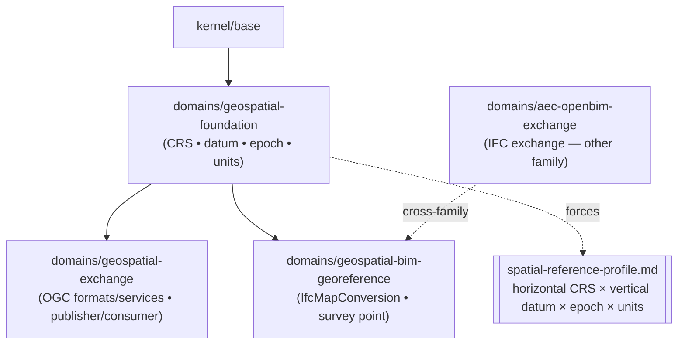

# Geospatial / GIS Wedge — Phase 2 Implementation Plan

> **For agentic workers:** REQUIRED SUB-SKILL: Use superpowers:subagent-driven-development (recommended) or superpowers:executing-plans to implement this plan task-by-task. Steps use checkbox (`- [ ]`) syntax for tracking.

**Goal:** Build the three-module geospatial wedge specified by PRD-0024 — `geospatial-foundation`, `geospatial-exchange`, `geospatial-bim-georeference` — plus templates, a diagram, a composition, discoverability propagation, and catalog-count bumps, landing CI-green.

**Architecture:** Catalog-only governance modules (markdown + YAML), not runtime code. Mirrors the shipped AEC family one-to-one (`geospatial-foundation` ≈ `aec-iso19650-im` substrate; `geospatial-exchange` ≈ `aec-openbim-exchange` access layer; the new `geospatial-bim-georeference` is the catalog's first **cross-family dependency**, depending on `aec-openbim-exchange`). Sensitivity is composed via existing overlays, not built. The modules are NOT added to `harness.manifest.yaml` (predict-clean: the harness's own CI does not activate them).

**Tech Stack:** Bash 3.2 + system Ruby validators; markdownlint-cli2; mermaid diagrams; SPDX dual-license headers (`UncleNate@gmail.com`).

**Reference (copy the pattern exactly):** the shipped AEC family —
`platform/profiles/domains/aec-iso19650-im/`, `.../aec-openbim-exchange/`,
`platform/templates/aec/`, `platform/compositions/aec-bim-project.yaml`,
diagram `## 13.` in `docs/architecture/diagrams.md`.

**The validator IS the test.** For governance modules there is no unit test —
each task ends by running the relevant validator(s) and a commit. The full gate
is the 17-validator suite + markdownlint, run exactly as CI does.

**Governing facts (do not drift):**

- Module type for all three: `domain`.
- Catalog base counts before this work: **43 profile modules / 52 total / 84 templates / 14 diagrams / 13 compositions**. After: **46 / 55 / 88 / 15 / 14**. (Re-derive against `main` at execution time; maintainer/Codex parallel work may have moved them — `validate-catalog-counts.sh` is the oracle.)
- Per-module sensitive-path self-coverage: every `sensitivePaths` pattern in a module MUST also appear in that module's own `companionRules[].triggerPaths` (the module YAMLs below already satisfy this — do not remove a trigger pattern).
- Diff-mode validators run as: `validate-companions.sh harness.manifest.yaml . main` and `validate-knowledge-redaction.sh . main`.

---

## Task 1: `geospatial-foundation` module (substrate)

**Files:**
- Create: `platform/profiles/domains/geospatial-foundation/module.yaml`
- Create: `platform/profiles/domains/geospatial-foundation/README.md`

- [ ] **Step 1: Create `module.yaml`** with exactly this content:

```yaml
# Copyright 2026 Nate DiNiro <UncleNate@gmail.com>
# SPDX-License-Identifier: MIT OR Apache-2.0
id: geospatial-foundation
type: domain
version: 1.0.0
summary: Geospatial spatial-reference substrate — governs the coordinate reference system (horizontal datum, vertical datum, epoch, units) and per-dataset provenance via a compound, temporal forcing artifact.
dependsOn:
  - kernel/base
conflictsWith: []
requiredArtifacts:
  - docs/geospatial/spatial-reference-profile.md
  - docs/geospatial/dataset-inventory.md
optionalArtifacts: []
sensitivePaths:
  - description: Spatial data, coordinate, and projection surfaces
    patterns:
      - ^geo/
      - ^gis/
      - ^data/spatial/
      - coordinate
      - projection
      - crs
companionRules:
  - description: Changes to docs/geospatial/spatial-reference-profile.md (especially a CRS, datum, or epoch change) require an ADR under docs/adr/ or a docs/project/change-log.md entry
    triggerPaths:
      - ^docs/geospatial/spatial-reference-profile\.md$
      - ^geo/
      - ^gis/
      - ^data/spatial/
      - coordinate
      - projection
      - crs
    requiredAny:
      - ^docs/adr/ADR-
      - ^docs/project/change-log\.md$
    humanReview: Reviewers confirm any CRS, datum, vertical-datum, epoch, or units change is intentional — a datum or CRS change silently relocates all spatial data.
  - description: Changes to docs/geospatial/dataset-inventory.md require a docs/project/change-log.md entry or an ADR under docs/adr/
    triggerPaths:
      - ^docs/geospatial/dataset-inventory\.md$
    requiredAny:
      - ^docs/project/change-log\.md$
      - ^docs/adr/ADR-
    humanReview: Reviewers confirm dataset source, license, and provenance changes are intentional.
validators:
  - validate-companions
reviewGates:
  - Human review is required to change the declared authoritative CRS, datum, vertical datum, or epoch (it silently relocates all spatial data).
agentAdapters:
  - platform/agents/base
compiledFragments:
  - platform/profiles/domains/geospatial-foundation/README.md
recommendedSkills:
  - harness-governance   # trust tiers and companion rules (source: platform/skills/)
```

- [ ] **Step 2: Create `README.md`** with exactly this content:

```markdown
<!--
Copyright 2026 Nate DiNiro <UncleNate@gmail.com>
SPDX-License-Identifier: MIT OR Apache-2.0
Part of auto-harness — see LICENSE-MIT and LICENSE-APACHE at repository root.
-->

# Domain Overlay: Geospatial Foundation (Spatial Reference)

**Depends on:** `kernel/base`.
**Conflicts with:** None.

This overlay governs the **spatial-reference substrate** of a geospatial project —
the coordinate reference system (horizontal datum, vertical datum, epoch, and
units) and the provenance of each dataset. It is the foundation of the geospatial
domain family; `domains/geospatial-exchange` and
`domains/geospatial-bim-georeference` build on it.

The overlay's core is **CRS-agnostic**. It makes no coordinate reference system
the default — it forces the consumer to declare theirs in a required artifact.
Assuming WGS84 / EPSG:4326 when the data is in NAD83, ETRS89, or a local grid
silently misplaces every feature by metres.

## When To Activate

Activate when a project handles geospatial / mapping data — GIS layers, survey
data, basemaps, or any coordinates tied to the real world. Pairs with
`domains/geospatial-exchange` (OGC exchange) and
`domains/geospatial-bim-georeference` (BIM↔GIS pinning).

## What This Overlay Requires

| Artifact | Purpose |
|----------|---------|
| `docs/geospatial/spatial-reference-profile.md` | The compound, temporal forcing artifact — declares horizontal datum/CRS × vertical datum × epoch × units; carries the bias guardrail |
| `docs/geospatial/dataset-inventory.md` | Each dataset's source, license, format, declared CRS, and provenance |

Templates for both live in `platform/templates/geospatial/`.

## Sensitive Paths and Companion Rules

Sensitive paths cover spatial-data, coordinate, and projection surfaces (`geo/`,
`gis/`, `data/spatial/`, and paths containing `coordinate`, `projection`, `crs`).
Two companion rules:

- `spatial-reference-profile.md` (or any CRS/datum/projection surface) changes
  require an ADR or a change-log entry.
- `dataset-inventory.md` changes require a change-log entry or an ADR.

## Review Gate

Human review is required to change the declared authoritative CRS, datum, vertical
datum, or epoch — it silently relocates all spatial data.

## See Also

- Module definition: [`module.yaml`](module.yaml)
- Active modules table: [`HARNESS.md`](../../../../HARNESS.md)
- Built on by: [`domains/geospatial-exchange`](../geospatial-exchange/README.md), [`domains/geospatial-bim-georeference`](../geospatial-bim-georeference/README.md)
- Templates: `platform/templates/geospatial/`
- Origin: [`OPP-0045`](../../../../docs/opportunities/OPP-0045-domain-family-geospatial-decomposed.md), [`PRD-0024`](../../../../docs/requirements/PRD-0024-geospatial-gis-wedge.md)
```

- [ ] **Step 3: Verify module-graph + companions resolve**

Run: `bash platform/validators/validate-module-graph.sh; echo $?`
Expected: `0` (the `geospatial-foundation → kernel/base` edge resolves).

Run: `bash platform/validators/validate-sensitive-paths.sh; echo $?`
Expected: `0` (every `sensitivePaths` pattern is self-covered by the module's own `triggerPaths`).

- [ ] **Step 4: Commit**

```bash
git add platform/profiles/domains/geospatial-foundation/
git commit -m "feat(geospatial): add geospatial-foundation substrate module"
```

---

## Task 2: `geospatial-exchange` module (access layer + role axis)

**Files:**
- Create: `platform/profiles/domains/geospatial-exchange/module.yaml`
- Create: `platform/profiles/domains/geospatial-exchange/README.md`

- [ ] **Step 1: Create `module.yaml`** with exactly this content:

```yaml
# Copyright 2026 Nate DiNiro <UncleNate@gmail.com>
# SPDX-License-Identifier: MIT OR Apache-2.0
id: geospatial-exchange
type: domain
version: 1.0.0
summary: Geospatial exchange overlay — governs OGC exchange formats and services (GeoJSON, GeoPackage, CityGML/CityJSON, shapefile; WMS/WFS/WMTS, OGC API), the publisher / consumer role axis, and a CRS-on-the-wire preservation policy on top of the spatial-reference substrate.
dependsOn:
  - kernel/base
  - geospatial-foundation
conflictsWith: []
requiredArtifacts:
  - docs/geospatial/exchange-profile.md
optionalArtifacts: []
sensitivePaths:
  - description: Geospatial exchange and service surfaces
    patterns:
      - ^exchange/
      - ^services/
      - ^api/geo
      - wfs
      - wms
      - geojson
      - tiles
companionRules:
  - description: Changes to docs/geospatial/exchange-profile.md (format set, CRS-on-the-wire policy, or role axis) require an ADR under docs/adr/ or a docs/project/change-log.md entry
    triggerPaths:
      - ^docs/geospatial/exchange-profile\.md$
      - ^exchange/
      - ^services/
      - ^api/geo
      - wfs
      - wms
      - geojson
      - tiles
    requiredAny:
      - ^docs/adr/ADR-
      - ^docs/project/change-log\.md$
    humanReview: Reviewers confirm format-set, CRS-on-the-wire, and role-axis changes preserve the declared CRS across exchange boundaries (GeoJSON RFC 7946 drops non-WGS84 CRS on the wire).
  - description: Publishing a new authoritative dataset or service endpoint requires a docs/security/risk-register.md update or an ADR under docs/adr/
    triggerPaths:
      - ^services/
      - ^api/geo
      - wfs
      - wms
      - tiles
    requiredAny:
      - ^docs/security/risk-register\.md$
      - ^docs/adr/ADR-
    humanReview: Reviewers verify a newly published service grant is intentional (publication = exposure).
validators:
  - validate-companions
reviewGates:
  - Human review is required to widen a published service grant or change the CRS-on-the-wire policy.
agentAdapters:
  - platform/agents/base
compiledFragments:
  - platform/profiles/domains/geospatial-exchange/README.md
recommendedSkills:
  - harness-governance   # trust tiers and companion rules (source: platform/skills/)
```

- [ ] **Step 2: Create `README.md`** with exactly this content:

```markdown
<!--
Copyright 2026 Nate DiNiro <UncleNate@gmail.com>
SPDX-License-Identifier: MIT OR Apache-2.0
Part of auto-harness — see LICENSE-MIT and LICENSE-APACHE at repository root.
-->

# Domain Overlay: Geospatial Exchange (OGC Formats & Services)

**Depends on:** `kernel/base`, `geospatial-foundation`.
**Conflicts with:** None.

This overlay governs how geospatial data is **exchanged** — the OGC formats
(GeoJSON, GeoPackage, CityGML / CityJSON, shapefile) and services (WMS, WFS, WMTS,
OGC API – Features / Tiles) a project publishes or consumes, the **publisher ↔
consumer** role axis (who is the authoritative source vs. a derived consumer), and
an explicit **CRS-on-the-wire** policy.

The CRS-on-the-wire policy exists because some formats silently drop the declared
CRS: GeoJSON (RFC 7946) fixes coordinates to WGS84 and removed the `crs` member, so
any non-WGS84 GeoJSON carries no CRS on the wire. The `exchange-profile.md` must
state how the foundation's declared CRS is preserved across each declared format.

## When To Activate

Activate when a project publishes or consumes geospatial data through files or OGC
services. Requires `domains/geospatial-foundation` (the declared CRS it preserves).

## What This Overlay Requires

| Artifact | Purpose |
|----------|---------|
| `docs/geospatial/exchange-profile.md` | Declared formats and services, the publisher/consumer role axis, and the CRS-on-the-wire preservation policy |

The template lives in `platform/templates/geospatial/`.

## Sensitive Paths and Companion Rules

Sensitive paths cover exchange and service surfaces (`exchange/`, `services/`,
`api/geo`, and paths containing `wfs`, `wms`, `geojson`, `tiles`). Two companion
rules:

- `exchange-profile.md` (or any exchange/service surface) changes require an ADR or
  a change-log entry.
- Publishing a new authoritative dataset or service endpoint requires a
  risk-register update or an ADR (publication = exposure).

## Review Gate

Human review is required to widen a published service grant or change the
CRS-on-the-wire policy.

## See Also

- Module definition: [`module.yaml`](module.yaml)
- Active modules table: [`HARNESS.md`](../../../../HARNESS.md)
- Built on: [`domains/geospatial-foundation`](../geospatial-foundation/README.md)
- Templates: `platform/templates/geospatial/`
- Origin: [`OPP-0045`](../../../../docs/opportunities/OPP-0045-domain-family-geospatial-decomposed.md), [`PRD-0024`](../../../../docs/requirements/PRD-0024-geospatial-gis-wedge.md)
```

- [ ] **Step 3: Verify the intra-family dependency resolves**

Run: `bash platform/validators/validate-module-graph.sh; echo $?`
Expected: `0` (`geospatial-exchange → geospatial-foundation → kernel/base` resolves).

Run: `bash platform/validators/validate-sensitive-paths.sh; echo $?`
Expected: `0`.

- [ ] **Step 4: Commit**

```bash
git add platform/profiles/domains/geospatial-exchange/
git commit -m "feat(geospatial): add geospatial-exchange module (intra-family dep)"
```

---

## Task 3: `geospatial-bim-georeference` module (cross-family bridge)

**Files:**
- Create: `platform/profiles/domains/geospatial-bim-georeference/module.yaml`
- Create: `platform/profiles/domains/geospatial-bim-georeference/README.md`

- [ ] **Step 1: Create `module.yaml`** with exactly this content (note the cross-family `dependsOn: aec-openbim-exchange`):

```yaml
# Copyright 2026 Nate DiNiro <UncleNate@gmail.com>
# SPDX-License-Identifier: MIT OR Apache-2.0
id: geospatial-bim-georeference
type: domain
version: 1.0.0
summary: BIM↔GIS georeferencing bridge — governs the map conversion that pins a federated IFC/BIM model into a declared real-world CRS (IfcMapConversion parameters, survey-point origin, target georeferencing level). The catalog's first cross-family dependency.
dependsOn:
  - kernel/base
  - geospatial-foundation
  - aec-openbim-exchange
conflictsWith: []
requiredArtifacts:
  - docs/geospatial/georeference-map.md
optionalArtifacts: []
sensitivePaths:
  - description: Georeferencing and map-conversion surfaces
    patterns:
      - ^georef/
      - mapconversion
      - projectedcrs
      - surveypoint
      - sharedcoordinates
companionRules:
  - description: Changes to docs/geospatial/georeference-map.md (any map-conversion parameter or target CRS) require an ADR under docs/adr/ or a docs/project/change-log.md entry
    triggerPaths:
      - ^docs/geospatial/georeference-map\.md$
      - ^georef/
      - mapconversion
      - projectedcrs
      - surveypoint
      - sharedcoordinates
    requiredAny:
      - ^docs/adr/ADR-
      - ^docs/project/change-log\.md$
    humanReview: Reviewers verify the map conversion (datum, origin, rotation, scale) and target CRS are correct — a wrong map conversion silently mislocates the entire federated model.
validators:
  - validate-companions
reviewGates:
  - Human review is required to change the georeferencing (datum, origin, rotation, or scale) or the target CRS.
agentAdapters:
  - platform/agents/base
compiledFragments:
  - platform/profiles/domains/geospatial-bim-georeference/README.md
recommendedSkills:
  - harness-governance   # trust tiers and companion rules (source: platform/skills/)
```

- [ ] **Step 2: Create `README.md`** with exactly this content:

```markdown
<!--
Copyright 2026 Nate DiNiro <UncleNate@gmail.com>
SPDX-License-Identifier: MIT OR Apache-2.0
Part of auto-harness — see LICENSE-MIT and LICENSE-APACHE at repository root.
-->

# Domain Overlay: BIM↔GIS Georeference (Bridge)

**Depends on:** `kernel/base`, `geospatial-foundation`, `aec-openbim-exchange`.
**Conflicts with:** None.

This overlay governs the **BIM↔GIS georeferencing handshake** — the map conversion
that pins a federated IFC/BIM model into a declared real-world coordinate reference
system. It is the catalog's **first cross-family dependency**: it depends on
`domains/aec-openbim-exchange` (the BIM exchange side) as well as
`domains/geospatial-foundation` (the CRS side), because the seam it governs only
exists when both are present.

A wrong or absent map conversion silently mislocates the entire federated model —
every discipline model agrees with itself but sits in the wrong place on Earth.

## Cross-family dependency rationale

The bridge is **incoherent without both sides**, so the dependency is a hard
`dependsOn` (not a compose-with). Activating this module transitively activates the
AEC exchange substrate (`aec-openbim-exchange → aec-iso19650-im`) and inherits its
required artifacts — intended, because you cannot govern the BIM↔GIS pin without
the BIM exchange governance. This is distinct from optional concerns (e.g.
sensitivity), which stay compose-with.

## When To Activate

Activate when a project pins a Revit/IFC model to real-world coordinates (survey
point / shared coordinates / `IfcMapConversion`). Requires both
`domains/geospatial-foundation` and `domains/aec-openbim-exchange`.

## What This Overlay Requires

| Artifact | Purpose |
|----------|---------|
| `docs/geospatial/georeference-map.md` | The BIM↔GIS pin: map-conversion parameters (eastings, northings, orthogonal height, rotation, scale), survey-point origin, target georeferencing level, linked to the declared CRS |

The template lives in `platform/templates/geospatial/`.

## Sensitive Paths and Companion Rules

Sensitive paths cover georeferencing and map-conversion surfaces (`georef/`, and
paths containing `mapconversion`, `projectedcrs`, `surveypoint`,
`sharedcoordinates`). One companion rule: `georeference-map.md` (or any
georeferencing surface) changes require an ADR or a change-log entry.

## Review Gate

Human review is required to change the georeferencing (datum, origin, rotation, or
scale) or the target CRS.

## See Also

- Module definition: [`module.yaml`](module.yaml)
- Active modules table: [`HARNESS.md`](../../../../HARNESS.md)
- Built on: [`domains/geospatial-foundation`](../geospatial-foundation/README.md), [`domains/aec-openbim-exchange`](../aec-openbim-exchange/README.md)
- Templates: `platform/templates/geospatial/`
- Origin: [`OPP-0045`](../../../../docs/opportunities/OPP-0045-domain-family-geospatial-decomposed.md), [`PRD-0024`](../../../../docs/requirements/PRD-0024-geospatial-gis-wedge.md)
```

- [ ] **Step 3: Verify the cross-family dependency resolves**

Run: `bash platform/validators/validate-module-graph.sh; echo $?`
Expected: `0` (`geospatial-bim-georeference → {geospatial-foundation, aec-openbim-exchange → aec-iso19650-im} → kernel/base` resolves — the first cross-family edge).

Run: `bash platform/validators/validate-sensitive-paths.sh; echo $?`
Expected: `0`.

- [ ] **Step 4: Commit**

```bash
git add platform/profiles/domains/geospatial-bim-georeference/
git commit -m "feat(geospatial): add geospatial-bim-georeference bridge (first cross-family dep)"
```

---

## Task 4: `platform/templates/geospatial/` — four templates

**Files:**
- Create: `platform/templates/geospatial/spatial-reference-profile.md`
- Create: `platform/templates/geospatial/dataset-inventory.md`
- Create: `platform/templates/geospatial/exchange-profile.md`
- Create: `platform/templates/geospatial/georeference-map.md`

All templates use the tokenized SPDX header (tokens `[[YEAR]]`, `[[OWNER_NAME]]`,
`[[OWNER_EMAIL]]`, `[[SPDX_LICENSE]]`) exactly as `platform/templates/aec/*` do.

- [ ] **Step 1: Create `spatial-reference-profile.md`** (the compound + temporal forcing artifact, carrying the bias guardrail):

````markdown
<!--
Copyright [[YEAR]] [[OWNER_NAME]] <[[OWNER_EMAIL]]>
SPDX-License-Identifier: [[SPDX_LICENSE]]
-->

# Spatial Reference Profile — [[PROJECT_NAME]]

> Owner: [[OWNER]]
> Last updated: YYYY-MM-DD

Required artifact for the `geospatial-foundation` domain overlay. Forces an
explicit declaration of the coordinate reference system this project's data is in.

> **Bias guardrail.** This module makes no coordinate reference system the default.
> Declare your horizontal datum/CRS, vertical datum, epoch, and units below.
> **Do not assume WGS84 / EPSG:4326** — assuming it when the data is in NAD83,
> ETRS89, or a local/national grid silently misplaces every feature by metres. A
> CRS is bound to *place and time*: dynamic datums drift, so the epoch matters.

## Declared Spatial Reference (compound: four axes)

| Axis | Declaration |
|------|-------------|
| Horizontal datum / CRS | [[HORIZONTAL_CRS]] (authority:code, e.g. EPSG:6318 NAD83(2011); EPSG:4326 WGS84; a local grid) |
| Vertical datum | [[VERTICAL_DATUM]] (e.g. NAVD88 + GEOID18; ellipsoidal; none) |
| Epoch | [[EPOCH]] (e.g. 2010.0; n/a for a static datum) |
| Linear units | [[UNITS]] (metre / international foot / US survey foot — note the US survey foot was deprecated 2022) |

## Notes

Record the source of the declared CRS (survey control, agency mandate), any
transformation/reprojection applied to incoming data, and the accuracy budget.
````

- [ ] **Step 2: Create `dataset-inventory.md`:**

````markdown
<!--
Copyright [[YEAR]] [[OWNER_NAME]] <[[OWNER_EMAIL]]>
SPDX-License-Identifier: [[SPDX_LICENSE]]
-->

# Dataset Inventory — [[PROJECT_NAME]]

> Owner: [[OWNER]]
> Last updated: YYYY-MM-DD

Required artifact for the `geospatial-foundation` domain overlay. One row per
dataset; each declares its own CRS so silent reprojection cannot hide a mismatch
with the project's declared `spatial-reference-profile.md`.

| Dataset | Source / Authority | License | Format | Declared CRS | Provenance / date |
|---------|--------------------|---------|--------|--------------|-------------------|
| [[DATASET_NAME]] | [[SOURCE]] | [[LICENSE]] | [[FORMAT]] | [[DATASET_CRS]] | [[PROVENANCE]] |

## Notes

Flag any dataset whose declared CRS differs from the project CRS and the
transformation used to align it.
````

- [ ] **Step 3: Create `exchange-profile.md`:**

````markdown
<!--
Copyright [[YEAR]] [[OWNER_NAME]] <[[OWNER_EMAIL]]>
SPDX-License-Identifier: [[SPDX_LICENSE]]
-->

# Exchange Profile — [[PROJECT_NAME]]

> Owner: [[OWNER]]
> Last updated: YYYY-MM-DD

Required artifact for the `geospatial-exchange` domain overlay. Declares the
formats and services this project exchanges, the role it plays, and how the
declared CRS is preserved on the wire.

## Role on the publisher ↔ consumer axis

| Role | Declaration |
|------|-------------|
| This project is | [[ROLE]] (authoritative publisher / derived consumer / both) |

## Declared formats and services

| Channel | Format / service | CRS-on-the-wire policy |
|---------|------------------|------------------------|
| [[CHANNEL]] | [[FORMAT_OR_SERVICE]] (e.g. GeoPackage; OGC API – Features; GeoJSON) | [[CRS_POLICY]] (how the declared CRS is carried/recovered) |

> **CRS-on-the-wire hazard.** GeoJSON (RFC 7946) fixes coordinates to WGS84 and
> dropped the `crs` member — non-WGS84 GeoJSON carries no CRS. State for each
> channel how the `spatial-reference-profile.md` CRS is preserved (sidecar,
> GeoPackage `gpkg_spatial_ref_sys`, documented reprojection).

## Notes

List published service endpoints and any access controls.
````

- [ ] **Step 4: Create `georeference-map.md`:**

````markdown
<!--
Copyright [[YEAR]] [[OWNER_NAME]] <[[OWNER_EMAIL]]>
SPDX-License-Identifier: [[SPDX_LICENSE]]
-->

# Georeference Map — [[PROJECT_NAME]]

> Owner: [[OWNER]]
> Last updated: YYYY-MM-DD

Required artifact for the `geospatial-bim-georeference` domain overlay. Records the
map conversion that pins the federated BIM/IFC model into the real-world CRS
declared in `spatial-reference-profile.md`.

## Target CRS

| Field | Declaration |
|-------|-------------|
| Target CRS (IfcProjectedCRS) | [[TARGET_CRS]] (authority:code; must match the declared spatial-reference-profile) |

## Map conversion (IfcMapConversion)

| Parameter | Value |
|-----------|-------|
| Eastings | [[EASTINGS]] |
| Northings | [[NORTHINGS]] |
| Orthogonal height | [[ORTHOGONAL_HEIGHT]] |
| X-axis abscissa / ordinate (rotation) | [[XAXIS_ABSCISSA]] / [[XAXIS_ORDINATE]] |
| Scale | [[SCALE]] (default 1.0) |

## Model origin and georeferencing level

| Field | Declaration |
|-------|-------------|
| Revit survey-point / shared-coordinates origin | [[SURVEY_POINT]] |
| Target georeferencing level (LoGeoRef 0–50) | [[LOGEOREF_LEVEL]] |

## Notes

A wrong map conversion silently mislocates the whole federated model. Record how
the parameters were derived and verified.
````

- [ ] **Step 5: Verify header hygiene + lint**

Run: `bash platform/validators/validate-header-hygiene.sh; echo $?`
Expected: `0` (all four templates carry the tokenized SPDX header).

Run: `npx markdownlint-cli2 "platform/templates/geospatial/*.md" 2>&1 | tail -2`
Expected: `Summary: 0 error(s)`.

- [ ] **Step 6: Commit**

```bash
git add platform/templates/geospatial/
git commit -m "feat(geospatial): add four geospatial templates (CRS forcing artifact + bias guardrail)"
```

---

## Task 5: Sample composition `geospatial-bim-twin.yaml`

**Files:**
- Create: `platform/compositions/geospatial-bim-twin.yaml`
- Modify: `platform/compositions/README.md` (add the composition to its index)
- Modify: `README.md` (root — add to the compositions list, mirroring how `aec-bim-project.yaml` is listed)

- [ ] **Step 1: Create `geospatial-bim-twin.yaml`** with exactly this content:

```yaml
# Copyright 2026 Nate DiNiro <UncleNate@gmail.com>
# SPDX-License-Identifier: MIT OR Apache-2.0
# Starter composition for a BIM + GIS digital twin of a place. Activates the
# geospatial spatial-reference substrate, the OGC exchange layer, and the BIM<->GIS
# georeferencing bridge, plus the AEC openBIM exchange substrate it bridges to, and
# the digital-twin + privacy-by-design overlays for geospatial sensitivity and
# personal data — the catalog's first 4-way domain x domain x cross-cutting x
# cross-cutting composition.
# References:
#   - platform/profiles/domains/geospatial-foundation/README.md
#   - platform/profiles/domains/geospatial-exchange/README.md
#   - platform/profiles/domains/geospatial-bim-georeference/README.md
#   - docs/requirements/PRD-0024-geospatial-gis-wedge.md
schemaVersion: 1
project:
  id: example-geospatial-bim-twin
  name: Example BIM + GIS Digital-Twin Project
  maturity: prototype
  criticality: high
modules:
  core:
    - kernel/base
  domains:
    - geospatial-foundation
    - geospatial-exchange
    - geospatial-bim-georeference
    - aec-openbim-exchange
    - aec-iso19650-im
  management:
    - digital-twin
    - privacy-by-design
overrides:
  requiredArtifacts: []
  disabledValidations: []
```

- [ ] **Step 2: Add the composition to `platform/compositions/README.md`**

Read `platform/compositions/README.md`, find the entry for `aec-bim-project.yaml`,
and add a sibling entry for `geospatial-bim-twin.yaml` in the same format/section,
described as "BIM + GIS digital twin — first 4-way domain × domain × cross-cutting
× cross-cutting composition."

- [ ] **Step 3: Add the composition to the root `README.md`**

Read root `README.md`, find where `aec-bim-project.yaml` (or the compositions list)
appears, and add `geospatial-bim-twin.yaml` in the identical format.

- [ ] **Step 4: Verify module-graph resolves the full closure**

Run: `bash platform/validators/validate-module-graph.sh; echo $?`
Expected: `0` (every module in the composition resolves, including the cross-family
edge and both cross-cutting overlays).

- [ ] **Step 5: Commit**

```bash
git add platform/compositions/geospatial-bim-twin.yaml platform/compositions/README.md README.md
git commit -m "feat(geospatial): add geospatial-bim-twin sample composition (first 4-way)"
```

---

## Task 6: Diagram #15 — Geospatial Domain Family

**Files:**
- Modify: `docs/architecture/diagrams.md`

- [ ] **Step 1: Append the new diagram section** immediately after the `## 14. Digital Twin Overlay Family` section ends (before any closing/appendix content). Use exactly:

````markdown
## 15. Geospatial Domain Family

**Question:** *What is the geospatial module family composition, where does the CRS forcing artifact belong, and how does it bridge to AEC?*



The substrate (`geospatial-foundation`) carries the compound, temporal
spatial-reference forcing artifact and is depended on by both the exchange layer
and the georeference bridge. The bridge is the catalog's first **cross-family
dependency** — it also depends on `domains/aec-openbim-exchange` to govern the
BIM↔GIS seam. This is the fourth deep-domain vertical (after healthcare #12, AEC
#13) and the first to compose two domain families.
````

- [ ] **Step 2: Update the diagram index table** — add a row after the `| 14 | ... |` row:

```markdown
| 15 | *What is the geospatial family composition, where does the CRS forcing artifact belong, and how does it bridge to AEC?* | [Geospatial Domain Family](#15-geospatial-domain-family) |
```

- [ ] **Step 3: Update the prose count** — change the intro line `Fourteen diagrams below, grouped by what they answer:` to `Fifteen diagrams below, grouped by what they answer:`.

- [ ] **Step 4: Verify lint + doc-references**

Run: `npx markdownlint-cli2 "docs/architecture/diagrams.md" 2>&1 | tail -2`
Expected: `Summary: 0 error(s)`.

Run: `bash platform/validators/validate-doc-references.sh; echo $?`
Expected: `0` (the new anchor `#15-geospatial-domain-family` resolves).

- [ ] **Step 5: Commit**

```bash
git add docs/architecture/diagrams.md
git commit -m "docs(geospatial): add diagram #15 (geospatial domain family + cross-family edge)"
```

---

## Task 7: Discoverability propagation (SUMMARY, module table, onboarding skill, discovery-to-composition)

**Files (modify each, mirroring the three `aec-*` entries exactly):**
- Modify: `SUMMARY.md` — add the three modules under the domains section + a short "Geospatial domain family" orientation line, mirroring the AEC entries.
- Modify: `README.md` (root catalog Module table) — add three rows for the geospatial modules in the same column format as the `aec-*` rows.
- Modify: `platform/skills/harness-onboarding/SKILL.md` — add the three modules to the domain catalog, mirroring the AEC family entry (when an agent onboards a GIS / mapping / BIM↔GIS codebase, route to these modules + their artifacts).
- Modify: `platform/workflow/discovery-to-composition.md` (Step 6) — add the geospatial family, mirroring the AEC family entry.

- [ ] **Step 1:** For each file above, locate the `aec-iso19650-im` / `aec-openbim-exchange` / `aec-iso19650-5-security` entries and add the parallel geospatial entries (`geospatial-foundation`, `geospatial-exchange`, `geospatial-bim-georeference`) in the identical format. Use the module summaries from their `module.yaml` files for descriptions.

- [ ] **Step 2: Verify list-completeness**

Run: `bash platform/validators/validate-list-completeness.sh; echo $?`
Expected: `0` (every module appears in SUMMARY, the catalog README module table, and every other enumerated surface the validator checks). If it reports a missing surface, add the module there and re-run until green.

- [ ] **Step 3: Lint + commit**

```bash
npx markdownlint-cli2 "SUMMARY.md" "README.md" "platform/skills/harness-onboarding/SKILL.md" "platform/workflow/discovery-to-composition.md" 2>&1 | tail -2
git add SUMMARY.md README.md platform/skills/harness-onboarding/SKILL.md platform/workflow/discovery-to-composition.md
git commit -m "docs(geospatial): propagate three modules to discovery surfaces"
```

---

## Task 8: Catalog-count bumps (validator-driven)

**Files:** every file that asserts a catalog count — `HARNESS.md`, `README.md`,
`SUMMARY.md`, and any others the validator names. Do NOT guess the list; let the
validator enumerate it.

- [ ] **Step 1: Run the counts validator to get the exact failing sites**

Run: `bash platform/validators/validate-catalog-counts.sh`
Expected now: failures naming each site and the expected vs. found number (profile
modules 43→46, total 52→55, templates 84→88, diagrams 14→15, compositions 13→14 —
re-derive against actual `main`).

- [ ] **Step 2: Update each named site** to the new count (numeric and any
spelled-out forms, e.g. "fourteen"→"fifteen" if a site uses words). Re-run until:

Run: `bash platform/validators/validate-catalog-counts.sh; echo $?`
Expected: `0` — `✓ All N catalog-count assertions match canonical recipes.`

- [ ] **Step 3: Lint + commit**

```bash
npx markdownlint-cli2 "**/*.md" 2>&1 | tail -2
git add -u
git commit -m "docs(geospatial): bump catalog counts (modules 46/55, templates 88, diagrams 15, compositions 14)"
```

> ⚠️ Use `git add -u` (tracked files only) — never `git add -A`/`.`: the untracked
> `docs/superpowers/specs/2026-06-09-digital-twin-seed-brief.md` must NOT be staged.

---

## Task 9: Distillation observation + change-log + full verification

**Files:**
- Modify: `docs/knowledge/shared-observations.md`
- Modify: `docs/project/change-log.md`

The new module YAMLs trigger the PRD-0004 distillation rule, so this PR needs a
knowledge-destination entry. (The design PR already filed one substantive
observation for the cross-family-dependency taxonomy; the implementation PR adds
the *implementation* learning.)

- [ ] **Step 1: Append an observation to `docs/knowledge/shared-observations.md`**
(follow the existing entry structure: `### heading`, then `**Context:**`,
`**Observation:**`, `**Implication:**`, `**Confidence:**`, `**Severity:**`,
`**Contributed by:**`). Capture the implementation learning, e.g.: the first
cross-family `dependsOn` resolved cleanly with no `validate-module-graph` change —
the harness's existing dependency mechanism already spans family boundaries, so a
"bridge module" needs no new primitive, only a hard edge. Also update the
append-only `**Last Updated:**` ledger line at the top (prepend the new entry,
demote the prior one to `Prior:`).

- [ ] **Step 2: Add a `change-log.md` entry** dated at filing, titled
"geospatial / GIS deep-domain wedge (implementation)", summarizing the three
modules + four templates + diagram #15 + composition + count bumps shipped
catalog-only / predict-clean.

- [ ] **Step 3: Full CI-equivalent gate** — run everything CI runs:

```bash
# full 17-validator suite (diff-mode validators with their CI arg forms)
for f in platform/validators/validate-*.sh; do
  name=$(basename "$f" .sh)
  case "$name" in
    validate-companions) bash "$f" harness.manifest.yaml . main >/dev/null 2>&1 ;;
    validate-knowledge-redaction) bash "$f" . main >/dev/null 2>&1 ;;
    *) bash "$f" >/dev/null 2>&1 ;;
  esac
  echo "$(printf '%-32s' "$name") exit=$?"
done
npx markdownlint-cli2 "**/*.md" 2>&1 | tail -2
```

Expected: every validator `exit=0`; markdownlint `0 error(s)`.

- [ ] **Step 4: Commit**

```bash
git add docs/knowledge/shared-observations.md docs/project/change-log.md
git commit -m "docs(geospatial): distillation observation + change-log for the implementation"
```

---

## Task 10: Branch, push, PR (stop at the merge gate)

- [ ] **Step 1:** Ensure all work is on a feature branch `feat/geospatial-gis-wedge-impl` (created from `main` at the start of execution). Push: `git push -u origin feat/geospatial-gis-wedge-impl`.
- [ ] **Step 2:** Open the PR with `gh pr create`, body summarizing FR-001…FR-S02 coverage and the test plan (17/17 validators, markdownlint clean, module-graph resolves the cross-family edge).
- [ ] **Step 3:** Confirm all CI checks pass (`gh pr checks`).
- [ ] **Step 4: STOP.** Merging to `main` is the hard gate — get Nate's explicit word, then admin-merge: `gh pr merge <N> --squash --admin --delete-branch`.

---

## Self-Review (spec coverage)

| PRD-0024 FR | Task |
|-------------|------|
| FR-001 geospatial-foundation | Task 1 |
| FR-002 geospatial-exchange | Task 2 |
| FR-003 geospatial-bim-georeference (cross-family) | Task 3 |
| FR-004 four templates | Task 4 |
| FR-005 discoverability | Task 7 |
| FR-006 diagram #15 | Task 6 |
| FR-007 sample composition | Task 5 |
| FR-008 catalog-count propagation | Task 8 |
| FR-009 full 17-validator suite | Task 9 (gate) |
| FR-S01 distillation observation | Task 9 |
| FR-S02 when-to-activate per README | Tasks 1–3 (each README has the section) |
