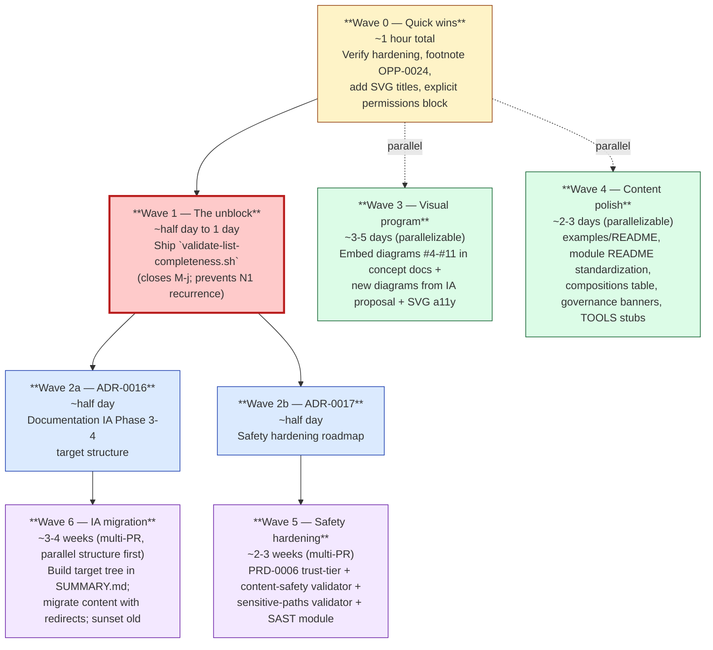

# auto-harness — Execution Roadmap

**Prepared:** 2026-05-27
**Companion to:** `refresh-2.md`, `ia-restructure-proposal.md`, `safety-security-sweep.md` (same folder)
**Status:** Plan only — sequencing decisions, not authored artifacts
**Scope:** Translate the three audit deliverables into seven sequenced waves of work, with per-wave scope, effort, dependencies, companion-rule implications, and what counts as "done."

---

## 1. Principles this plan is built on

Four constraints shape the sequencing:

1. **Structural enforcement before content.** The audit's cross-cutting finding is that every recurring drift class lands because enforcement is structural-only. Ship the list-completeness validator (Wave 1) **before** anything else, because every later content fix becomes durable once it exists and brittle until it does. This is the single inversion the roadmap insists on.

2. **One ADR shelters multi-commit work.** Editing README/HARNESS/AGENTS or doctrine trips the governance-entrypoint companion rule. Authoring an ADR up front turns N commits' worth of "stub change-log entry per file" into one citation per commit — same governance bar, much lower friction. ADR-0013 already did this for Phases 0–2; ADR-0016 (IA) and ADR-0017 (safety) do it for what follows.

3. **Parallel-safe waves run in parallel.** Visual program (Wave 3) and content polish (Wave 4) don't depend on each other and don't depend on the safety hardening (Wave 5). Don't serialize what doesn't need serializing.

4. **Respect what's already in flight.** OPP-0020, OPP-0029→PRD-0014, OPP-0031, PRD-0006 are already in the project's pipeline. The roadmap below integrates with them — never proposes work that duplicates a live PRD/OPP.

---

## 2. The seven waves at a glance



The critical path is **Wave 0 → Wave 1 → Wave 2 → (Wave 5 ∥ Wave 6)**. Waves 3 and 4 can start the moment Wave 0 lands; they don't gate anything else.

---

## 3. Wave 0 — Quick wins (~1 hour total · do today)

Six items, each small enough to land in the next hour. None requires a companion ADR; they fit under existing change-log discipline.

| Item | Effort | What lands | Why now |
|---|---|---|---|
| Run the five `gh api` commands from safety sweep §10 | 5 min | Confirmation that branch protection / secret scanning / push protection are configured | L3-04 has been Cannot-Verify since 2026-05-18. Two minutes of `gh` from your machine resolves it. |
| Footnote OPP-0024 in `docs/opportunities/candidates.md` | 5 min | One-line entry explaining the numbering gap (reserved / retired) | Refresh #2 finding N3. Closes ambiguity for contributors. |
| Add `<title>` and `<desc>` to `hero-before-after.svg` and `trust-tier-ladder.svg` | 15 min | Screen-reader text equivalents | Safety sweep §12 a11y finding H1. Two SVG file edits. |
| Add `permissions: contents: read` to `.github/workflows/harness.yml` workflow root | 10 min | Least-privilege CI tokens | Safety sweep §10 H-2. One line per workflow. |
| Pin actions to commit SHAs (`actions/checkout`, `ruby/setup-ruby`) and ensure dependabot covers `github-actions` (already does) | 20 min | Supply-chain hardening (H-1) | Find current SHAs from each action's release page; replace the ~10 floating-tag references in `harness.yml`. |
| Manually patch the immediate ADR-0015 row into `docs/README.md` ADR table | 5 min | Closes N1 by hand pending Wave 1 | Stop-gap; Wave 1 makes this permanent |

**Companion-rule shape:** all six are documentation-or-config edits, single change-log entry covers the bundle.

**Definition of done:** every item has an associated commit on `main`; the SHA-pinning is in a single PR alongside the permissions block (one consolidated CI-hardening PR), the rest can go in a "Wave 0 housekeeping" PR.

---

## 4. Wave 1 — The unblock (~half day to 1 day)

**One PR. One validator. The most consequential half-day of work on this roadmap.**

Ship `platform/validators/validate-list-completeness.sh` with the contract:

```
For every ADR file in docs/adr/, assert one row exists in
  the docs/README.md ADR table.
For every PRD file in docs/requirements/, assert one row in
  the PRD table.
For every OPP file in docs/opportunities/, assert one row in
  the OPP table AND in candidates.md (or a "retired" footnote).
For every composition .yaml in platform/compositions/, assert
  one row in compositions/README.md AND in the README.md root
  starter-compositions table.
For every template subdirectory in platform/templates/,
  assert one section in templates/README.md directory map.
For every module.yaml under platform/profiles/, assert one
  row in the family-appropriate catalog page (SUMMARY.md
  Module Library + how-to-read.md catalog count).
```

The pattern follows `validate-catalog-counts.sh` exactly — file-set discovery, regex-pattern recipe, file-by-file assertion, structured stderr on failure, exit 0/1/2 contract.

**Scope notes:**
- The new validator imports `harness_registry.rb` like its siblings — no new Ruby surface area.
- Add it to `.github/workflows/harness.yml` `validators` job.
- Add a test class `test_list_completeness` in `platform/validators/test/` with at least 4 fixture projects: complete-aligned, ADR-missing, OPP-missing, template-missing.
- Add an entry to `platform/validators/README.md` and update the validator-count in the canonical assertion sites (which the existing `validate-catalog-counts.sh` will now check at 9 instead of 8 — slot it in there too).
- Land an immediate fixing commit that adds ADR-0015's row to `docs/README.md` *via the validator's CI failure* so the fix is structurally durable rather than hand-maintained.

**Companion-rule shape:** the new validator is a sensitive path (`platform/validators/`) and triggers the existing kernel companion rule — needs `docs/project/change-log.md` entry plus the catalog-count assertion update.

**Effort:** half day if the recipe pattern is straightforward; one day if test-fixture authoring takes more attention. Don't over-engineer — the simplest expression of the contract is the right one.

**Definition of done:** one PR merged; CI passes; running the validator against an intentionally-missing-row state (test fixture) fails with a clear `✗ docs/README.md missing ADR table row for ADR-0015`. M-j moves from Open to Resolved.

**Why this comes first:** every subsequent wave produces lists that this validator polices. Phase 3's diagram-embedding will add diagram references; Wave 4's module README standardization will add module rows; Wave 5's new modules will need catalog rows. Land this before any of them and the recurring drift class dies. Skip it and every following fix carries its own discipline tax.

---

## 5. Wave 2 — Decision records (one or two half-days · parallel-safe)

Two ADRs, authored independently, neither blocks the other. Both serve as companion-rule shelter for the multi-commit work that follows.

### Wave 2a — ADR-0016: Documentation IA Phase 3-4 Target Structure

**Cites:** IA Restructure Proposal as context source. Supersedes Phases 3-4 of ADR-0013 (which were prose sketches, not full structural decisions).

**Decision recorded:** the 9-section target tree from the IA proposal becomes the documentation IA going forward. Migration approach: parallel structure first, then content move with redirects, then sunset old sections after a quiet period (per IA proposal §11).

**Scope boundaries explicit in the ADR:**
- ADR-0013 Phases 0–2 stand as historical record.
- Source-of-truth content in `platform/core/kernel/base/` does NOT move; §2 Concepts hub holds curated teaching content that links to kernel source.
- The five entrypoints (README/HARNESS/AGENTS/CLAUDE/TOOLS) remain as files; §9 Entry points explains them as a unit but doesn't merge them.

**Effort:** half day. Most of the rationale already exists in the IA proposal; this ADR records the decision.

### Wave 2b — ADR-0017: Safety Hardening Roadmap

**Cites:** Safety & Security Sweep as context source.

**Decision recorded:** the framework's safety profile improves by converting Asserted-only claims to Enforced through five priorities (from safety sweep §16). The order: list-completeness (Wave 1, completed by the time this ADR lands), PRD-0006 trust-tier enforcement, `validate-skill-content.sh` content-safety validator, `management/security-static-analysis` SAST module, repo-hardening verification.

**Scope boundaries:**
- Wave 5 work that overlaps OPP-0020 / OPP-0031 / PRD-0014 explicitly cites those as the implementing artifacts.
- Sub-items that don't yet have an OPP/PRD pair (list-completeness, content-safety scanner, sensitive-paths validator, SAST module, knowledge-redaction validator) get OPPs filed alongside this ADR — the ADR lists them as "OPPs to file" with one-line scoping for each.

**Effort:** half day. Strong case the safety sweep makes most of the argument; this ADR records the priority order and OPP queue.

**Companion-rule shape:** both ADRs touch `docs/adr/` (companion rule satisfied), and both update `docs/README.md` ADR table — but **only because Wave 1 added the validator that requires those rows.** That's the architecture working: an ADR cannot ship without its index entry. Good.

---

## 6. Wave 3 — Visual program (~3-5 days · parallel-safe after Wave 0)

ADR-0013 Phase 3 work, now with the IA proposal's diagrams added.

**Per-PR breakdown** (each is independent; ship in any order):

| PR | Scope | Effort |
|---|---|---|
| 3.1 | Embed Diagram #1 (Component Composition) in `platform/core/registry/module-types.md` | ~30 min |
| 3.2 | Embed Diagram #2 (Trust Tier Decision Flow) in `platform/core/kernel/base/trust-model.md` + reference the designed SVG ladder | ~30 min |
| 3.3 | Embed Diagram #4 (OPP→PRD→ADR Lifecycle) in `docs/README.md` (or where the lifecycle is described) | ~30 min |
| 3.4 | Embed Diagrams #7-#11 (paired mechanism, design-pressure, catalog-counts, canonical-position, anchor-satellite) in the doctrine/operating-principles docs that discuss those concepts | ~1-2 hours |
| 3.5 | Add new agent-pack inheritance tree diagram (from IA proposal §11) to `platform/agents/base/README.md` | ~30 min |
| 3.6 | Add new "anatomy of a module" diagram (from IA proposal §11) to `platform/core/registry/module-types.md` | ~30 min |
| 3.7 | Add `<title>` and `<desc>` to existing SVGs (`hero-before-after.svg`, `trust-tier-ladder.svg`, `cover-front.svg`, `cover-back.svg`) — closes a11y H1 | already in Wave 0 |
| 3.8 | Add accessibility validator: bash one-liner that greps every SVG in `docs/_assets/**` for `<title>`/`<desc>` and fails CI on any missing | ~1 hour |

**Companion-rule shape:** each PR touches concept-doc files, satisfies the existing companion rules via the embedded diagram being the content edit + a change-log row. None need an ADR (these are content additions, not structural decisions).

**Definition of done:** all 11 diagrams reachable from at least one concept doc beyond `diagrams.md`. H-f moves from Open to Resolved.

---

## 7. Wave 4 — Content polish (~2-3 days · parallel-safe after Wave 0)

The carry-over list from Refresh #2 §3. Each item is independent; ship as bandwidth allows.

| PR | Scope | Effort |
|---|---|---|
| 4.1 | `platform/examples/README.md` refresh — document all 5 sample projects, narrate at least one as end-to-end walkthrough | ~3 hours |
| 4.2 | Standardize module READMEs — uniform "X Overlay: Name" heading, fixed-position "Depends on / Conflicts with" callout, "See Also" block on every module README. **Do this *now* because every week of delay adds more to converge — 8 new modules already added two heading patterns.** | ~half day |
| 4.3 | `platform/compositions/README.md` table — add `agentic-ui-saas.yaml` and `mcp-server-typescript.yaml` (M-h). After Wave 1, the list-completeness validator catches this on the next try. | ~15 min |
| 4.4 | `bootstrap-quickstart.md` Bootstrap Complete criteria — extend to include companions, doc-references, catalog-counts, list-completeness (M-i) | ~30 min |
| 4.5 | Governance-doc banners on `docs/adr/`, `docs/requirements/`, `docs/opportunities/` — short "for contributors, not first-time users" header (L-a) | ~30 min |
| 4.6 | `validators/README.md` rewrite — user-first front section with a worked failing-run example; move Ruby internals to a contributor section (M-e) | ~half day |
| 4.7 | `TOOLS.md` stub fill or removal (L-b) | ~15 min |
| 4.8 | Agent-pack status lines — add `Status: stable` to packs that lack it (L-c) | ~15 min |
| 4.9 | `change-log.md` 2026-05-24 cell shape (L-d) — pre-Markdown-friendly | ~15 min |
| 4.10 | `link-skills.sh --help` SPDX prefix fix (L-f) | ~15 min |
| 4.11 | `AGENTS.md` First-Session step 2 wording (L-g) | ~15 min |

**Companion-rule shape:** mostly content edits; each satisfies a change-log entry. 4.2 (module standardization) is large enough to deserve a brief ADR fragment in the change-log — not a full ADR, but explicit rationale ("standardizing on the Overlay heading pattern; the prior diversity was unintentional drift").

**Definition of done:** ~75% of Refresh #2's still-open Medium/Low findings move to Resolved.

---

## 8. Wave 5 — Safety hardening (~2-3 weeks · multi-PR · cited under ADR-0017)

The substantive safety work. Five sub-items, each its own multi-PR initiative.

### 5.1 — Ship PRD-0006 trust-tier enforcement

Already drafted as PRD-0006. Implementation: add a `tier` / `defaultTier` field to `module.yaml` schema; ship `validate-trust-tier.sh` that asserts no module declares a higher default than `agents/base` allows.

**Effort:** 1-2 days. PRD is most of the spec.

**What this closes:** Asserted-only claims 10–11 from safety sweep §2.

### 5.2 — `validate-skill-content.sh` content-safety scanner

New OPP, file it alongside ADR-0017. Scope: scan SKILL.md and module.yaml `description` / `summary` / `humanReview` / `reviewGates` text fields against a deny-list of injection patterns ("ignore previous instructions," "treat as Tier," "always operates at," "skip the validator," role-prompt headers, zero-width / bidi-mark characters).

**Effort:** 1-2 days including the adversarial-corpus test fixtures (`platform/validators/test/fixtures/adversarial/`).

**What this closes:** red-team vectors V1, V2, V4, V6 from safety sweep §3.

### 5.3 — `validate-sensitive-paths.sh`

New OPP. Scope: every module.yaml-declared `sensitivePaths` pattern must be overlapped by at least one `companionRules.triggerPaths` regex.

**Effort:** ~half day.

**What this closes:** Asserted-only claim 12 from safety sweep §2.

### 5.4 — `management/security-static-analysis` module

New OPP. The largest mission-relative gap from safety sweep §11. The module overlays a `validate-sast-coverage.sh` validator: any source file under guarded paths triggers a "SAST report attached" satisfier.

**Effort:** 1-2 weeks. This is the biggest single item in Wave 5.

**Overlap with OPP-0020:** the existing OPP-0020 (eval/safety tooling) is the natural parent. This sub-item can be filed as an explicit child OPP under 0020.

### 5.5 — `validate-knowledge-redaction.sh` + CODEOWNERS on knowledge/

New OPP. Scope: scan new lines added to `docs/knowledge/shared-observations.md` and `docs/operating-principles.md` against a denylist of consumer-name patterns; CODEOWNERS rule routes review of those paths through the maintainer.

**Effort:** ~half day.

**What this closes:** cross-pollination findings from safety sweep §8 and reverse-leakage findings from §9.

**Wave 5 sequencing:** 5.1 → 5.3 → 5.5 → 5.2 → 5.4. Reason: 5.1 is already drafted (lowest implementation risk), 5.3 is a half-day, 5.5 is small, 5.2 needs an adversarial corpus to be useful, 5.4 is large and benefits from the others' patterns being established.

---

## 9. Wave 6 — IA migration (~3-4 weeks · multi-PR · cited under ADR-0016)

The structural reorganization of the GitBook nav into the 9-section target tree. The largest piece of pure content/IA work on this roadmap.

### Phase 6.1 — Parallel structure (~1 week)

Add the 9 new top-level sections to `SUMMARY.md` as siblings of the existing 15. Prefix each with `[NEW]` during the transition. Build the missing hub pages:

- `concepts/index.md` (or wherever the target tree's §2 Concepts hub lands)
- `cookbook/index.md` (target §4.6)
- `30-minute-hello-world.md` (target §1.4)
- Catalog hub pages for §5 Modules/Compositions/Skills/Validators/Templates

Content is curated, not authored from scratch — pull from existing kernel docs, workflow guides, examples.

### Phase 6.2 — Content move with redirects (~1-2 weeks)

For each section in the target tree, move (don't copy) content from current location. Leave a 1-line redirect stub at the old path:

```markdown
> This page has moved to [Concepts → Trust Tiers](../../concepts/trust-tiers.md).
```

`validate-doc-references.sh` becomes important here — every move that changes a link is a potential breakage. Run it after every commit; don't merge red.

### Phase 6.3 — Sunset old sections (~1 week)

After the new tree has been in GitBook for 2-3 weeks and no inbound links target old anchors, delete the `[NEW]` prefix and remove the duplicate old section structure. Final commit: the IA migration is complete.

**Companion-rule shape:** each commit touches GitBook config and several markdown files; cite ADR-0016 in each commit message; change-log entry summarizes the wave at end.

**Risk and mitigation:**
- **External backlinks break.** Mitigation: redirects in Phase 6.2 hold for the full Phase 6.3 quiet period; longer for any high-traffic anchors.
- **GitBook search re-indexes.** Mitigation: minor — search recovers within hours; surface this to readers via a one-line banner during the transition.
- **`validate-doc-references` red on every commit.** Mitigation: this is the system working as designed; fix forward.

---

## 10. Tracking the work — recommended discipline

Each PR carries:
1. **A wave tag in the title** — `[Wave 1] validate-list-completeness.sh`, `[Wave 3.4] embed diagrams 7-11`, etc. Makes the roadmap legible from `git log`.
2. **An ADR citation when applicable** — Waves 2/5 cite ADR-0017; Wave 6 cites ADR-0016.
3. **A "closes" reference** to the finding ID it addresses — `Closes Refresh-1 H-e`, `Closes Safety-Sweep §8`, etc.
4. **A line in `docs/project/change-log.md`** under a Wave header — gives the future Refresh #3 a clean delta to verify.

Update the scheduled doc-watch task's log file (`docs/doc-watch-log.md`) as each wave closes so the Monday-morning watch can see progress.

---

## 11. What the audit's recurring cadence catches

The weekly doc-watch (Monday 7am PT) automatically re-runs the drift checks against whichever wave is in flight. After Wave 1 lands, the watch will validate list-completeness in addition to its current scope — so the audit cycle that produced this plan also becomes the audit cycle that polices its own execution. That closes a feedback loop the project hasn't had before.

The next deep audit (Refresh #3, manual cadence — recommend mid-July 2026 unless something accelerates) will measure:
- Did Wave 1 actually prevent the drift class from recurring? *(test: are any new ADRs/PRDs missing from their tables?)*
- Did Wave 5 reduce the Asserted-only cluster from 7 to ≤3?
- Did Wave 6 move the GitBook nav to 9 top-level sections?
- Did consumer projects (Tula, OpenEMR, YouBase) report adoption-friction reduction?

Those four questions are the test of whether the roadmap landed. Refresh #3's existence is the discipline that keeps the work honest.

---

## 12. If you have only 4 hours this week

The smallest interesting cut: **Wave 0 + Wave 1.** ~5 hours combined. Closes M-j, addresses the L3-04 carry-over, fixes the immediate a11y gap, and unblocks every later wave. The roadmap can pause indefinitely after that — the structural enforcement is now in place and the rest waits.

If you have only 1 hour: Wave 0 alone is still net-positive (verifies hardening, closes 6 small items). It just doesn't unblock anything downstream.

---

## 13. The immediate first step

Wave 0 item #1 — running the `gh api` commands — is five minutes from your terminal and tells you whether L3-04 is already-resolved or genuinely-open. **Do that first.** It either closes a finding or surfaces a concrete configuration task; either outcome is a usable answer.

After that, the natural next move is Wave 1 — and I can draft `validate-list-completeness.sh` and its test fixtures in the same session if you want a code-shaped artifact to review rather than just a sequencing plan. Same for ADR-0016 and ADR-0017 — the audit material is dense enough that the ADR shape is mostly transcription at this point.

Three concrete next-step offers, in increasing scope:
1. **Smallest:** I run through Wave 0 items 2-5 as drafted edits you can copy-paste into commits. ~20 min for me; ~5 min for you to review and commit.
2. **Medium:** I draft `validate-list-completeness.sh` + its test class + its `validators/README.md` entry. You review the file; the PR shape is then yours. ~1-2 hours for me.
3. **Largest in this session:** I draft Wave 1 + ADR-0016 + ADR-0017 as a three-file bundle. You have the validator code, the IA decision record, and the safety roadmap ADR all ready to sequence into PRs. ~3-4 hours for me.

Tell me which depth and I'll start.

---

*Execution roadmap prepared 2026-05-27. No repository files were modified beyond this folder. Companion to `refresh-2.md`, `ia-restructure-proposal.md`, `safety-security-sweep.md`.*
