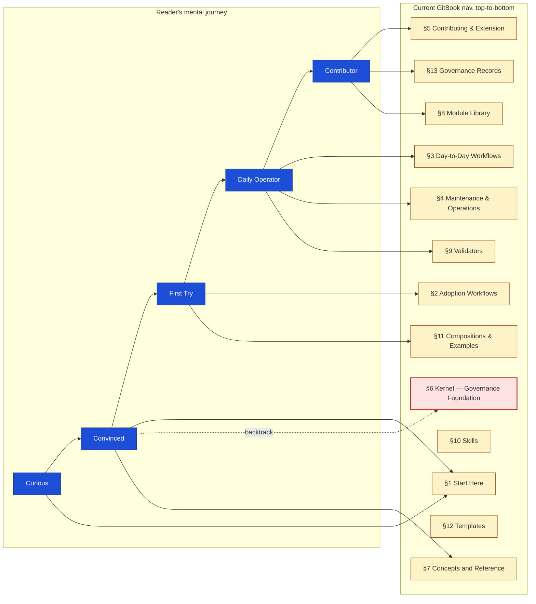
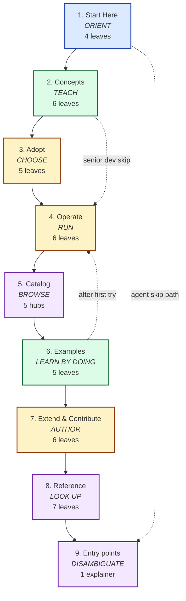
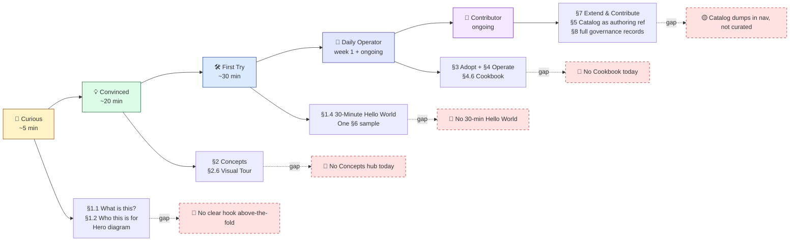

# auto-harness — Information Architecture Restructure Proposal

**Prepared:** 2026-05-27
**Companion to:** `refresh-2.md`, `safety-security-sweep.md`
**Scope:** Target tree + narrative arc + three new diagrams. No executable edit plan (per maintainer choice).
**Status:** Proposal and design rationale — no repository files were modified.

---

## 1. Executive summary

The framework now publishes through GitBook with **~290 visible leaves** rendered across **15 top-level sections**, max nav depth **4**. By the standard 7±2 nav heuristic the front door is over-loaded by a factor of two — but the more consequential problem is structural: the section that *teaches what the framework is* (the Kernel — Governance Foundation block) sits at **position 6**, after the reader has already been asked to choose an Adoption workflow, run Day-to-Day operations, and consider Maintenance. The "why" arrives after the "how." The reader is asked to commit before being convinced.

The fix is not subtraction. The catalog of 35 modules, 11 architecture diagrams, 15 ADRs, 14 PRDs, 31 OPPs, 18 workflow guides, and 65+ templates represents real work and real teaching value. The fix is **curation and sequencing** — a 9-section spine that walks the reader from *Curious* to *Convinced* to *First Try* to *Daily Operator* to *Contributor*, with the catalog visible *to* the reader as a library of examples and recipes rather than dumped *on* the reader as an alphabetical inventory.

This proposal lays out (a) the current IA quantified, (b) four breaks in its narrative arc, (c) four coverage gaps a learner experiences, (d) a target tree that resolves both, (e) the newcomer-to-contributor journey arc the tree should teach, and (f) three new diagrams that illustrate the move. The proposal is design-only — concrete enough to argue with, without a per-file move plan. If accepted, the migration is large enough to warrant its own sibling decision record — recommended as **ADR-0016 (Documentation IA Phase 3–4 Target Structure)** superseding the relevant portions of ADR-0013.

---

## 2. The current IA, quantified

`.gitbook.yaml` configures the book at the repo root (`readme: README.md`, `summary: SUMMARY.md`). `platform/SUMMARY.md` is a 15-line redirect stub. `.gitbookignore` excludes only validator test fixtures, `legacy/`, and `.claude/` — **everything under `docs/` is published**, surfacing all 31 OPPs, 14 PRDs, and 15 ADRs into the rendered nav.

The fifteen top-level sections (H2s) in `SUMMARY.md`, with their visible leaf counts:

| # | Section | Leaves | Depth |
|---|---|---:|---:|
| 1 | Start Here (with "Entry Points by Audience") | 11 | 3 |
| 2 | Adoption Workflows | 5 | 2 |
| 3 | Day-to-Day Workflows | 9 | 2 |
| 4 | Maintenance & Operations | 3 | 2 |
| 5 | Contributing & Extension | 2 | 2 |
| 6 | Kernel — Governance Foundation | 8 | 2 |
| 7 | Concepts and Reference | 4 | 2 |
| 8 | Module Library | 35 | 3 |
| 9 | Validator Reference (+ Tests + Bootstrap + CI Templates) | 18 | 3 |
| 10 | Harness-Native Skills | 7 | 2 |
| 11 | Compositions and Examples | 53 | 4 |
| 12 | Templates | 65+ | 3 |
| 13 | Project Governance & Community (ADRs/PRDs/OPPs) | 67 | 3 |

**Total visible leaves: ~290.** Top-level count of 15 is well beyond 7±2; max nav depth of 4 is on the upper edge of what most readers tolerate before bouncing.

---

## 3. Four breaks in the narrative arc

A reader walks the GitBook nav top-to-bottom. Tracing what they encounter:

**Break #1 — workflows are split three ways before concepts arrive.** Adoption (§2) → Day-to-Day (§3) → Maintenance (§4) → Contributing (§5). Four buckets of *how to use this thing*, all before §6 explains *what the thing actually is*. A reader who wants to evaluate before adopting must skim three sections forward, find Kernel at §6, read it, then return to §2. The nav teaches the wrong order.

**Break #2 — `/docs/` and `/platform/` cross-pollinate in nav.** Roadmap and Threat Model live in `docs/`. Glossary, Topic Index, and How-to-Read live in `platform/reference/`. Architecture Diagrams live in `docs/architecture/`. ADRs, PRDs, and OPPs live in `docs/`. Three reading affordances (orientation, reference, governance) split across two directory roots that the GitBook user can't see — they just experience the inconsistency as scattered nav.

**Break #3 — Examples are buried at depth 4.** "Compositions and Examples" is section 11 of 15, and sample projects sit at H3 inside it. The single most concrete teaching tool — a fully-worked-out sample — is two clicks below the fold on a 290-leaf nav. By the time a reader reaches it, they have walked past every conceptual section, every catalog page, and every reference.

**Break #4 — the catalog dumps swamp the nav.** ADRs (15), PRDs (14), and OPPs (31) collectively account for **67 leaves in section 13** — roughly 23% of the entire visible nav. These are governance-internal records mostly inscrutable to a newcomer. They appear in nav because the rule is "if it's a markdown file under `docs/`, GitBook publishes it." That rule is fine; the consequence is that the front door for a newcomer reads as a 96-leaf catalog of governance paperwork.

---

## 4. Four coverage gaps a learner experiences

What's *missing* from the nav that would help a learner:

1. **No Concepts hub.** Trust tiers, modules, companion rules, the OPP→PRD→ADR lifecycle, manifests — all are defined somewhere, but no single section consolidates them into a conceptual tour. The Kernel section comes closest but is structured as governance reference (doctrine, audit, enforcement, lifecycle) rather than as teaching content.
2. **No "From Zero in 30 Minutes" learning path.** The Bootstrap Quickstart exists, but it's one of five sibling adoption options. Nothing in nav tells a newcomer "if you have never seen this before, do this first."
3. **No Cookbook.** Common recipes — *"add a new module to my project,"* *"loosen a validator temporarily,"* *"audit my harness,"* *"migrate from copy to submodule,"* *"add a sensitive path with companion enforcement"* — live scattered inside Maintenance Operations and Modify Composition Mid-Project, not in a recipe index.
4. **No Visual Tour.** Eleven architecture diagrams sit in one leaf (`docs/architecture/diagrams.md`). They should be the on-ramp — the easiest way to see the system at a glance — but they appear as a single nav entry buried in the Kernel section.

---

## 5. Catalog visibility — over-exposed vs under-curated

The current rule is "all markdown files get nav rows." That has consequences:

| Asset | Current exposure | Pathology |
|---|---|---|
| 31 OPPs | All in nav, top level | These are pre-PRD candidates, ~half in `proposed` status. Useful as a flat list on a hub page; not as 31 sidebar leaves. |
| 14 PRDs | All in nav | Same — a hub page with one curated row each, not 14 sibling leaves. |
| 15 ADRs | All in nav | Borderline. A short curated "core ADRs" list (e.g., 0001, 0003, 0005, 0008, 0013, 0015) belongs in a Concepts hub; the full chronological list belongs in a Reference appendix. |
| 35 modules | All in nav, alphabetical within family | Appropriate as a Module Library, but no curation: a "Start with these three" subset (kernel/base, your stack, a delivery overlay) would beat alphabetical-within-family for a learner. |
| 65+ templates | All in nav, 15 sub-categories | Over-exposed. Templates are *outputs of activating a module*; they should be visible *via the module that requires them*, not as 14 nav sub-categories. |
| Sample-project leaves | ~40+ leaves, one branch per sample | Duplicate the same file structure for each sample. Should be collapsed to one "sample tour" leaf that links into samples by use case. |

**Lift candidates into nav:** Concepts hub, Learning Path, Cookbook, Visual Tour, curated ADR shortlist.
**Demote out of nav:** full OPP/PRD/ADR enumerations, full template tree, per-validator script leaves, individual sample-project sub-files.

---

## 6. The target tree

Nine top-level sections instead of fifteen. Max depth 3 instead of 4. Curation everywhere a 290-leaf dump used to be.

```text
auto-harness GitBook
│
├── 1. Start Here                    (~10–12 min total — orientation)
│   ├── What is auto-harness?
│   ├── Who this is for
│   ├── Pick your path
│   └── 30-Minute Hello World        ← NEW: end-to-end first-touch
│
├── 2. Concepts                       ← NEW HUB
│   ├── The four-layer model
│   │   (manifest → modules → contract → validators)
│   ├── Trust Tiers
│   ├── Modules and Composition
│   ├── Companion Rules
│   ├── The Lifecycle of a Change
│   │   (OPP → PRD → ADR → implementation)
│   └── Visual Tour                   ← lifted from docs/architecture/diagrams.md
│
├── 3. Adopt                          ← collapsed from current §2 + §3 + §5
│   ├── Which path? (decision chart)
│   ├── Submodule integration (recommended)
│   ├── Bootstrap quickstart
│   ├── Brownfield onboarding
│   └── Discovery-to-composition (idea-stage)
│
├── 4. Operate                        ← Day-to-Day + Maintenance, fused
│   ├── Running validators
│   ├── CI integration
│   ├── Honoring companion rules in a PR
│   ├── Maintenance and upgrades
│   ├── Troubleshooting (validator error solver)
│   └── Cookbook                      ← NEW: ~10 named recipes
│
├── 5. Catalog                        ← curated, with "start here" callouts
│   ├── Modules (35, browse by family, "core three to start")
│   ├── Compositions (9 starters, with selector matrix)
│   ├── Skills (7, with activation conditions)
│   ├── Validators (8, with what each guards)
│   └── Templates (browse via the module that requires them)
│
├── 6. Examples                       ← lifted out of Compositions
│   ├── Sample tour (which sample teaches what)
│   ├── node-web-saas-postgres (most complete)
│   ├── interview-driven-hackathon
│   ├── agentic-ui-starter
│   └── mcp-server-starter
│
├── 7. Extend & Contribute
│   ├── Extending the harness (modules / validators / skills / templates)
│   ├── Skill authoring conventions
│   ├── Contributing guide
│   ├── Security disclosure
│   ├── Code of conduct
│   └── Threat model
│
├── 8. Reference
│   ├── Glossary
│   ├── Topic index
│   ├── How to read this documentation
│   ├── Roadmap
│   ├── Curated ADR shortlist
│   ├── Governance records (full ADR/PRD/OPP lists — demoted from top-level)
│   └── Operating principles
│
└── 9. Entry points (repo-root files)
    └── README / HARNESS / AGENTS / CLAUDE / TOOLS — explained side-by-side
```

**Top-level: 9 sections. Max depth: 3.** No section exceeds ~10 leaves at top level except Catalog (which curates 35 modules behind a hub page) and Reference (which carries the demoted full ADR/PRD/OPP catalog).

The five-entrypoint quirk that's confused readers since v1 — README / HARNESS / AGENTS / CLAUDE / TOOLS — gets a side-by-side explainer at section 9, not a banner at the top. That ordering trusts the reader to first understand *what auto-harness is* before being asked to disambiguate five files with similar names.

---

## 7. The narrative arc — five waypoints

The tree above is *designed to teach a journey*. The journey has five waypoints, each with a content-meets-waypoint pairing:

| Waypoint | What they need to know | Where in target tree | Effort |
|---|---|---|---|
| **Curious** | What is this? Why does it matter? Should I care? | §1.1 What is auto-harness? + §1.2 Who this is for + hero diagram | ~5 min |
| **Convinced** | What are the moving parts? What's the mental model? | §2 Concepts (the four-layer model, trust tiers, companion rules) + §2.6 Visual Tour | ~20 min |
| **First Try** | Can I make it work on something small? | §1.4 30-Minute Hello World + one §6 sample | ~30 min |
| **Daily Operator** | I've adopted it — how do I run my project under it day-to-day? | §3 Adopt + §4 Operate + §4.6 Cookbook | first week + ongoing |
| **Contributor** | I want to extend it / fix it / add to the catalog. | §7 Extend & Contribute + §8 Reference (full records) + §5 Catalog as authoring reference | open-ended |

The current IA scatters all five of these across the same 15 top-level sections — every waypoint reaches into multiple sections, with backtracking. The target IA gives each waypoint a primary home and a clean transition to the next.

---

## 8. Three diagrams

These three Mermaid diagrams are ready-to-drop into the proposal's eventual implementation. They are designed to be read in sequence: the *problem* (scatter), the *solution* (target tree), and the *journey* (arc).

### Diagram A — Current IA Scatter

Shows how the newcomer's mental journey crosses many GitBook sections, with backtracking. The visual story is: every step of the journey fans out to 2–4 sections; the conceptual step ("Convinced") has an arrow pointing back to §6 after the reader has already passed §2–§5.



The red-bordered §6 is the visual punchline: the section that explains *why the framework exists* is where the reader has to jump backward to.

### Diagram B — Target IA Tree

Shows the proposed 9 sections as a vertical pipeline, each labeled by its *didactic intent*. Skip-ahead arrows on the right show optional reader paths (AI agent, senior dev) that don't need the full walk.



The four colors encode the four reader-intents: **ORIENT** (blue), **TEACH** (green), **DO** (amber), **REFERENCE** (purple). The pipeline reads as a natural progression of intent, not just nav order.

### Diagram C — Newcomer-to-Contributor Journey Arc

Maps each waypoint to the content it meets in the target tree, with effort estimates. Side annotations show *what's missing today* at each waypoint — visually documenting the four coverage gaps from §4.



Each red dashed gap is a thing the *target* tree adds that the *current* tree lacks. The visual makes the gap census concrete.

---

## 9. Section-by-section rationale

A few sections deserve specific commentary because their construction is non-obvious.

**§2 Concepts is the largest *new* unit.** It pulls content from three current locations: parts of `platform/core/kernel/base/` (which becomes governance reference rather than teaching), `platform/reference/` (glossary stays in Reference; topical content lifts to Concepts), and the architecture diagrams (which become §2.6 Visual Tour). The intent: a reader can walk §2 top-to-bottom in 20 minutes and emerge with the mental model. This is the largest single content reorganization the tree requires.

**§3 Adopt collapses three current sections into one.** Adoption Workflows, Day-to-Day Workflows, and parts of Contributing & Extension fuse. The decision chart at the top of §3 routes the reader to *exactly one* of five paths — fixing the QA-2026-05-18 finding L4 (recommended path missing from routing) once and for all.

**§4 Operate is what you read every day after adoption.** It's structurally smaller than the current Day-to-Day Workflows + Maintenance combined because it pulls only the *operational* sub-set; design-time work (extending the harness) moves to §7.

**§5 Catalog is a hub-page architecture, not a leaf-list.** Each of its five entries (Modules, Compositions, Skills, Validators, Templates) is a single hub leaf in the rendered nav. Inside the hub, curated browsing affordances live (start-with-these subsets, family groupings, selector matrices). The 35 modules don't appear as 35 nav rows.

**§6 Examples gets its own section.** Currently buried at depth 4 inside Compositions. The most concrete teaching tool in the entire repo deserves a top-level home.

**§8 Reference absorbs the demoted catalog.** All ADRs, all PRDs, all OPPs land here as enumerated lists — they don't disappear from publication, they just stop dominating nav. A curated "core ADR shortlist" pointer lifts into §2 Concepts for the half-dozen ADRs that explain *why* the framework is shaped the way it is.

**§9 Entry points goes last because newcomers don't need it first.** The repo-root five-file disambiguation belongs after the reader knows what the framework is. A reader entering via the GitHub repo still sees `README.md` first because the repo-root README is unchanged (and the rebuilt README from Phase 1 stays); §9 is for the *GitBook reader* who's walked the tree.

---

## 10. ADR-0013 succession

ADR-0013 (Documentation Information Architecture) is Accepted and has driven Phases 0–2. Its Phases 3 and 4 are described in prose — `embed diagrams in concept docs`, `standardize module READMEs`, `refresh examples README`, `governance-doc banners`, `validators/README rewrite`. None of those Phase 3–4 items are *wrong*, but they describe surface-level edits, not the structural restructure this proposal recommends.

**Two options:**

1. **Sibling ADR-0016 supersedes ADR-0013 Phases 3–4** with the target tree above. ADR-0013's Phases 0–2 stand as the record of what shipped; ADR-0016 records the next-phase decision.
2. **ADR-0013 is amended in place** (status remains Accepted, content updated). Cleaner if you think of the IA as one continuous decision; loses the auditability of "what was decided 2026-05-25 vs 2026-05-27."

Recommendation: **Option 1.** ADRs are immutable once Accepted (per `docs/README.md` ADR table guidance); supersession by sibling is the project's documented pattern. This also creates a natural place for the new ADR's *Decision* section to cite this proposal as its context source — closing the loop the way ADR-0013 already cited the v1 audit.

---

## 11. Migration approach (sketch, no executable plan)

A few pragmatic notes — not an edit plan, but the texture of what the migration would feel like:

- **Parallel structure first.** Build the new 9 top-level sections in `SUMMARY.md` as siblings to the existing 15 (rendered nav temporarily has both). Land them as `[NEW]` prefixed during the transition.
- **Move content via redirect.** GitBook's permalink handling rewards stable URLs. Where content moves between files (e.g., parts of `kernel/base/` migrate to a new `concepts/` directory), keep a stub at the old path with a 1-line redirect note for the first release after migration.
- **Curate the catalog hubs.** §5 Catalog hubs (Modules, Compositions, Skills, Validators, Templates) need to be authored — they don't exist today as standalone pages. Each is ~1 page of hub content + curated lists.
- **Sunset old sections after a quiet period.** Once the new tree is in nav for 2–3 weeks and no incoming links go to old anchors, delete the duplicate `[NEW]` prefix and the old section structure.
- **Risks.** Backlinks in older PRs and external referrers will break; GitBook search may re-index; readers who bookmarked specific pages will hit redirects. Each is acceptable; none is fatal.

The validator implication of this migration is non-trivial: `validate-doc-references.sh` will see many link changes in a single commit window. The migration PR (or PR series) should run that validator green at every step — if it's not green, the migration is breaking links somewhere unintended.

---

## 12. What this teaches (and why that matters)

A target tree is itself a teaching artifact. Every reader who walks the proposed §1 → §2 → §3 → ... is being implicitly taught: *orient yourself, then learn the concepts, then choose a path, then operate, then browse the catalog when you need to, then find examples, then extend, then look up references*. That sequence is the framework's own theory of how a project should be governed — articulated through nav choices.

This is the didactic-effect framing made concrete. The current tree teaches *the catalog* (here are all the modules, here are all the validators, here are all the ADRs). The target tree teaches *the journey* (here is how you become a contributor). Both are valid teaching choices; only one of them serves the priority reader.

---

## 13. Open questions

A few decisions this proposal deliberately leaves to the maintainer:

1. **The §2 Concepts hub absorbs the trust-model.** Does the kernel doctrine still live in `platform/core/kernel/base/` (yes — that's the source of truth for governance) and §2 Concepts pulls *teaching versions* of the kernel material? Or does the kernel itself move? Recommendation: source-of-truth stays where it is; §2 holds curated teaching content that links to the kernel source.
2. **The five sample projects — are all five worth top-level Examples sections?** §6 lists four (omits `submodule-consumer` because its current state is a duplicate of `node-web-saas-postgres` per QA L4-08, even though L4-08 was marked resolved with a "deliberate topology-agnostic teaching device" note). Reconsider whether `submodule-consumer` is teaching anything distinct.
3. **Curated ADR shortlist composition.** §2 Concepts cites "core ADRs." Which? Recommend: 0001 (Modular Governance, the founding), 0003 (Submodule Integration, the adoption pattern), 0005 (Open-Source Cut, the licensing decision), 0008 (MCP Awareness, the agent-surface decision), 0013 (Documentation IA, the meta-decision), and once ADR-0016 lands, this proposal's own record.
4. **Templates curation.** The proposal says templates appear *via the module that requires them*, not as a 14-category dump. Concretely that means each module's catalog hub page lists its templates as an attribute of the module. The current standalone `platform/templates/README.md` remains but as a flat reference index, not a primary nav entry.
5. **Workflow guides.** 18 workflow guides currently live in `platform/workflow/`. In the target tree they split: adoption-related guides → §3 Adopt; operational guides → §4 Operate; extension guides → §7 Extend & Contribute. Some guides (e.g., `cycle-end-distillation.md`) span categories — those need to be either split or assigned to the dominant category.

---

## 14. Companion deliverables

- **Refresh #2** (`refresh-2.md`) — progress verification + the 48-hour drift findings that confirmed M-j (list-completeness gap) as the highest-leverage outstanding item.
- **Safety & Security Sweep** (`safety-security-sweep.md`) — eight safety dimensions; surfaces the cross-cutting structural insight that ties this IA proposal, the validator hardening, and the safety hardening into one architectural move.

The three docs argue the same thing in three voices: **the framework's enforcement is structural-only; the next phase of work is turning honor-code into code-code**. The IA proposal is the navigation-and-teaching expression of that move.

---

*IA Restructure Proposal prepared 2026-05-27. No repository files were modified.*
