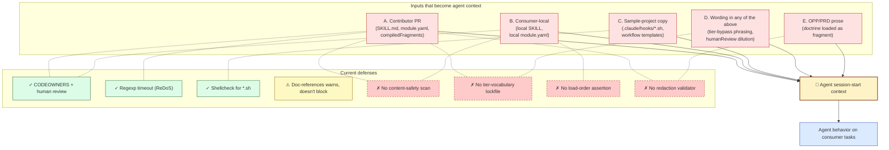
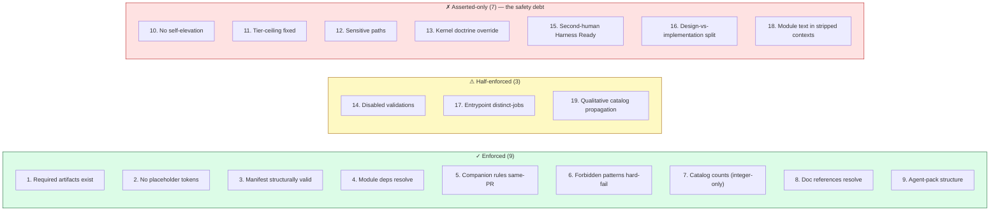

# auto-harness — Safety & Security Sweep

**Prepared:** 2026-05-27
**Repo state:** `main` @ `1e1791f`, post-v0.5.2
**Companion to:** `refresh-2.md`, `ia-restructure-proposal.md`
**Method:** four focused agent passes (repo/CI hardening, governance contract integrity, adversarial red-team, equity & future-analyses) plus a targeted seventh-agent pass covering the four follow-up framings (output determinism & sandboxing, underhanded-code risk, cross-pollination, doc-code alignment) plus reverse-direction prompt leakage and recursive policy validation
**Status:** Audit and recommendations only — no repository files were modified
**Scope:** Eight named safety dimensions (Core Safety + Targeted Safety) plus three supporting dimensions (repo/CI hardening, equity & accessibility, recommended future analyses)

---

## 1. Executive summary

Eight safety dimensions, audited concurrently against a fast-moving codebase that has, encouragingly, **already named the right next moves itself** — OPP-0020 (eval / safety tooling), OPP-0031 (agent defense-in-depth), OPP-0029 (agent observability), and PRD-0014 (OTel for agents) are all in flight. The audit's job is not to discover problems the maintainer hasn't seen; it's to make the *cross-cutting structural cause* visible and to surface the specific gaps that aren't yet on the inbound list.

**The cross-cutting finding, stated plainly:** the harness's enforcement surface is **structural-only.** Validators check that files exist, that paths match regexes, and that integers in documentation match canonical recipes. They do *not* check that lists are complete, that wording preserves a tier declaration, that a claim made in prose has a code anchor, or that consumer-specific content has been redacted before being absorbed into framework doctrine. Every highest-severity finding across the eight dimensions traces to this one structural cause. The framework is one careful contributor away from any single defense; it is also one careless contributor away from any single failure.

**Severity tally across all dimensions:**

- **Critical:** none. There is no acute live vulnerability.
- **High:** seven findings — five doc-code alignment misalignments (Documentation-Code Alignment), the underhanded-code-in-governed-software blind spot (the framework governs AI code generation but has no defense against subtly-bad code outputs), four upstream-propagation pathways for consumer→framework prompt leakage, validator auditability gap (no structured output), the L3-04 repo-hardening Cannot-Verify, two existing posture gaps from prior audits (action SHA pinning, explicit `permissions:` blocks).
- **Medium:** eleven findings, mostly governance-contract-integrity gaps and equity items.
- **Low:** several cosmetic findings.

**The single highest-leverage move:** ship the *content-safety* validator class — list-completeness assertions (closing the recurring drift class), trust-tier enforcement (PRD-0006), and sensitive-path enforcement (currently documentary). Each is well-scoped; together they convert the most load-bearing parts of the framework's doctrine from honor-code into code-code.

The rest of this sweep walks the eight named dimensions, three supporting dimensions, two visuals, and a refreshed priority list.

---

## Part I — Core Safety Analysis Framework

### 2. Formal Verification — Claim-vs-Enforcement Map

The formal-verification angle for a framework that is mostly markdown + bash + Ruby is not literal proof-carrying code. The spirit of the framing is: **for each load-bearing claim the framework makes about agent behavior or governance, classify it as Enforced, Half-enforced, or Asserted-only.** That classification is the project's own "doctrine vs enforcement" gap, made explicit.

The audit enumerated 19 important claims drawn from `doctrine.md`, `trust-model.md` (recently expanded), `audit-model.md`, `enforcement-model.md`, `lifecycle-controls.md`, and `operating-principles.md`:

| # | Claim | Status | Notes |
|---|---|---|---|
| 1 | Required artifacts must exist | **Enforced** | `validate-required-artifacts.sh` |
| 2 | No unfilled `[[PLACEHOLDER]]` tokens | **Enforced** | `validate-placeholders.sh` |
| 3 | Manifest structurally valid | **Enforced** | `validate-manifest.sh` |
| 4 | Module dependencies resolve, conflicts honored | **Enforced** | `validate-module-graph.sh` |
| 5 | Companion rules fire in the same PR | **Enforced** | `validate-companions.sh` |
| 6 | `forbiddenPatterns` hard-fail | **Enforced** | runs first |
| 7 | Catalog counts match recipes | **Enforced** (numeric only — see Targeted §5/§7) | `validate-catalog-counts.sh` |
| 8 | Markdown links resolve | **Enforced** | `validate-doc-references.sh` (now consumer-aware per PRD-0012) |
| 9 | Agent packs structurally complete | **Enforced** | `validate-agent-pack.sh` |
| 10 | Agents may never self-elevate trust tier | **Asserted-only** | The centerpiece safety claim is honor-code; trust-model.md openly admits this; PRD-0006 is the closure path |
| 11 | Agent pack default tier ceiling cannot be raised silently | **Asserted-only** | No `tier` field exists on any `module.yaml` |
| 12 | Sensitive paths trigger elevated review | **Asserted-only** | `sensitivePaths` field is read by *zero validators* — purely documentary metadata |
| 13 | Kernel doctrine cannot be overridden by modules | **Asserted-only** | No precedence check exists |
| 14 | `disabledValidations` is deliberate and documented | **Half-enforced** | Read structurally; no check pairs an override to a change-log row |
| 15 | "Harness Ready" requires second-human review | **Asserted-only** | No PR-attestation check |
| 16 | Operating principle §9 (Split Design from Implementation) | **Asserted-only** | No code consumer of the design-vs-implementation separation |
| 17 | Repo-root entrypoints maintain distinct job statements | **Half-enforced** | Companion rule on the paths; no quality-of-distinctness check |
| 18 | Module-text reads cleanly in stripped contexts | **Asserted-only** (by-design) | Documented as a review concern |
| 19 | Active-module catalog changes propagate to 5 documented surfaces | **Half-enforced** | Numeric drift caught; *qualitative* propagation (new module named in HARNESS / SUMMARY / README / harness-onboarding / discovery-to-composition) not caught |

**Score: 9 Enforced · 3 Half-enforced · 7 Asserted-only.** Of the seven Asserted-only items, **six are about agent behavior or governance contract integrity** (claims 10–13, 15, 16) — exactly the surface that matters most for the framework's stated mission. The trust-model document itself names this gap candidly; PRD-0006 (trust-tier enforcement) is the maintainer's named closure path for claims 10–11.

**Concrete recommendation:** at minimum, ship PRD-0006 to enforce claims 10 and 11. Beyond that, write a `validate-sensitive-paths.sh` that asserts every declared `sensitivePaths` pattern has at least one companion rule whose `triggerPaths` overlaps it — turning claim 12 from documentary metadata into machine-checked structural metadata.

---

### 3. Adversarial Red-Teaming — Attack Tree

The threat model: auto-harness's documentation files — `module.yaml`, `SKILL.md`, agent-pack READMEs, the `compiledFragments` declared in each module — **are loaded into downstream AI agent contexts at session start.** This makes the framework's authored content an attack surface for prompt injection and governance subversion against any consumer's agent.

Root: *compromise a downstream agent through governance content.*

**Five attack branches:**

- **A. Contributor-side injection** (PR lands adversarial payload)
- **B. Consumer-side / local module injection** (local module overrides framework)
- **C. Supply-chain via sample projects** (sample artifacts contain malicious content that propagates by copy)
- **D. Wording-based trust-tier bypass** (text reframes a Tier-4 action as Tier-2)
- **E. Adversarial OPP/PRD content** (governance fragments load attacker doctrine)

**Ten concrete attack vectors** (selected, ranked by audit assessment):

| # | Name | Persona | Feasibility | Severity | Current mitigation |
|---|---|---|---|---|---|
| V1 | Skill-description payload | Malicious contributor | Easy | High | CODEOWNERS review only; no content scan |
| V2 | CompiledFragment README poisoning | Malicious contributor | Medium | High | Single-maintainer review (acknowledged in threat-model.md A3) |
| V3 | Sample-hook supply chain | Malicious contributor | Medium | High | Shellcheck catches some patterns; no "writes outside repo" check |
| V4 | Wording-based tier downgrade | Malicious contributor | Easy | High | Reviewer eyeballing |
| V5 | Consumer-local skill overrides framework skill by load order | Adversarial consumer | Easy | Medium | No load-order assertion exists |
| V6 | HumanReview text dilution | Malicious contributor | Easy | Medium | Companion rule checks paths, not content quality |
| V7 | OPP-laundering of weak defaults (slow accumulation of "v2-deferred" enforcement) | Patient adversary across many small PRs | Hard (slow) | High over time | Acknowledged in OPP-0031; explicit risk in PRD-0014's Non-Goals; §9 operating principle actively *embraces* the pattern |
| V8 | ReDoS on validator regex | Adversarial manifest author | Hard | Low | `Regexp.timeout = 1.0` defends this case |
| V9 | Doc-references warning-classified target redirected | Malicious contributor | Medium | Medium | `validate-doc-references.sh` classifies but doesn't block on warning categories |
| V10 | MCP tool tier inflation | Compromised MCP-module maintainer | Easy | High | No cross-check between declared tier and effect-pattern |

**Coverage gap vs. existing OPPs:** OPP-0031 (defense-in-depth) is *generic agent posture*; it does not cover V1, V2, V4, V5, V6, V10 (the contributor/wording/load-order/MCP attack vectors). PRD-0014 (observability) is runtime trace — it would not detect attacks that land in session-start context. **The most uncovered surface area is the content-text channel itself.**

**Concrete recommendations** (not duplicating existing OPPs):

1. File a new OPP, working title `governance-content-integrity`, anchored under OPP-0027 alongside OPP-0031.
2. Ship a `validate-skill-content.sh` validator that scans SKILL.md / module.yaml text fields (`description`, `summary`, `humanReview`, `reviewGates`) for a deny-list of patterns: "ignore previous instructions," "treat as Tier," "always operates at," "skip the validator," "supersedes harness-governance," role-prompt headers ("System:", "User:"), zero-width characters, mismatched Unicode bidirectional marks.
3. Maintain a **tier-vocabulary lockfile** (`platform/core/kernel/base/tier-vocabulary.lock`) — canonical tier→effect strings. Any PR changing a documented Tier→action mapping without also updating the lockfile fails validation. Closes V4.
4. Add a **"defer-to-v2" accumulation cap** in operating-principles: a module may not be merged if it brings the count of "v2-deferred enforcement" items per architecture-family above a threshold (e.g., 2). Forces enforcement debt to be paid down. Closes V7.
5. Maintain `platform/validators/test/fixtures/adversarial/` — known injection strings, tier-bypass phrasings, role-prompt headers — and assert `validate-skill-content.sh` flags every one. Treat any new injection pattern surfaced in the wild as a fixture addition.

---

### 4. Prompt Injection Testing — Specific Defenses & Gaps

This dimension narrows the red-team to the prompt-injection sub-channel specifically. Three vectors (V1, V2, V6) from §3 are prompt-injection in form. They share a single root cause: **no validator examines the text content of files that compile into agent context.** The framework treats these files as governance metadata (paths and shapes) but treats their *prose content* as trusted by virtue of human review.

**Indirect injection from third-party data.** Beyond the contributor-side vectors, two indirect injection paths exist:

- **Sample-project content as injection medium.** A consumer who copies `platform/examples/sample-projects/*/docs/...` artifacts into their own repo carries whatever prose was in those files into their agent's session-start context. The current sample-project content is benign, but its content is governed only by ordinary code review. Any future addition (a new hook, a new sample document) carries the same risk surface.
- **Distillation reflux** (also see Cross-Pollination §8): observations from consumer projects can land in `docs/knowledge/shared-observations.md` upstream, which is then loaded into the framework's own agent contexts on subsequent runs. A consumer who introduces adversarial wording into their observation (knowingly or not) plants it upstream.

**Recommended addition to the red-team validator scope:** the deny-list approach is necessary but insufficient — text-content prompt injection is a permanently-incomplete defense. Pair it with:

- **Two-stage compiledFragment loading.** Today the framework's compiledFragments are loaded by string concatenation into agent context. A safer pattern: load them through a *content-classifier* pass that flags suspicious passages for the agent's awareness (a sort of "treat as untrusted input" marker). This is design-level work; cite as input to a future OPP.

---

### 5. Output Determinism & Sandboxing

The framework's validators run in two contexts: developer machines (locally, before commit) and CI (on every PR). Two questions: are they deterministic? Are they sandboxed?

**Sandboxing — strong.** No `eval`, `instance_eval`, `exec`, `system`, or `Kernel.send` is called against manifest-derived strings (grep across `platform/validators/lib/*.rb` confirms zero hits). `YAML.safe_load(..., permitted_classes: [], aliases: false)` at `harness_registry.rb:33,54` blocks YAML object-instantiation attacks. Regex compilation from `module.yaml` is bounded by `Regexp.timeout = 1.0` at `harness_registry.rb:12` — explicit ReDoS defense. The only shell-out is `git diff` with the `base_branch` argument validated by `REF_NAME_REGEX` (`/^[A-Za-z0-9._\/-]+$/`, line 151). **Validators cannot be coerced into arbitrary code execution by a malicious manifest.**

**Determinism — mostly reproducible, with one ordering hazard.** `find` invocations are count-only (order-insensitive). `validate-doc-references.sh` Pass 1 explicitly `.sort`s globbed files (line 121); Pass 2 sorts in `harness_registry.rb:443`. `validate-companions.sh` iterates `Array(manifest…)` order which is YAML-source-ordered (deterministic given the same file). **One subtle hazard:** `extract_first_capture` at `validate-catalog-counts.sh:175` returns the *first* match — if two regex-matching lines exist in a watched file, the result is line-order dependent. Re-ordering a doc without a count change could change the validator's outcome.

**Network / time — clean.** No validator hits the network. `Time.now` and `date` are used only in the optional `distillation-prompt.sh` audit log; no validator decision depends on them.

**Auditability — weak. This is the single biggest gap in this dimension.** All validator output is unstructured stdout/stderr (`✓` / `✗` prefix). There is no `--json` flag, no machine-parseable output, no append-only audit ledger. A "hallucinated approval" — a future change that makes a validator silently pass on a forbidden state — is invisible in CI logs except as the *absence* of an error line. There is no positive evidence trail that a specific assertion was checked and passed.

**Cross-OS reproducibility — generally fine, one watch-out.** Bash 3.2 and Bash 4+ both work; Ruby 3.3 pinned in CI; CI matrix is `ubuntu-latest, macos-latest`. **However:** `Regexp.timeout` is a no-op on Ruby <3.2 — a stale developer machine on Ruby 3.1 has no ReDoS defense. The CI pin (3.3) defends the merged result, but local development could silently regress.

**Recommendations:**

1. Add `--json` output mode to each validator, emitting `{validator, status, exit_code, checks: [{id, status, evidence}]}`. Land in CI as a per-PR `validator-trace.jsonl` artifact so retroactive auditing exists.
2. Make `extract_first_capture` return *all* matches and fail if any disagree — closes the line-order hazard.
3. Document the Ruby 3.2+ requirement for local development prominently (and consider a `ruby >= 3.2` check at the top of each validator).

---

## Part II — Targeted Safety Analyses

### 6. Recursive Policy Validation

When a new module / PRD / ADR lands, are its rules cross-checked against existing kernel doctrine and other modules' rules for contradiction? Audited against the most recent additions (ADR-0014, ADR-0015, operating-principle §9):

- **ADR-0014 (sunset distilled-learnings)** is internally consistent and matches the live `knowledge-capture/module.yaml` v1.2.0. No surviving rule still requires `distilled-learnings.md`. **Clean.**
- **ADR-0015 (managed-fleet)** carries an asymmetric `conflictsWith`. `managed-fleet/module.yaml` declares `conflictsWith: [prototype]`; `prototype/module.yaml`'s `conflictsWith: [production-saas]` does *not* list managed-fleet symmetrically. `validate-module-graph.sh:63-65` iterates each active module's declared conflicts against the active set — so a manifest activating `prototype + managed-fleet` *is* caught (via managed-fleet's side), but `production-saas + managed-fleet` activation goes uncaught: both ship operational artifacts and neither names the other. **Asymmetric — gap.**
- **Operating-principle §9 vs. §5.** §9 ("Split Design from Implementation") embraces the deferred-enforcement pattern. §5 ("Self-Governance") says "disabled validations are documented and justified — not silently skipped." Distinction holds: §9's deferrals are *documented OPP/PRD pairs*, not `disabledValidations` overrides. **Consistent.**
- **Operating-principle §9 vs. §3 ("catalog changes propagate").** ADR-0015 *explicitly* carves out an exception to §3: `HARNESS.md` Active Modules is *not* updated because auto-harness doesn't activate `managed-fleet`. The ADR labels this "a deliberate deviation from the generic propagation reflex." A documented exception, not a contradiction — but it weakens §3's "always" framing. **Documented but worth a follow-up §3 rewording.**

**Recommendations:**

1. Add a validator that asserts `conflictsWith` symmetry — if A conflicts with B, B's `module.yaml` must list A. Roughly 30 lines of Ruby.
2. Loosen §3's "always propagate" framing to "propagate when the module is self-activated; otherwise label as catalog-only." Turn ADR-0015's exception into a rule rather than a one-off.
3. Add a `module.yaml` field `exclusiveCategory: delivery` (or similar) and have `validate-module-graph.sh` assert at-most-one-per-category for the categories that semantically demand exclusivity (delivery postures are mutually exclusive in practice, but no validator currently enforces this — the prose says they are).

---

### 7. Documentation-Code Alignment

This dimension is the *no-hallucinated-guardrails* check, performed as a specific-claim-verification pass. The audit picked ten guardrail claims made in documentation and verified each against the actual code. Status legend:

- **Aligned** — code enforces what the doc claims
- **Misaligned** — doc claims something stronger than code does
- **No-code-anchor** — claim is purely aspirational; code has no enforcement

| # | Claim | Source | Status |
|---|---|---|---|
| 1 | "Validators run on every PR and catch governance gaps before merge" | README:215 | **Aligned** — workflow triggers verified |
| 2 | "Agents may never self-elevate" | README:251, trust-model.md | **No-code-anchor** |
| 3 | "Companion rules fire in the same PR" | doctrine | **Aligned** |
| 4 | "Sensitive path governance — patterns that trigger elevated human review" | README:273 | **No-code-anchor** — zero validators consume `sensitivePaths` |
| 5 | Specific Tier-3 / Tier-4 action gates | harness-governance SKILL.md | **No-code-anchor** |
| 6 | "Eight validator scripts" | README:160 | **Aligned** — catalog-counts self-checks |
| 7 | "Secrets never belong in tracked artifacts" | README/§4 | **No-code-anchor** in the harness's own workflow (relies on GitHub's repo-level secret scanning, which is itself Cannot-Verify per L3-04) |
| 8 | "`validate-doc-references` consumer-aware" | PRD-0012 | **Aligned** — code matches PRD's FR-001 / FR-002 |
| 9 | Operating-principle §9 "Split Design from Implementation" | operating-principles.md §9 | **No-code-anchor (intentional)** — doctrine only by §9's own logic |
| 10 | "Kernel doctrine cannot be overridden by modules" | doctrine implication | **No-code-anchor** — phrase not literally present; no precedence check |

**Score: 4 Aligned · 0 Misaligned · 6 No-code-anchor.** The Misaligned count is zero — no claim outright lies. But **four of the six No-code-anchor items** (claims 2, 4, 5, 7) appear in the README and SKILL files as *guarantees* without caveats. A reader of those documents could reasonably believe these guardrails exist in code; they exist only in prose.

**Severity: high for claims 2, 4, 5, 7.** The README sells `sensitivePaths` as a security feature; the code never reads the field. Trust-tier discipline is the framework's centerpiece safety claim; no code checks it. Secret governance is delegated to GitHub repo-level features whose state is Cannot-Verify from this audit.

**Recommendations:**

1. Either ship the enforcement (PRD-0006 trust-tier, `validate-sensitive-paths.sh`, secret-scanning verification) or amend the documentation prose to explicitly label these surfaces "doctrinal, not machine-enforced." The current 4-of-10 unambiguously-aligned ratio is below what the README's confidence implies.
2. Adopt a documentation convention: any guardrail claim that is honor-code carries an inline marker like `(asserted; not machine-enforced — see PRD-NNNN)` until enforcement lands. This makes the claim-vs-enforcement gap visible at the point of claim, not buried in a separate audit.

---

### 8. Cross-Pollination / Data Contamination Risk

The harness uses a knowledge-loop pattern: distillation, shared observations, cycle-end distillation, examples copied across consumers. The question is whether sensitive content from one project can leak into the framework's own published doctrine.

**Consumer-name leakage into framework doctrine — medium severity.** Tula, OpenEMR, YouBase, and `bdits/municipal-brain` are repeatedly named in upstream-tracked files:

- `docs/knowledge/shared-observations.md` cites Tula 15+ times, plus `github.com/unclenate/tula` URL fragments.
- ADR-0013, PRD-0012, PRD-0009, PRD-0010 all reference `tula:docs/...` paths (paths *inside* the consumer's tree).
- OPP-0027 quotes verbatim README text from `unclenate/tula`.
- OPP-0028 enumerates `MedImageInsight`, `CXRReportGen`, `MedGemma 4B/27B` — Tula/Microsoft vendor-tech specifics.

The maintainer also owns Tula, which softens the issue (no third-party PII is being exposed), but it doesn't eliminate it: these consumer-derived observations are now load-bearing for `operating-principles.md` §9 ("first applied across three instances in one session, 2026-05-26"). Durable framework doctrine is grounded in evidence that originated in one specific external consumer project. If Tula were re-licensed, taken private, or restructured, the framework's own learning-trace would still cite it.

**Sample-project credential scan — clean.** No real credentials or API keys found in `platform/examples/sample-projects/`. Variable names like `KB_API_KEY` appear in documented specs (e.g., `transport-and-auth.md:88`) but never with values. The newly-added `distillation-prompt.sh` reads `CLAUDE_SESSION_ID` from env, never writes credentials.

**ADR-0014 net effect — risk-reducing.** Sunsetting `distilled-learnings.md` *reduces* the absorption surface — one fewer destination, one fewer companion rule, one fewer required artifact. The remaining destinations (`shared-observations.md`, `operating-principles.md`) have stricter inflow shape. ADR-0014 reduces cross-pollination risk on net.

**Tula-derived OPPs 0027-0032 are Tula-flavored but generalize in framing.** The OPPs explicitly frame as pattern abstraction (`foundry-agnostic`, `frontier-agent posture`) — fair, but all five satellites would benefit from at least one non-Tula second-evidence source before being shipped as v1 modules. The healthcare-bias guardrail already documented in `shared-observations.md:1056-1098` is evidence the maintainer noticed the symptom; the remedy is currently per-domain, not structural.

**Recommendations:**

1. Establish an upstream-doc redaction rule: consumer names in `docs/knowledge/`, `docs/operating-principles.md`, and `docs/adr/` should be anonymized to "Consumer-A / Consumer-B" once an observation crystallizes into framework doctrine. A private appendix maps codes to real consumers; published doctrine carries the codes only.
2. Extend the healthcare-bias guardrail to durable doctrine: any operating-principle citing exactly one consumer is flagged for second-evidence sourcing before promotion to durable text.
3. Ship `validate-knowledge-redaction.sh` that scans new lines in `shared-observations.md` and `operating-principles.md` against a small denylist of consumer-name patterns (configurable in `.knowledge-redaction-ignore`) and warns on PR if any match.

---

### 9. Prompt Leakage & Hijacking — Context Window Integrity (Reverse-Direction)

Prior analysis covered framework→consumer injection. The reverse direction: can a consumer's project documentation, knowledge contribution, or harness-skill output inject content that **propagates back to the framework**?

**Four upstream-propagation pathways exist:**

1. **Cycle-end distillation rule (knowledge-capture rule #4)** *requires* a knowledge-destination edit when distillation-worthy work lands. The destinations are `docs/knowledge/shared-observations.md` and `docs/operating-principles.md` — both upstream-tracked. When the maintainer authors an OPP/ADR/module while logged into auto-harness, the rule pushes them to write upstream-visible observations. **There is no review gate that the observation has been scrubbed of consumer-specific content** before merge.
2. **Consumer-PR upstream propagation.** Anyone with PR access can submit a PR to `auto-harness/main` containing a `shared-observations.md` entry. No CODEOWNERS rule guards `docs/knowledge/` separately. The validator suite would accept any structurally-valid observation — the "cargo-cult observation" reviewGate (`knowledge-capture/module.yaml:42`) is human-only.
3. **Sample-project content as upstream template.** `platform/examples/sample-projects/*/` is consumer-shaped but lives upstream. `distillation-prompt.sh` is documented as the reference implementation consumers copy. If a sample evolves with consumer-specific drift (session-id formats, log path conventions), those propagate into every new adopter via copy-paste.
4. **Skill outputs writing upstream.** `harness-onboarding` SKILL's job is to produce consumer-side assessment documents — but the cycle-end rule then requires the maintainer to land an `operating-principles.md` or `shared-observations.md` entry capturing the skill's learning. This is precisely the leakage path that produced the Tula citations across upstream doctrine.

**Severity: high.** The upstream-propagation path is *built in by design*. The healthcare-bias guardrail is evidence the maintainer noticed the symptom, but the remedy is currently per-domain. The structural fix is missing.

**Recommendations:**

1. CODEOWNERS protection on `docs/knowledge/` and `docs/operating-principles.md` so a third party cannot land observations without maintainer sign-off.
2. The redaction validator from §8 (`validate-knowledge-redaction.sh`) directly addresses this pathway.
3. Make rule #4 of the knowledge-capture module a *two-stage* commit: the consumer-facing distillation writes locally; a follow-up PR (after redaction) lands upstream. The current single-commit pattern collapses the redaction step.

---

## Part III — Additional Dimensions

### 10. Repo / CI Hardening + Supply Chain

**Already-known posture gaps (unchanged):**

- **H-1: Actions pinned to floating major tags, not commit SHAs.** `actions/checkout@v6` and `ruby/setup-ruby@v1` appear ~10 times across `.github/workflows/harness.yml`. Floating tags are silently mutable; SHA pinning is the supply-chain-grade control. Repin to immutable SHAs and let Dependabot manage bumps.
- **H-2: No explicit `permissions:` block at workflow or job level.** All six jobs inherit default `GITHUB_TOKEN` permissions. Add `permissions: contents: read` at workflow level; jobs that need more override.
- **H-3: Repo hardening Cannot-Verify** — branch protection, secret scanning, push protection, merge-commit policy. Run the listed `gh api` commands locally:

```
gh api repos/unclenate/auto-harness
gh api repos/unclenate/auto-harness/branches/main/protection
gh api repos/unclenate/auto-harness/secret-scanning/alerts
gh api repos/unclenate/auto-harness/private-vulnerability-reporting
gh api -X GET /repos/unclenate/auto-harness/code-scanning/alerts
```

**Newly-verified, all-pass items:**

- SPDX header propagation: all 20 newly-added files in the 21-commit delta carry the SPDX header block.
- Third-party attribution: OTel / Microsoft AI Foundry / model providers are cited descriptively, no embedded marks, no embedded code snippets.
- License compatibility: zero new dependencies added in the delta.
- Existing gates: `validate-catalog-counts.sh` ✓, `validate-doc-references.sh` ✓, markdownlint + shellcheck active.

**Medium:** CODEOWNERS is coarse-grained — `docs/`, `platform/profiles/`, `platform/agents/`, `platform/skills/` fall through to the `*` default. Coverage exists; the *signal* of "governance-sensitive" doesn't extend to those paths. Add explicit lines.

---

### 11. Underhanded-Code Risk in Governed Software

This is the largest mission-relative gap in the entire safety sweep. The harness governs AI agents that generate code. There is **zero machinery in the harness that inspects agent-generated code in the consumer project** for security smells. `validate-placeholders.sh` and `validate-doc-references.sh` are documentation hygiene checks; they have no SAST surface.

- `harness-mcp/SKILL.md` cites MCP Security Best Practices but only as advice — no validator asserts the advice was followed.
- `harness-agentic-interfaces/SKILL.md` mentions "sandbox-permitted-but-dangerous" patterns once, descriptively.
- No skill instructs agents to flag their own potentially-risky outputs.
- The risk-register template lists SAST as a common control but does not require it.
- No "agent reviewing agent" mechanism exists; human review is the sole defense for code-output quality.

**Severity: high.** A consumer adopting the harness today gets governance scaffolding around their AI agent's *changes* but no structural check on whether the *code produced* contains underhanded patterns — off-by-one bugs, TOCTOU races, integer truncation, sign-flip in security predicates.

**Recommendations:**

1. Add an optional `management/security-static-analysis` module that lists required SAST configs by stack (Semgrep for polyglot, CodeQL for GH-native, Bandit for Python, gosec for Go, etc.) — companion rule: any new source file under guarded paths triggers a "SAST report attached" satisfier.
2. Add an "Agent Self-Review" reviewGate to `agents/base/module.yaml` requiring agents to enumerate non-obvious risk surfaces in their PR description (a structured "what could go wrong" section).
3. Add `S6 — Underhanded code in agent output` to `docs/threat-model.md`.

---

### 12. Equity & Accessibility

**Accessibility:**

- **Hero SVG and trust-tier ladder lack `<title>` and `<desc>` elements.** Screen-reader users on GitBook (which often renders SVG inline) hear nothing. Add `<title>` (short) and `<desc>` (1–3 sentences) inside every SVG root. Severity: **high**.
- Color encoding in Mermaid diagrams duplicates information in labels (not color-only). **Pass.**
- Hero SVG body text at 13–13.5px is below comfortable reading size when scaled down. Bump to 14–15px. Severity: **medium**.
- README image alt text is descriptive-thin: `![auto-harness — without it vs with it]` describes title, not content. Replace with content-describing alt text. Severity: **low**.
- Markdown heading hierarchy is clean across audited files; link text descriptive. **Pass.**

**Equity / inclusivity:**

- **Cognitive load gating** in `operating-principles.md` §3 and in PRD cross-reference sections — coined terms ("curated longitudinal destination," "rationale-expansion-without-rule-change pattern") appear in prose before any glossary entry. Severity: **high** for the most-trafficked docs.
- **Sample-project monoculture** — all five samples are tech-startup flavored. No regulated industry (HIPAA / FedRAMP), civic tech, education, internal IT/ops, or static-site/content shop. Severity: **medium**.
- **Vendor neutrality asymmetric.** Good: `delivery/self-hosted-oss` exists alongside `production-saas`. Trouble: OPP-0030 (model routing) does not mention Ollama, llama.cpp, vLLM, or any local-model story. Severity: **medium** — file an OPP for `architectures/local-first-models` or extend OPP-0030's solution space.
- **Agent allow-list skews commercial.** README enumerates Claude Code, Cursor, Copilot, OpenClaw, Gemini — all commercial. Open-source agents (Aider, Continue, Cline) are not named, despite the framework's agents/ overlay being agent-agnostic. Severity: **medium**.
- **Language inclusivity scan: clean.** Branch is `main`. No blacklist/whitelist outside legitimate technical reference. One "master" in a gitbook README (replace with "primary"). One "sanity check" in a plan file (replaceable with "verification"). No gendered terms, no ableist metaphors, no "crazy/insane" hyperbole.

---

### 13. Recommended Future Periodic Analyses

Beyond the existing weekly doc-drift watch and ad-hoc deep audits, seven recurring analyses are recommended:

1. **Security re-sweep — quarterly.** Scope: secret scanning (paid-tier scanner like Gitleaks against full history once per quarter), dependency-pin currency for validator scripts, SECURITY.md disclosure-channel liveness. Output: one-page report + GitHub issues. **Trigger off-cadence on any commit touching `platform/core/kernel/` or `validate-*.sh`.**
2. **Consumer-adoption health check — every 6 weeks.** Sample 3 real downstream consumer repos (Tula and 2 others), run validator suite against them, measure: disabled validations count, companion-rule overrides count, days since last upstream sync. Output: `docs/audits/consumer-health-NNNN.md` with adoption-friction findings.
3. **Doctrine-vs-enforcement re-evaluation — on-change, capped at quarterly.** Trigger: any ADR touching doctrine or any new kernel rule. Scope: for every *should* in `doctrine.md` and `operating-principles.md`, is there a validator/companion rule that catches violations? Output: doctrine→enforcement traceability matrix flagging unenforced principles.
4. **Adversarial red-team — quarterly.** Half-day exercise where an auditor plays "agent trying to merge bad code" against the current harness. Try `overrides.disabledValidations`, deleting required artifacts, renaming sensitive paths, splitting a Tier-4 change into Tier-2 commits, the V1–V10 vectors from §3.
5. **Complexity-budget check — every 8 weeks.** Count modules, count companion rules, count required-artifact entries, measure SUMMARY.md depth, count cross-references per ADR. Set ceilings now: e.g., "if active-module catalog exceeds 40 modules, run a consolidation pass." Output: red/yellow/green scorecard. **The canary against the *catalog growing past comprehensibility* failure mode.**
6. **Accessibility re-scan — on-change for visual additions, full sweep semi-annually.** Trigger: any commit adding/modifying SVG / Mermaid / PDF. Scope: contrast ratio, `<title>`/`<desc>`, color-only encoding, alt-text quality. **A bash validator that grep-checks every SVG in `docs/_assets/**` for `<title>` and `<desc>` is implementable today and would catch §12's H-severity finding.**
7. **Equity-and-language re-scan — semi-annually.** Re-run language inclusivity grep, audit new sample-projects for persona diversity, audit new OPPs/ADRs for vendor-naming balance.

---

## Part IV — Synthesis

### 14. The cross-cutting structural cause

The four highest-severity findings across all dimensions — auditability gap (§5), underhanded-code blind spot (§11), no-code-anchor claims (§7), upstream-propagation pathways (§9) — share one structural cause: **the harness's enforcement surface is structural-only**. Validators check files, paths, regex matches, and integers. They do not check behavior, content semantics, or cross-PR temporal patterns.

This is the same insight surfaced from a different angle in `refresh-2.md` (the M-j list-completeness drift) and `ia-restructure-proposal.md` (the documentation IA can't teach what enforcement claims aren't true). The three docs argue the same architectural move in three voices:

- **Refresh #2:** ship list-completeness validation.
- **IA proposal:** restructure the nav to stop teaching the catalog and start teaching the journey.
- **Safety sweep:** ship content-safety validation, trust-tier enforcement, sensitive-path enforcement, and the redaction validator.

All three are flavors of the same move: **turning honor-code into code-code.** The framework has done this once before — the catalog-counts validator was authored explicitly to close a doctrine-vs-enforcement gap that the maintainer named in `shared-observations.md`. Doing it again, four more times, is the same well-trodden pattern applied to today's known gaps.

OPP-0020 (eval/safety tooling) is the maintainer-named inbound move that would close several of these at once. Prioritizing OPP-0020 above further catalog growth would change the overall safety profile more than any other single move.

---

### 15. Two visuals

**Visual 1 — Attack Surface Map.** Shows the five attack branches from §3 (A: contributor, B: consumer-local, C: supply-chain, D: wording, E: OPP/PRD) feeding into the agent's session-start context, with current mitigations and gaps labeled.



**Visual 2 — Claim-Enforcement Coverage.** Maps the 19 audited claims (from §2) to enforcement status. The "Asserted-only" cluster is the visible safety debt.



The Asserted-only cluster contains every load-bearing claim about agent behavior the framework exists to enforce. PRD-0006 closes A1+A2; a `validate-sensitive-paths.sh` closes A3; a kernel-invariants validator closes A4; PR-template attestation closes A5; a PRD-shape check closes A6.

---

### 16. If you do only five things

1. **Ship list-completeness validation.** Closes the recurring drift class from `refresh-2.md` M-j and N1. The single highest-leverage move in the entire audit.
2. **Ship PRD-0006 trust-tier enforcement.** Closes claims A1+A2 in §15's Asserted-only cluster — the centerpiece safety contract converts from honor-code to code-code.
3. **Ship `validate-skill-content.sh`** (the content-safety deny-list scanner). Closes attack vectors V1, V2, V4, V6 from §3.
4. **Ship the SAST recommendation module** (`management/security-static-analysis`). Addresses §11 — the largest mission-relative gap.
5. **Run the `gh api` commands listed in §10 H-3.** Verifies or fixes the repo-hardening posture that no audit can confirm from sandbox.

Items 1, 3, and 4 each map to a clean OPP that doesn't yet exist; PRD-0006 is already drafted; item 5 is a 5-minute maintainer task. Together they would change the framework's safety profile measurably and address a finding from every Part of this sweep.

---

### 17. Companion-rule and governance implications

Several recommendations in this sweep touch governance entrypoints (operating-principles, doctrine), validator code (`platform/validators/`), or kernel companion rules. The governance-entrypoint companion rule from `kernel/base/module.yaml` requires an ADR/PRD/operating-principles update in the same commit for any touch to those paths.

Recommendation: bundle the safety-hardening work under a single new ADR (working title **ADR-0017: Safety Hardening Roadmap**) that records the structural-cause framing and the five priorities from §16, citing this sweep as context. Subsequent PRs land each item individually citing ADR-0017, avoiding scattered per-PR change-log noise.

For the IA work proposed in `ia-restructure-proposal.md`, that document recommends ADR-0016 as a sibling. ADR-0016 (IA) and ADR-0017 (safety) together form the next major doctrine layer — both could plausibly land in the same v0.6.0 milestone.

---

*Safety & Security Sweep prepared 2026-05-27. No repository files were modified. Eight named dimensions + three supporting dimensions audited; ~70 specific findings consolidated to ~30 distinct items above. Detailed evidence from each agent pass available on request.*
