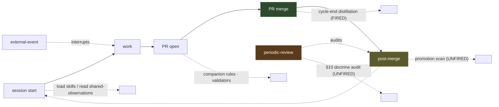

<!--
Copyright 2026 Nate DiNiro <UncleNate@gmail.com>
SPDX-License-Identifier: MIT OR Apache-2.0
Part of auto-harness — see LICENSE-MIT and LICENSE-APACHE at repository root.
-->

# Session Shape and the Review-Trigger Taxonomy

This is the **umbrella taxonomy** for session-boundary review checkpoints and
the trigger-classes that fire automation at them. It is the peer-and-parent of
[`cycle-end-distillation.md`](cycle-end-distillation.md), which covers one slice
of this picture — the **PR-boundary** distillation trigger. Read this doc to see
the whole session arc; read the cycle-end doc for the worked detail of the one
trigger that is fully wired today.

> **Advisory, not prescriptive.** The harness does not force a single canonical
> session shape on consumers via module machinery. This doc *describes* the
> checkpoints and catalogs the harness's own currently-firing (and
> currently-unfired) reviews so a maintainer can sequence follow-up work and a
> consumer can decide whether to mirror the shape or diverge with rationale.
> Per PRD-0013 (origin OPP-0032), v1 is **workflow-doc-only**: no new companion
> rules, no validator, no schema change — naming the gaps is the deliverable.

## Why this doc exists

Auto-harness has accumulated enforcement primitives — companion rules at the PR
boundary, eighteen validators, Stop-event hook adapters, audit-trail rules, the
cycle-end distillation trigger — and exactly one demonstrably-working
*declared-review-with-a-fired-trigger* pair (PRD-0004 → the cycle-end rule). But
several other review processes are **declared in prose with nothing firing
them**: the operating-principles promotion-candidate scan, the second-pass
brownfield onboarding, the knowledge-tree back-pressure audit, the periodic
doctrine (§10) audit, and more. A declared review that no automation fires
silently dies — the canonical evidence is `distilled-learnings.md` going 40 days
with zero inbound flow because the "dedicated review sessions" it depended on
were never scheduled (ADR-0014).

The gap is **not** "we need more primitives." It is **deciding which review
wants which primitive, at which checkpoint, with what evidence-bar firing it.**

## The session arc

Green = a checkpoint with a fired trigger today. Amber/brown = checkpoints whose
declared reviews are mostly unfired.

## 1. Session-boundary checkpoints (where a review could fire)

| Checkpoint | What it is | Automations that fit here | Harness example today |
|---|---|---|---|
| **Session start** | An agent or human begins a work session. | Skill load, `shared-observations.md` read, manifest read, framing-question prompt. | Agents load `harness-governance` / `harness-onboarding` skills; the heartbeat write-policy says read `shared-observations.md` on each heartbeat. |
| **Work** | Active editing, building, analysis. | Trust-tier gating, inline validators run locally. | The trust-tier doctrine governs every action mid-work; validators are runnable locally before commit. |
| **PR open** | A branch is pushed and a PR is opened. | Companion rules, the full validator chain, lint/shellcheck. | `validate-companions` + the 18-validator chain run in CI on every PR. |
| **PR merge** | A PR is squash-merged to `main`. | Cycle-end distillation, audit-trail satisfiers. | **The cycle-end distillation rule (PRD-0004) — the one fully-wired declared review.** |
| **Post-merge** | Immediately after a merge lands on `main`. | Promotion scans, count/enumeration reconciliation, status reconciliation. | Mostly **unfired** — promotion of observations into operating-principles happens ad-hoc. |
| **Periodic-review** | A cadence not tied to any single PR. | Scheduled CI audit, doctrine (§10) re-classification, back-pressure audit. | Mostly **unfired** — the §10 audit's "quarterly cap" trigger does not exist. |
| **External-event-driven** | A trigger from outside the repo. | New consumer onboarding, an upstream standard ratifying, a maintainer parallel PR. | The brownfield-onboarding flow exists, but its *second-pass* review is unfired. |

The checkpoint a review belongs to is **not** the same as the trigger-class that
fires it — a post-merge promotion scan could be fired by a session-boundary
hook, a count-boundary threshold, or a time-boundary cadence. The mapping is
many-to-many.

## 2. Trigger-class taxonomy (how a review fires)

| Trigger-class | Implementing primitive | Failure mode it prevents | Example |
|---|---|---|---|
| **PR-boundary** | A companion rule (`triggerPaths` → `requiredAny`), checked by `validate-companions` in CI. | A substantive change merging without its paired artifact (decision without rationale; observation without audit trail). | The cycle-end distillation rule; the audit-trail rules. |
| **Session-boundary** | A Stop-event hook adapter or an agent-skill prompt fired at session start/end. | A review that depends on "remembering to do it at the end of a session." | (Aspirational) a session-end prompt to run the promotion scan. |
| **Time-boundary** | A scheduled CI workflow (cron). | A review with no natural PR or session hook that silently lapses (the 40-day `distilled-learnings` dormancy). | (Aspirational) a quarterly §10 doctrine-audit job. |
| **Count-boundary** | A validator/CI check that fires when a surface crosses a size threshold. | Unbounded accumulation outrunning synthesis (observation back-pressure). | (Aspirational) a check on `shared-observations.md` growth-vs-promotion rate. |
| **Audit-boundary** | A manual or scheduled audit cadence with a checklist; a reviewer gate. | A quality concern that a regex/path check cannot see (cargo-cult satisfiers). | The reviewer gate that rejects cargo-cult observations (`cycle-end-distillation.md:118`). |
| **External-event-driven** | A flow/skill invoked by an outside event. | A review that should run on a consumer/standard/parallel-PR event but waits for someone to notice. | The brownfield-onboarding flow (first pass fires on the onboarding event; the second pass does not). |

## 3. What's already firing (the positive baseline)

These declared reviews **have** a fired trigger today. They are the reference set
— the shape the pattern takes when it works.

| Review | Declared at | Fired by | Trigger-class |
|---|---|---|---|
| Cycle-end distillation | `platform/profiles/management/knowledge-capture/module.yaml:35` | companion rule on ADR/OPP/module/manifest paths → `shared-observations.md` \| `operating-principles.md`; enforced by `validate-companions` | PR-boundary |
| Shared-observations audit trail | `platform/profiles/management/knowledge-capture/module.yaml:22` | companion rule on `shared-observations.md` → daily memory \| change-log | PR-boundary |
| Knowledge-structure change → ADR | `platform/profiles/management/knowledge-capture/module.yaml:29` | companion rule on `docs/knowledge/README.md` → ADR | PR-boundary |
| Opportunity-record edit audit trail | `platform/profiles/management/opportunity-capture/module.yaml:22` | companion rule on `OPP-` paths → daily memory \| change-log | PR-boundary |
| Opportunity-policy change → ADR | `platform/profiles/management/opportunity-capture/module.yaml:29` | companion rule on `docs/opportunities/README.md` → ADR | PR-boundary |

**Why the positive baseline is all PR-boundary:** the only trigger-class the
harness has actually wired is the companion rule. Every fired review hangs off a
PR diff. That is precisely why the gap list below skews to the *other* five
trigger-classes — the harness has the primitives on paper (hooks, scheduled CI,
agent prompts) but has only built the PR-boundary one.

## 4. What's declared but unfired (the gap — the actionable output)

Each row is a review process declared in prose with **no automation firing it**.
Per FR-006, each is classified by the trigger-class that would fire it correctly.
Citations are to the declaring text so a future reader can verify the audit is
current.

| # | Declared-but-unfired review | Declared at | Purpose | Trigger-class it wants | Recommended next step |
|---|---|---|---|---|---|
| 1 | **Operating-principles promotion-candidate scan** | `docs/knowledge/README.md:87` ("Promotion to Operating-Principles … not on a fixed cadence") | Periodically promote crystallized observations from `shared-observations.md` into `operating-principles.md`. | Session-boundary or time-boundary | OPP: a session-end prompt and/or a periodic job that surfaces promotion candidates. |
| 2 | **Second-pass brownfield onboarding** | `docs/knowledge/shared-observations.md` (2026-05-25 "catalog gaps surface in layers" observation) + `OPP-0032:38`; **notably absent from** `platform/skills/harness-onboarding/SKILL.md` | After the first onboarding pass, run an orthogonal-framing second pass to catch platform-layer gaps the first pass missed. | External-event-driven (+ session-boundary prompt) | OPP: add a framing-question prompt + second-pass recommendation to `harness-onboarding`. |
| 3 | **Knowledge-tree back-pressure audit** | `OPP-0032:23` ("never audit the back-pressure between observation accumulation and synthesis") | Detect observations accumulating faster than they are synthesized/promoted (the `distilled-learnings` dormancy class). | Count-boundary or time-boundary | OPP: a count-threshold check on accumulation-vs-promotion. |
| 4 | **Periodic doctrine (§10) audit** | `docs/operating-principles.md:312` ("Re-evaluate on-change … and at a quarterly cap") + `docs/doc-watch-log.md:366` | Re-classify the framework's load-bearing claims (Enforced / Half-enforced / Asserted-only) on a cadence; refresh the Asserted-only queue. | Time-boundary | OPP: a quarterly scheduled audit job (the on-change half already fires; the cadence half does not). |
| 5 | **Cargo-cult observation-quality review** | `platform/workflow/cycle-end-distillation.md:118` | Reject observations appended only to satisfy the rule with no substantive connection to the trigger work. | Audit-boundary | Separate OPP (review *quality*, not firing) — bar is a second observed instance before machinery; see the note below. |
| 6 | **Candidate-stub promotion-criterion gate** | `OPP-0032:137` (the promotion-criterion text) + `candidates.md:89` | Promote a candidate-stub to an OPP only when its self-declared promotion-criterion is met (a second concrete instance). | Session-boundary or audit-boundary | Codify the technique in `candidates.md` after a second firing (deferred per OPP-0032). |

> **A note on review *quality* (out of scope, named here on purpose).** Rows 5
> is a different gap class than the rest: it is about a fired review being
> satisfied *shallowly*, not about an unfired review. Per PRD-0013 this is
> explicitly out of scope for v1 — but it is named here, with a promotion-
> criterion of its own (a second documented cargo-cult instance), applying the
> candidate-stub-with-promotion-criterion technique recursively to this doc's own
> deferrals.

## 5. Recommended sequencing of follow-up OPPs (advisory)

This ordering is **advisory** — PRD-0013 commits to none of it; the maintainer
prioritizes per the existing OPP cadence. It is a starting point, not a backlog
lock.

1. **Second-pass brownfield onboarding prompt** (gap #2) — highest leverage and
   lowest risk: a prose/prompt change to `harness-onboarding`, no new
   enforcement primitive. Brownfield onboarding is the harness's
   highest-leverage catalog-gap discovery mechanism, so improving its coverage
   compounds.
2. **Operating-principles promotion scan** (gap #1) — the most-cited dormant
   review; a session-boundary prompt is cheap and directly addresses the
   `distilled-learnings` failure class.
3. **Periodic §10 doctrine audit** (gap #4) — the on-change half already works;
   only the time-boundary cadence is missing, so this is a scoped addition.
4. **Back-pressure / count-boundary audit** (gap #3) — needs a new count-boundary
   primitive; sequence after the cheaper prompt-based reviews prove the taxonomy
   is load-bearing.
5. **Review-quality machinery** (gap #5) — defer until a second cargo-cult
   instance accumulates (its own promotion-criterion).

## 6. Why the cycle-end rule is the template to copy

The cycle-end distillation rule (PRD-0004) is the **positive template** every
follow-up should study, because it is a *declared review + a fired trigger + an
evidence-bar in the trigger paths*:

- **Declared:** the review ("capture the learning from substantive work") is
  named in the module README and the workflow doc.
- **Fired:** a companion rule fires it on every PR that touches an ADR/OPP/module
  path — it cannot be forgotten.
- **Evidence-bar:** the `triggerPaths` set is deliberately heavy so the rule
  fires on substantive work, not routine bumps; the `humanReview` text demands a
  *substantive* satisfier, not a cargo-cult one.

It worked end-to-end on its first firings (three PR-boundary distillations forced
into being; `cycle-end-distillation.md:177` tells reviewers to read the satisfier
for substance). A second, smaller positive instance is the
**candidate-stub-with-promotion-criterion gate**: OPP-0032 itself was held as a
stub until a second concrete instance accumulated, then promoted — a review
discipline that fired correctly once (`OPP-0032:137`). Both are the same shape:
a declared review with an explicit firing condition.

## 7. Cross-references

- [`cycle-end-distillation.md`](cycle-end-distillation.md) — the PR-boundary
  slice of this taxonomy, in full detail (the satisfier decision tree).
- [PRD-0004 — Distillation Triggers](../../docs/requirements/PRD-0004-distillation-triggers.md)
  — the positive template.
- [PRD-0013](../../docs/requirements/PRD-0013-session-cycle-orchestration.md) /
  [OPP-0032](../../docs/opportunities/OPP-0032-session-cycle-orchestration.md) —
  this doc's design contract and origin.
- [operating-principles § 3](../../docs/operating-principles.md) (Documentation
  as Part of the Change) and § 7 (Align File Boundaries with Change-Class
  Boundaries) — why each unfired review warrants its own OPP→PRD pass rather than
  bundling four rules into one.

> **This doc evolves with the catalog.** v1 covers the *current* state. Each new
> module that introduces a session-boundary primitive (e.g. the OPP-0027..0031
> cluster) adds a row to these tables. Treat it as a living taxonomy, not an
> immutable artifact.
