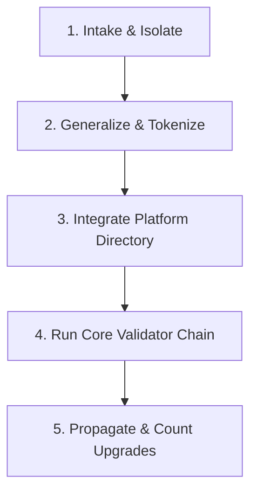

<!--
Copyright 2026 Nate DiNiro <UncleNate@gmail.com>
SPDX-License-Identifier: MIT OR Apache-2.0
Part of auto-harness — see LICENSE-MIT and LICENSE-APACHE at repository root.
-->

# Upstream Harvesting Guide — Consolidating Governance Additions

This document details the checklist, criteria, and workflow for **harvesting governance additions from consumer projects** back into the core auto-harness platform.

When a consumer project creates a custom module, validator, template, or skill, that capability should be upstreamed if it has general utility. This guide ensures the process is safe, structured, and consistent with the platform's self-governance.

---

## 1. Upstream Harvesting Criteria

Do not harvest every customized file. An addition is a candidate for harvesting only if it meets these criteria:

1. **General Utility:** The addition is useful to more than one project (e.g. a general `stacks/node-javascript` module rather than a hyper-specific setup for a single consumer's database replica).
2. **Schema Compliance:** Any harvested `module.yaml` matches the canonical schemas and compiles without exceptions.
3. **Battle-Tested:** The addition has been exercised in at least one consumer project session and has successfully gated merges in their CI environment.
4. **No IP Contamination:** The files do not contain proprietary code, secrets, customer names, or trademarked material of the consumer project (see [docs/knowledge/shared-observations.md](../../docs/knowledge/shared-observations.md) § Privacy and Redaction).

---

## 2. The Harvesting Checklist

Every harvested addition must go through these five checks before being merged to the core harness:



### 1. Intake & Isolate

* Isolate the customized files from the consumer's `.harness/` directory.
* Identify the exact changes: Was it a new module under `profiles/`? A custom validator under `validators/`? An updated template?

### 2. Generalize & Tokenize

* Remove all project-specific names, URLs, and emails.
* Replace project-specific details with canonical template placeholders (e.g., `[[PROJECT_NAME]]`, `[[SPDX_LICENSE]]`).
* Ensure the generalized templates pass the placeholder validator.

### 3. Integrate into the Platform Directory

* Move modules under the appropriate family folder in `platform/profiles/` or `platform/agents/`.
* Place new scripts in `platform/validators/`.
* Ensure all new workflow documents are placed in `platform/workflow/`.

### 4. Run the Core Validator Chain

* Run the full validator suite locally to confirm the module does not violate graph integrity or trust-tier boundaries:

    ```bash
    bash platform/validators/validate-manifest.sh harness.manifest.yaml
    bash platform/validators/validate-module-graph.sh harness.manifest.yaml
    ```

### 5. Propagate & Update Counts (The Catalog Tax)

Adding any new file to the platform registry changes the repository's count statistics. You **must** propagate these updates to prevent validators from failing:

* Update `platform/validators/validate-catalog-counts.sh` count recipes and assertion mappings.
* Update the prose counts in [platform/reference/how-to-read.md](../reference/how-to-read.md), [docs/architecture/diagrams.md](../../docs/architecture/diagrams.md), and [docs/_assets/cover-back.svg](../../docs/_assets/cover-back.svg).
* Add the new entity's row to the appropriate index table in [docs/README.md](../../docs/README.md) and [SUMMARY.md](../../SUMMARY.md).
* Verify the build is completely green using `validate-list-completeness.sh`.

---

## 3. Step-by-Step Harvesting Workflow

Follow this sequence to execute an upstream harvest:

### Step 1: File the Opportunity

File an opportunity record (e.g. `OPP-0052-harvest-node-javascript-stack.md`) stating:

* Which consumer project the capability is being harvested from.
* The business case/rationale for bringing it into the core platform.
* The scope of the refactoring required (what tokens need mapping, what templates are included).

### Step 2: Extract and Scrub

* Run a diff on the consumer's module against the closest platform baseline.
* Check the files against the `validate-knowledge-redaction.sh` denylist patterns to ensure no consumer internal names leak.
* Add standard Dual MIT/Apache-2.0 copyright headers to all new code/documentation files.

### Step 3: Apply the Deep Vertical Skeleton (If Applicable)

If you are harvesting a domain vertical or a management overlay, verify it has the six ingredients required by **Operating Principle § 12**:

1. **Jurisdiction-Neutral Core:** Ensure it assumes no single regulatory jurisdiction or standard version by default.
2. **Forcing Artifact:** It must demand exactly one conformance file (e.g., `engagement-profile.md`).
3. **Default-Deny Bias:** It does not overclaim maturity.
4. **Single-Concern Decomposition:** Decompose into sub-modules using `dependsOn`.
5. **Composition Shape:** Match one of the three canonical compositions.
6. **Predict-Clean Validator:** Gated so it only runs when the module is active.

### Step 4: Validate and Merge

* Create a branch named `harvest/OPP-NNNN`.
* Merge the refactored files and index updates.
* Verify CI executes the full validator suite and exits `0`.
* Flip the opportunity status to `accepted` (and eventually `closed` when tagged in a release).
